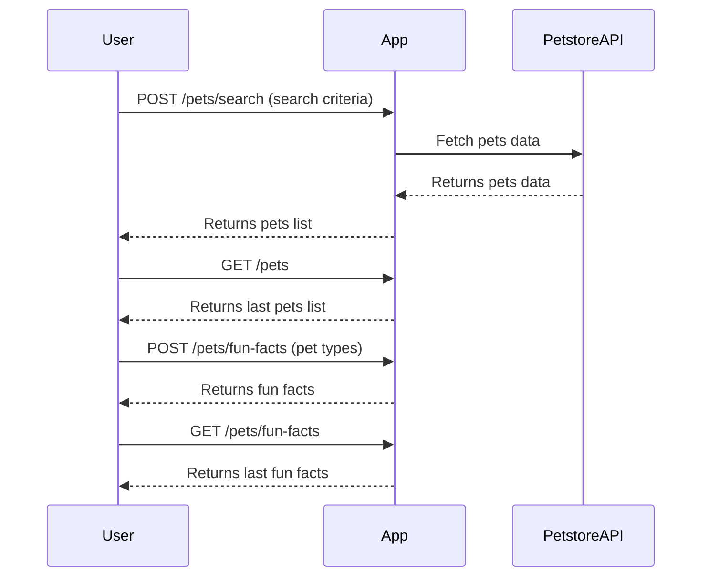
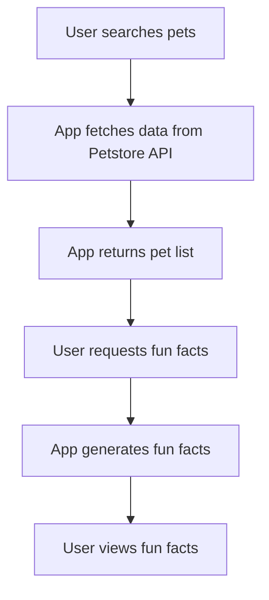

```markdown
# Purrfect Pets API - Final Functional Requirements

## API Endpoints

### 1. POST /pets/search
- **Description:** Query pets from external Petstore API based on search criteria.
- **Request:**
  ```json
  {
    "type": "string (optional)",     // e.g., "dog", "cat"
    "status": "string (optional)",   // e.g., "available", "sold"
    "limit": "integer (optional)"    // number of pets to retrieve
  }
  ```
- **Response:**
  ```json
  {
    "pets": [
      {
        "id": "integer",
        "name": "string",
        "type": "string",
        "status": "string",
        "photoUrls": ["string"]
      },
      ...
    ]
  }
  ```

### 2. GET /pets
- **Description:** Retrieve the last search result stored in the app.
- **Response:**
  ```json
  {
    "pets": [
      {
        "id": "integer",
        "name": "string",
        "type": "string",
        "status": "string",
        "photoUrls": ["string"]
      },
      ...
    ]
  }
  ```

### 3. POST /pets/fun-facts
- **Description:** Generate fun pet facts or tips based on provided pet types.
- **Request:**
  ```json
  {
    "types": ["string"]   // e.g., ["cat", "dog"]
  }
  ```
- **Response:**
  ```json
  {
    "facts": [
      "Cats sleep 70% of their lives.",
      "Dogs have three eyelids."
    ]
  }
  ```

### 4. GET /pets/fun-facts
- **Description:** Retrieve last generated fun facts.
- **Response:**
  ```json
  {
    "facts": [
      "Cats sleep 70% of their lives.",
      "Dogs have three eyelids."
    ]
  }
  ```

---

## Business Logic Notes
- All external data retrieval from Petstore API is done in POST endpoints (`/pets/search`).
- GET endpoints serve cached or last processed data only.
- Fun facts generation can be static or dynamically generated based on input pet types.

---

## User-App Interaction Sequence


```mermaid
sequenceDiagram
    participant User
    participant App
    participant PetstoreAPI

    User->>App: POST /pets/search (search criteria)
    App->>PetstoreAPI: Fetch pets data
    PetstoreAPI-->>App: Returns pets data
    App-->>User: Returns pets list

    User->>App: GET /pets
    App-->>User: Returns last pets list

    User->>App: POST /pets/fun-facts (pet types)
    App-->>User: Returns fun facts

    User->>App: GET /pets/fun-facts
    App-->>User: Returns last fun facts
```

---

## Simplified User Journey


```mermaid
flowchart TD
    A[User searches pets] --> B[App fetches data from Petstore API]
    B --> C[App returns pet list]
    C --> D[User requests fun facts]
    D --> E[App generates fun facts]
    E --> F[User views fun facts]
```
```

If you have no further questions or changes, I can now finalize our discussion.