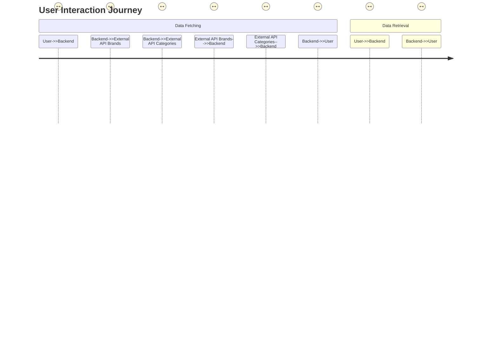
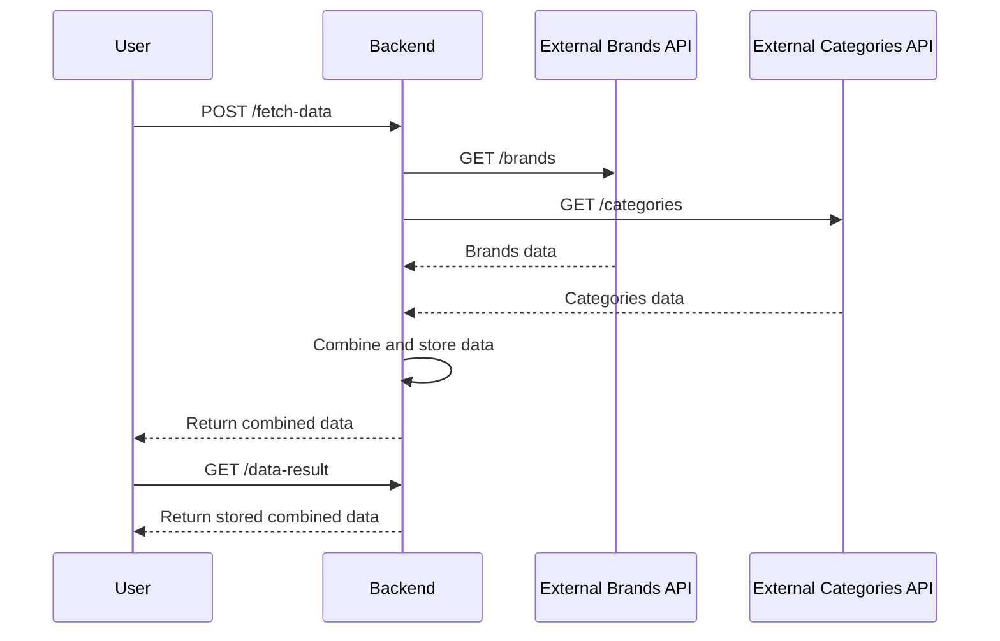

# Functional Requirements Specification for Combined Data Application

## Overview
This backend application retrieves and combines data from two external APIs—one for brands and one for categories. The application provides a structured way to fetch this data and retrieve the combined results.

## Endpoints

### 1. POST /fetch-data
**Purpose:**  
Invokes external API calls to retrieve brands and categories data, and combines the results for storage.

**Request:**  
- **Method:** POST  
- **URL:** /fetch-data  
- **Headers:**  
  - `Content-Type: application/json`  
- **Request Body:**  
  ```json
  {}
  ```

**Response (Success):**  
- **HTTP Status:** 200  
- **Response Body (example):**  
  ```json
  {
    "brands": [
      {
        "id": "01JN18XM8JDZW6D8AK67CW457J",
        "name": "ForgeFlex Tools",
        "slug": "forgeflex-tools"
      },
      {
        "id": "01JN18XM8JDZW6D8AK67CW457K",
        "name": "MightyCraft Hardware",
        "slug": "mightycraft-hardware"
      },
      {
        "id": "01jn1bmprhkpnt54fs7j9j8qea",
        "name": "new brand",
        "slug": "new-brand"
      }
    ],
    "categories": [
      {
        "id": "01JN18XM934FFV9DT6EWK81CZ9",
        "name": "Hand Tools",
        "slug": "hand-tools",
        "parent_id": null
      },
      {
        "id": "01JN18XM934FFV9DT6EWK81CZA",
        "name": "Power Tools",
        "slug": "power-tools",
        "parent_id": null
      }
    ],
    "combined_at": "2023-10-05T14:48:00Z"
  }
  ```

**Response (Error):**  
- **HTTP Status:** 500  
- **Response Body:**  
  ```json
  {
    "error": "Internal server error"
  }
  ```

### 2. GET /data-result
**Purpose:**  
Retrieves the stored combined result from the previous POST /fetch-data request.

**Request:**  
- **Method:** GET  
- **URL:** /data-result  
- **Headers:**  
  - `Accept: application/json`  

**Response (Success):**  
- **HTTP Status:** 200  
- **Response Body (example):**  
  ```json
  {
    "brands": [ ... ],
    "categories": [ ... ],
    "combined_at": "2023-10-05T14:48:00Z"
  }
  ```

**Response (Error):**  
- **HTTP Status:** 404  
- **Response Body:**  
  ```json
  {
    "error": "No combined data available"
  }
  ```

## User Interaction Diagrams

### User Journey Diagram

```mermaid
journey
  title User Interaction Journey
  section Data Fetching
    User->>Backend: POST /fetch-data request
    Backend->>External API Brands: GET brands data
    Backend->>External API Categories: GET categories data
    External API Brands-->>Backend: Brands data
    External API Categories-->>Backend: Categories data
    Backend->>User: Combined result response
  section Data Retrieval
    User->>Backend: GET /data-result request
    Backend->>User: Return stored combined result
```

### Sequence Diagram

```mermaid
sequenceDiagram
  participant U as User
  participant B as Backend
  participant EB as External Brands API
  participant EC as External Categories API
  U->>B: POST /fetch-data
  B->>EB: GET /brands
  B->>EC: GET /categories
  EB-->>B: Brands data
  EC-->>B: Categories data
  B->>B: Combine and store data
  B-->>U: Return combined data
  U->>B: GET /data-result
  B-->>U: Return stored combined data
```