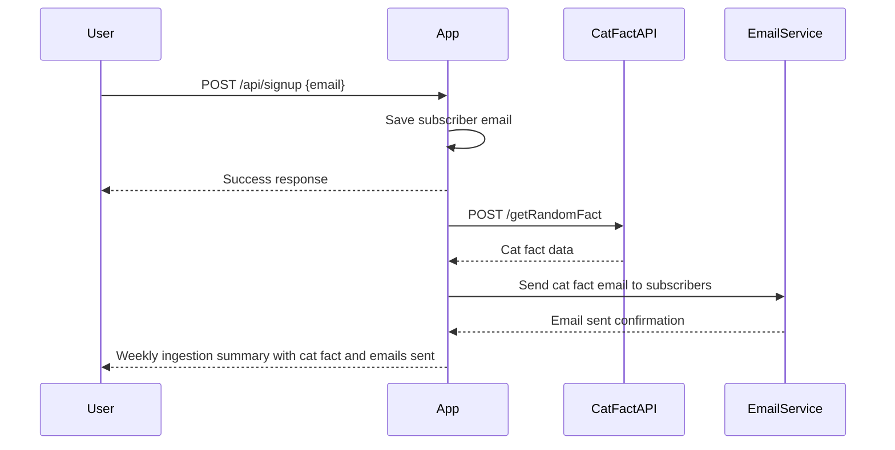
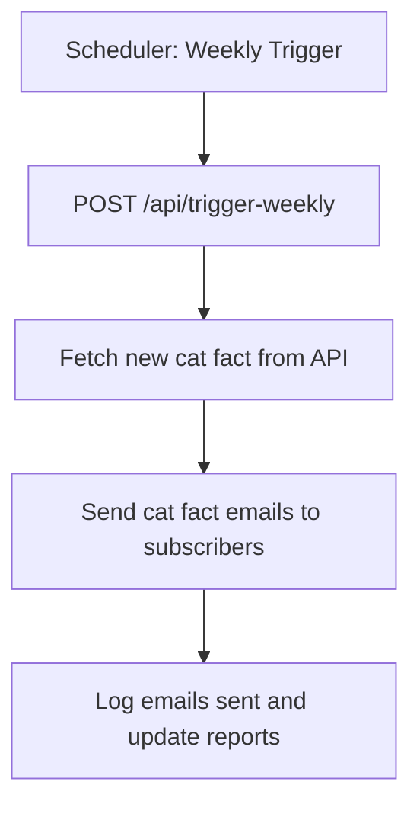

```markdown
# Functional Requirements and API Endpoints

## 1. API Endpoints

### 1.1 User Sign-Up  
**POST** `/api/signup`  
- Request:  
  ```json
  {
    "email": "user@example.com"
  }
  ```  
- Response:  
  ```json
  {
    "success": true,
    "message": "User subscribed successfully"
  }
  ```  
- Description: Registers a new subscriber with their email.

---

### 1.2 Retrieve Subscribers List  
**GET** `/api/subscribers`  
- Response:  
  ```json
  {
    "subscribers": [
      "user1@example.com",
      "user2@example.com"
    ],
    "count": 2
  }
  ```  
- Description: Returns the list of all subscribers and total count.

---

### 1.3 Trigger Weekly Cat Fact Ingestion and Email Send  
**POST** `/api/trigger-weekly`  
- Request:  
  ```json
  {}
  ```  
- Response:  
  ```json
  {
    "success": true,
    "cat_fact": "Cats sleep 70% of their lives.",
    "emails_sent": 20
  }
  ```  
- Description: Fetches a new cat fact from the external API and sends it by email to all subscribers.

---

### 1.4 Interaction Reporting  
**GET** `/api/report`  
- Response:  
  ```json
  {
    "total_subscribers": 20,
    "emails_sent": 50,
    "interactions": {
      "email_opens": 30,
      "clicks": 10
    }
  }
  ```  
- Description: Reports subscriber count and interaction metrics.

---

## 2. User-App Interaction Sequence (Mermaid Diagram)


```mermaid
sequenceDiagram
    participant User
    participant App
    participant CatFactAPI
    participant EmailService

    User->>App: POST /api/signup {email}
    App->>App: Save subscriber email
    App-->>User: Success response

    App->>CatFactAPI: POST /getRandomFact
    CatFactAPI-->>App: Cat fact data

    App->>EmailService: Send cat fact email to subscribers
    EmailService-->>App: Email sent confirmation

    App-->>User: Weekly ingestion summary with cat fact and emails sent
```

## 3. Weekly Scheduled Flow (Mermaid Diagram)


```mermaid
graph TD
  A[Scheduler: Weekly Trigger] --> B[POST /api/trigger-weekly]
  B --> C[Fetch new cat fact from API]
  C --> D[Send cat fact emails to subscribers]
  D --> E[Log emails sent and update reports]
```
```