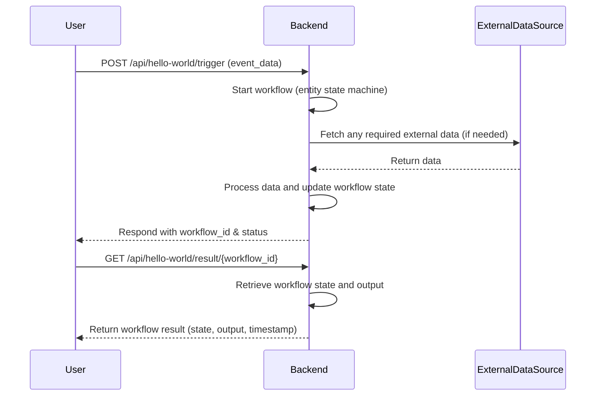

```markdown
# Functional Requirements for Hello World Application (Cyoda-based)

## Overview
This backend application is built using Cyoda design values: event-driven architecture with state machines, dynamic workflows, and entities triggered by events. The application exposes RESTful API endpoints to trigger workflows, process external data or calculations, and retrieve results.

---

## API Endpoints

### 1. Trigger Hello World Workflow  
**POST** `/api/hello-world/trigger`  
- **Description:** Triggers the Hello World entity workflow by accepting input data or event details. Contains any business logic that may involve external data retrieval or processing.  
- **Request JSON:**  
```json
{
  "event_data": "optional string or object to trigger workflow"
}
```  
- **Response JSON:**  
```json
{
  "workflow_id": "string - unique workflow instance ID",
  "status": "string - e.g., initiated"
}
```

---

### 2. Retrieve Workflow Result  
**GET** `/api/hello-world/result/{workflow_id}`  
- **Description:** Retrieves the result of the previously triggered workflow using its unique ID. No business logic or external data retrieval performed here.  
- **Response JSON:**  
```json
{
  "workflow_id": "string",
  "state": "string - current workflow state (e.g., completed)",
  "output": "string - e.g., 'Hello World!'",
  "timestamp": "ISO8601 datetime string"
}
```

---

## Business Logic Notes
- All event triggering, external data retrieval, and processing happen in the POST endpoint.
- GET endpoint is read-only and returns stored results.
- Workflows are managed as entities with state machines internally.

---

## User-App Interaction Sequence


```mermaid
sequenceDiagram
    participant User
    participant Backend
    participant ExternalDataSource

    User->>Backend: POST /api/hello-world/trigger (event_data)
    Backend->>Backend: Start workflow (entity state machine)
    Backend->>ExternalDataSource: Fetch any required external data (if needed)
    ExternalDataSource-->>Backend: Return data
    Backend->>Backend: Process data and update workflow state
    Backend-->>User: Respond with workflow_id & status

    User->>Backend: GET /api/hello-world/result/{workflow_id}
    Backend->>Backend: Retrieve workflow state and output
    Backend-->>User: Return workflow result (state, output, timestamp)
```

---

## Summary
- POST to trigger workflows and process data.
- GET to retrieve workflow results.
- Workflows internally managed as entities with state machines.
- External data integration occurs only during POST calls.

```
