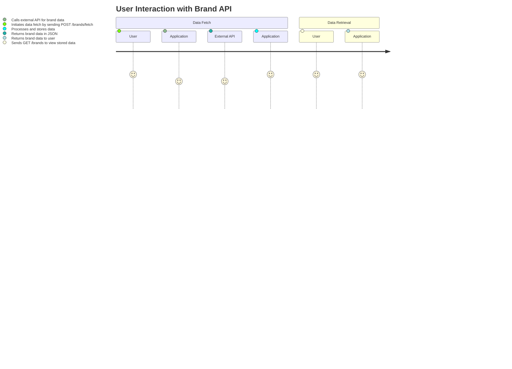
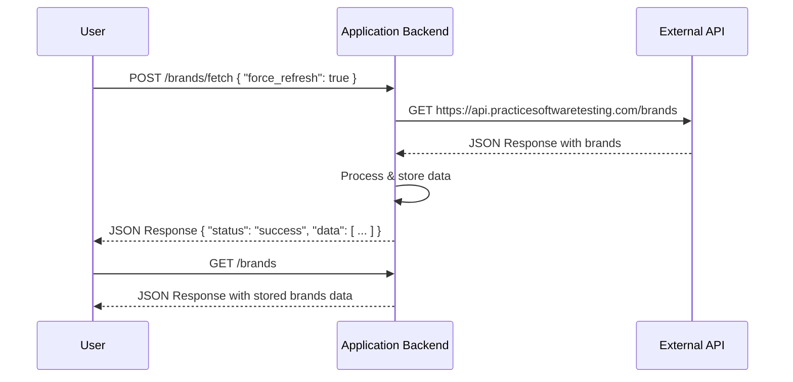

# Functional Requirements

## API Endpoints

### 1. POST /brands/fetch

- **Purpose:**  
  Invoke the external data source to retrieve brands and perform necessary business logic or data transformations.

- **Request Format:**  
  - **Content-Type:** application/json  
  - **Example Payload:**
    ```json
    {
      "force_refresh": true  // Optional flag to force a fresh fetch instead of using cached data
    }
    ```

- **Processing:**
  - Validate the request payload.
  - Trigger an HTTP GET call to the external API: `https://api.practicesoftwaretesting.com/brands`.
  - On successful external response, perform data transformations (e.g., renaming or omitting fields, filtering).
  - Store or update the application’s internal representation/data store with the retrieved brand list.
  - Log errors or unsuccessful responses for further analysis.

- **Response Format:**  
  - **Content-Type:** application/json  
  - **On Success:**
    ```json
    {
      "status": "success",
      "message": "Brands fetched and stored successfully.",
      "data": [
        {
          "id": "01JMWZK3N7PT3XMTMXMQTBACRV",
          "name": "ForgeFlex Tools",
          "slug": "forgeflex-tools"
        },
        {
          "id": "01JMWZK3N7PT3XMTMXMQTBACRW",
          "name": "MightyCraft Hardware",
          "slug": "mightycraft-hardware"
        }
      ]
    }
    ```
  - **On Failure:**
    ```json
    {
      "status": "error",
      "message": "Failed to retrieve data from the external service."
    }
    ```

### 2. GET /brands

- **Purpose:**  
  Retrieve the stored list of brands from the application’s internal data store.

- **Request Format:**  
  - Simple GET request with no request body. Optional query parameters may be added later for filtering or pagination.

- **Response Format:**  
  - **Content-Type:** application/json  
  - **Example Response:**
    ```json
    {
      "status": "success",
      "data": [
        {
          "id": "01JMWZK3N7PT3XMTMXMQTBACRV",
          "name": "ForgeFlex Tools",
          "slug": "forgeflex-tools"
        },
        {
          "id": "01JMWZK3N7PT3XMTMXMQTBACRW",
          "name": "MightyCraft Hardware",
          "slug": "mightycraft-hardware"
        }
      ]
    }
    ```

## Business Logic

- All external calls and data processing must be handled exclusively within the `POST /brands/fetch` endpoint.
- The `GET /brands` endpoint is strictly for retrieving results after the data has been fetched and stored.
- Implement proper error handling and logging in the `POST` endpoint to manage issues during external API interaction.
- Consider implementing caching and data validation to ensure data integrity and improve performance.

## Visual Representations

### User Journey Diagram


```mermaid
journey
  title User Interaction with Brand API
  section Data Fetch
    User: 5: Initiates data fetch by sending POST /brands/fetch
    Application: 4: Calls external API for brand data
    External API: 4: Returns brand data in JSON
    Application: 5: Processes and stores data
  section Data Retrieval
    User: 5: Sends GET /brands to view stored data
    Application: 5: Returns brand data to user
```

### Sequence Diagram


```mermaid
sequenceDiagram
  participant U as User
  participant A as Application Backend
  participant E as External API

  U->>A: POST /brands/fetch { "force_refresh": true }
  A->>E: GET https://api.practicesoftwaretesting.com/brands
  E-->>A: JSON Response with brands
  A->>A: Process & store data
  A-->>U: JSON Response { "status": "success", "data": [ ... ] }

  U->>A: GET /brands
  A-->>U: JSON Response with stored brands data
```