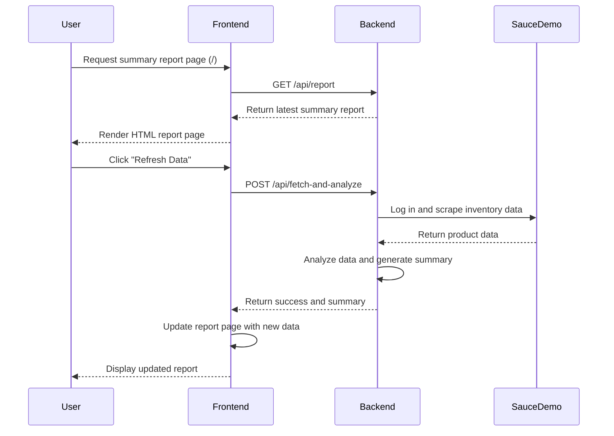

```markdown
# Functional Requirements and API Design

## Overview
The application logs into SauceDemo using the "standard_user" credentials, scrapes product data (item name, description, price, inventory), analyzes key metrics, and generates a summary report. The report is displayed as an HTML page.

---

## API Endpoints

### 1. POST `/api/fetch-and-analyze`
- **Purpose:** Trigger the login, web scraping, data extraction, and analysis workflow.
- **Request Body:** (empty or optional parameters for extensibility)
```json
{}
```
- **Response:**  
```json
{
  "status": "success",
  "message": "Data fetched and analyzed successfully",
  "summary": {
    "total_products": 6,
    "average_price": 29.99,
    "highest_priced_item": {
      "name": "Sauce Labs Fleece Jacket",
      "price": 49.99
    },
    "lowest_priced_item": {
      "name": "Sauce Labs Onesie",
      "price": 7.99
    },
    "total_inventory_value": 450.75
  }
}
```

---

### 2. GET `/api/report`
- **Purpose:** Retrieve the latest generated summary report.
- **Response:**  
```json
{
  "total_products": 6,
  "average_price": 29.99,
  "highest_priced_item": {
    "name": "Sauce Labs Fleece Jacket",
    "price": 49.99
  },
  "lowest_priced_item": {
    "name": "Sauce Labs Onesie",
    "price": 7.99
  },
  "total_inventory_value": 450.75
}
```

---

### 3. GET `/`
- **Purpose:** Display the summary report as an HTML page with clear formatting.

---

## Business Logic Notes
- POST `/api/fetch-and-analyze` performs:
  - Login to SauceDemo using "standard_user" and "secret_sauce".
  - Scrape inventory page data.
  - Extract "item name", "description", "price", and "inventory" (stock quantity).
  - Calculate total products, average price, highest & lowest priced items, and total inventory value.
  - Store results for retrieval by GET `/api/report` and display on `/`.

---

## User-App Interaction Sequence


```mermaid
sequenceDiagram
    participant User
    participant Frontend
    participant Backend
    participant SauceDemo

    User->>Frontend: Request summary report page (/)
    Frontend->>Backend: GET /api/report
    Backend-->>Frontend: Return latest summary report
    Frontend-->>User: Render HTML report page

    User->>Frontend: Click "Refresh Data"
    Frontend->>Backend: POST /api/fetch-and-analyze
    Backend->>SauceDemo: Log in and scrape inventory data
    SauceDemo-->>Backend: Return product data
    Backend->>Backend: Analyze data and generate summary
    Backend-->>Frontend: Return success and summary
    Frontend->>Frontend: Update report page with new data
    Frontend-->>User: Display updated report
```
```