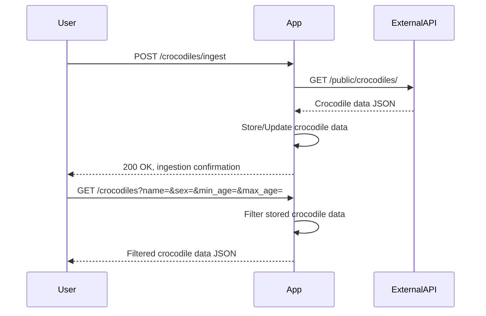

```markdown
# Functional Requirements and API Design for Crocodile Data Application

## API Endpoints

### 1. POST /crocodiles/ingest  
**Description:**  
Trigger ingestion of crocodile data from external API, store/update data in the application.

**Request:**  
```json
{}
```
(empty body since ingestion is triggered without parameters)

**Response:**  
```json
{
  "status": "success",
  "message": "Crocodile data ingested successfully",
  "ingested_count": 123
}
```

---

### 2. GET /crocodiles  
**Description:**  
Retrieve filtered crocodile data based on query parameters.

**Query Parameters:**  
- `name` (optional): string, filter by crocodile name (partial or full match)  
- `sex` (optional): string, "M" or "F"  
- `min_age` (optional): integer, minimum age inclusive (0-200)  
- `max_age` (optional): integer, maximum age inclusive (0-200)  

**Example Request:**  
`GET /crocodiles?name=rex&sex=M&min_age=5&max_age=50`

**Response:**  
```json
{
  "results": [
    {
      "id": 1,
      "name": "Rex",
      "sex": "M",
      "age": 12,
      "other_attributes": "..."
    }
  ],
  "count": 1
}
```

---

## Business Logic Notes

- External API data fetching and ingestion is exclusively done via the POST `/crocodiles/ingest` endpoint.
- Filtering is done only on stored data via GET `/crocodiles` with query parameters.
- Validation should ensure age ranges are between 0 and 200, and sex is "M" or "F" if provided.

---

## User-App Interaction Sequence Diagram


```mermaid
sequenceDiagram
    participant User
    participant App
    participant ExternalAPI

    User->>App: POST /crocodiles/ingest
    App->>ExternalAPI: GET /public/crocodiles/
    ExternalAPI-->>App: Crocodile data JSON
    App->>App: Store/Update crocodile data
    App-->>User: 200 OK, ingestion confirmation

    User->>App: GET /crocodiles?name=&sex=&min_age=&max_age=
    App->>App: Filter stored crocodile data
    App-->>User: Filtered crocodile data JSON
```
```