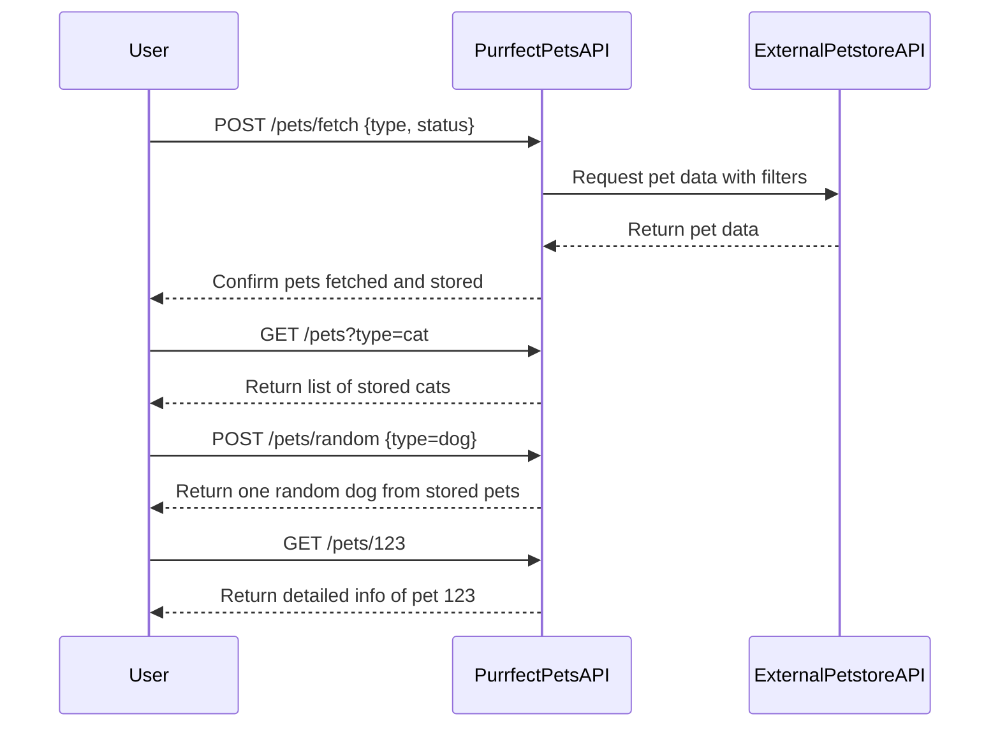

```markdown
# Purrfect Pets API - Functional Requirements

## Overview
The API provides a fun and interactive way to access and manage pet data sourced from the Petstore API. It follows RESTful principles where POST endpoints handle external data retrieval and processing, and GET endpoints provide retrieval of stored or computed results.

---

## API Endpoints

### 1. POST /pets/fetch
- **Purpose:** Fetch pet data from the external Petstore API, optionally filtered by type or status, then store or process it for later retrieval.
- **Request Body:**
  ```json
  {
    "type": "string (optional, e.g. cat, dog)",
    "status": "string (optional, e.g. available, sold)"
  }
  ```
- **Response:** 
  ```json
  {
    "message": "Pets fetched and stored successfully",
    "count": "number of pets fetched"
  }
  ```

### 2. GET /pets
- **Purpose:** Retrieve a list of pets previously fetched and stored.
- **Query Parameters (optional):**
  - `type`: filter pets by type
  - `status`: filter pets by status
- **Response:**
  ```json
  [
    {
      "id": "pet id",
      "name": "pet name",
      "type": "pet type",
      "status": "pet status",
      "tags": ["tag1", "tag2"]
    },
    ...
  ]
  ```

### 3. POST /pets/random
- **Purpose:** Retrieve a random pet from the stored dataset, optionally filtered by type.
- **Request Body:**
  ```json
  {
    "type": "string (optional)"
  }
  ```
- **Response:**
  ```json
  {
    "id": "random pet id",
    "name": "random pet name",
    "type": "random pet type",
    "status": "random pet status",
    "tags": ["tag1", "tag2"]
  }
  ```

### 4. GET /pets/{id}
- **Purpose:** Retrieve detailed information about a specific pet by its ID.
- **Response:**
  ```json
  {
    "id": "pet id",
    "name": "pet name",
    "type": "pet type",
    "status": "pet status",
    "tags": ["tag1", "tag2"],
    "photoUrls": ["url1", "url2"]
  }
  ```

---

## User-App Interaction Sequence


```mermaid
sequenceDiagram
    participant User
    participant PurrfectPetsAPI
    participant ExternalPetstoreAPI

    User->>PurrfectPetsAPI: POST /pets/fetch {type, status}
    PurrfectPetsAPI->>ExternalPetstoreAPI: Request pet data with filters
    ExternalPetstoreAPI-->>PurrfectPetsAPI: Return pet data
    PurrfectPetsAPI-->>User: Confirm pets fetched and stored

    User->>PurrfectPetsAPI: GET /pets?type=cat
    PurrfectPetsAPI-->>User: Return list of stored cats

    User->>PurrfectPetsAPI: POST /pets/random {type=dog}
    PurrfectPetsAPI-->>User: Return one random dog from stored pets

    User->>PurrfectPetsAPI: GET /pets/123
    PurrfectPetsAPI-->>User: Return detailed info of pet 123
```

---

## Summary
- POST endpoints perform external data retrieval and business logic.
- GET endpoints serve stored or processed data.
- Includes a fun random pet endpoint.
- JSON format used consistently for requests and responses.
```
