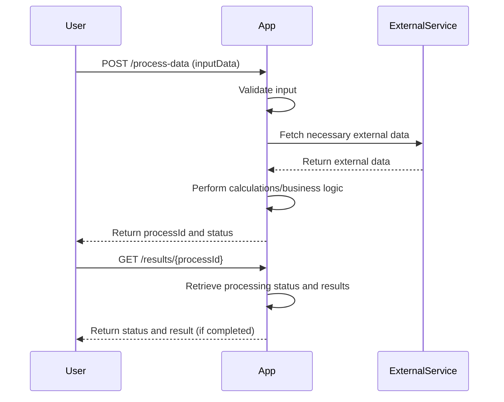

```markdown
# Functional Requirements for the Project

## API Endpoints

### 1. POST /process-data
- **Purpose:** Accept input data, invoke any business logic including external data retrieval, and perform calculations.
- **Request Format:** JSON  
  ```json
  {
    "inputData": { /* arbitrary structure depending on business logic */ }
  }
  ```
- **Response Format:** JSON  
  ```json
  {
    "processId": "string",         // unique identifier for the processed request
    "status": "processing|completed|failed",
    "message": "optional status message"
  }
  ```
- **Notes:** This endpoint triggers all external data calls and calculations. It starts processing asynchronously or synchronously depending on implementation.

---

### 2. GET /results/{processId}
- **Purpose:** Retrieve the results of the processing previously triggered via POST.
- **Path Parameter:**  
  - `processId` (string): Identifier of the processing job.
- **Response Format:** JSON  
  ```json
  {
    "processId": "string",
    "status": "completed|processing|failed",
    "result": { /* data structure with the final result, if available */ },
    "message": "optional status or error message"
  }
  ```
- **Notes:** Used only to fetch results; no external calls or heavy computations here.

---

## User-App Interaction Sequence Diagram


```mermaid
sequenceDiagram
    participant User
    participant App

    User->>App: POST /process-data (inputData)
    App->>App: Validate input
    App->>ExternalService: Fetch necessary external data
    ExternalService-->>App: Return external data
    App->>App: Perform calculations/business logic
    App-->>User: Return processId and status

    User->>App: GET /results/{processId}
    App->>App: Retrieve processing status and results
    App-->>User: Return status and result (if completed)
```

---

## Summary

- All business logic that involves external data retrieval or heavy calculations will be done on the POST `/process-data` endpoint.
- GET `/results/{processId}` endpoint strictly returns stored results or status without invoking external requests.
- JSON is used as the request and response format for simplicity and interoperability.
```