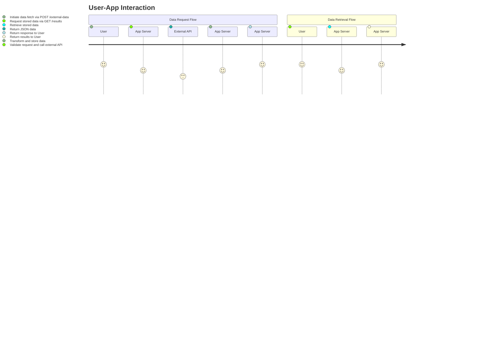
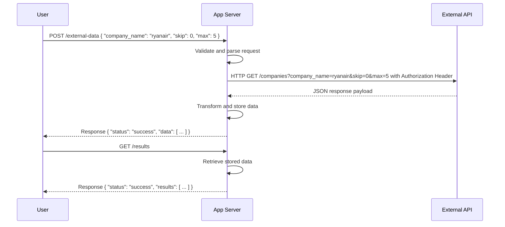

# Functional Requirements

## Overview
The application will provide an interface to retrieve company information from an external API based on user-defined criteria. This will involve making a POST request to gather data and a GET request to retrieve the results.

## API Endpoints

### 1. POST /external-data
- **Purpose**: Invokes business logic to retrieve data from an external data source (CRO API).
- **Request Format**:
  - Content-Type: `application/json`
  - Body Example:
    ```json
    {
      "company_name": "ryanair",
      "skip": 0,
      "max": 5
    }
    ```
- **Processing**:
  - Validate the request body for required fields.
  - Construct and send an external GET request using the provided parameters.
  - Use Basic Authorization header for the external API.
  - Process and transform the received JSON data as needed.
  - Store the retrieved result for later retrieval via the GET endpoint.
- **Response Format**:
  - Content-Type: `application/json`
  - Body Example:
    ```json
    {
      "status": "success",
      "data": [
        {
          "company_num": 117738,
          "company_bus_ind": "C",
          "company_name": "RYANAIR CARGO LIMITED",
          "company_addr_1": "3 DAWSON STREET",
          "company_addr_2": "DUBLIN 2.",
          "company_addr_3": "DUBLIN, DUBLIN, Ireland",
          "company_addr_4": "",
          "company_reg_date": "1986-10-28T00:00:00Z",
          "company_status_desc": "Dissolved",
          "company_status_date": "1993-11-19T00:00:00Z",
          "last_ar_date": "0001-01-01T00:00:00Z",
          "next_ar_date": "2002-04-28T00:00:00Z",
          "last_acc_date": "0001-01-01T00:00:00Z",
          "comp_type_desc": "Private limited by shares",
          "company_type_code": 1119,
          "company_status_code": 1158,
          "place_of_business": "Ireland",
          "eircode": ""
        }
      ]
    }
    ```

### 2. GET /results
- **Purpose**: Retrieves the stored results from previously executed POST operations.
- **Request Format**:
  - No request body is necessary.
- **Response Format**:
  - Content-Type: `application/json`
  - Body Example:
    ```json
    {
      "status": "success",
      "results": [
        {
          "company_num": 117738,
          "company_bus_ind": "C",
          "company_name": "RYANAIR CARGO LIMITED",
          "company_addr_1": "3 DAWSON STREET",
          "company_addr_2": "DUBLIN 2.",
          "company_addr_3": "DUBLIN, DUBLIN, Ireland",
          "company_addr_4": "",
          "company_reg_date": "1986-10-28T00:00:00Z",
          "company_status_desc": "Dissolved",
          "company_status_date": "1993-11-19T00:00:00Z",
          "last_ar_date": "0001-01-01T00:00:00Z",
          "next_ar_date": "2002-04-28T00:00:00Z",
          "last_acc_date": "0001-01-01T00:00:00Z",
          "comp_type_desc": "Private limited by shares",
          "company_type_code": 1119,
          "company_status_code": 1158,
          "place_of_business": "Ireland",
          "eircode": ""
        }
      ]
    }
    ```

## User Interaction Flow

### Journey Diagram

```mermaid
journey
    title User-App Interaction
    section Data Request Flow
      User: 5: Initiate data fetch via POST /external-data
      App Server: 4: Validate request and call external API
      External API: 3: Return JSON data
      App Server: 4: Transform and store data
      App Server: 5: Return response to User
    section Data Retrieval Flow
      User: 5: Request stored data via GET /results
      App Server: 4: Retrieve stored data
      App Server: 5: Return results to User
```

### Sequence Diagram

```mermaid
sequenceDiagram
    participant U as User
    participant A as App Server
    participant E as External API

    U->>A: POST /external-data { "company_name": "ryanair", "skip": 0, "max": 5 }
    A->>A: Validate and parse request
    A->>E: HTTP GET /companies?company_name=ryanair&skip=0&max=5 with Authorization Header
    E-->>A: JSON response payload
    A->>A: Transform and store data
    A-->>U: Response { "status": "success", "data": [ ... ] }

    U->>A: GET /results
    A->>A: Retrieve stored data
    A-->>U: Response { "status": "success", "results": [ ... ] }
```