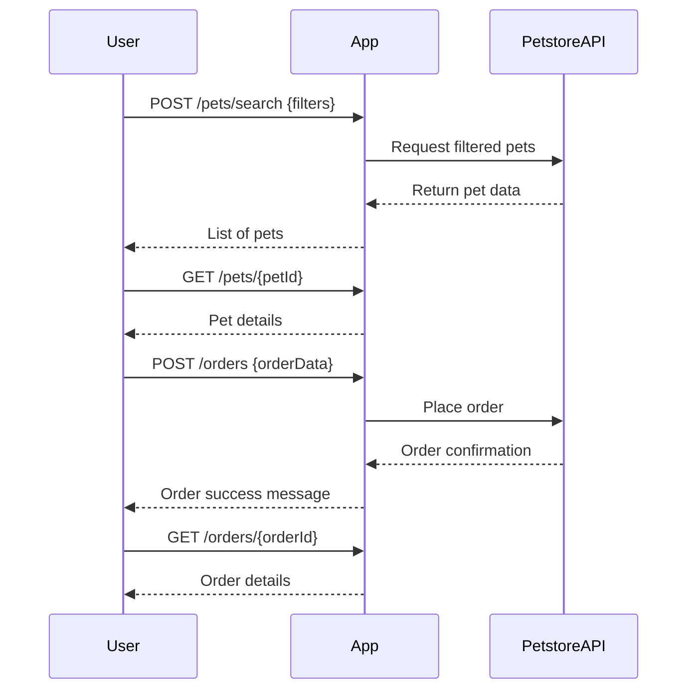

```markdown
# Functional Requirements for "Purrfect Pets" API App

## API Endpoints

### 1. Search Pets  
**POST** `/pets/search`  
- **Description:** Search pets based on filters like status, category, or name. Retrieves data from Petstore API and processes it.  
- **Request Body (JSON):**  
```json
{
  "status": "available | pending | sold",  // optional
  "category": "string",                   // optional
  "name": "string"                       // optional
}
```  
- **Response (JSON):**  
```json
{
  "pets": [
    {
      "id": 1,
      "name": "Fluffy",
      "category": "cat",
      "status": "available",
      "photoUrls": ["url1", "url2"]
    }
  ]
}
```

---

### 2. Get Pet Details  
**GET** `/pets/{petId}`  
- **Description:** Retrieve detailed info about a specific pet from the app’s stored data (no external calls).  
- **Response (JSON):**  
```json
{
  "id": 1,
  "name": "Fluffy",
  "category": "cat",
  "status": "available",
  "photoUrls": ["url1", "url2"],
  "tags": ["cute", "small"]
}
```

---

### 3. Place Order for Pet  
**POST** `/orders`  
- **Description:** Place an order by sending petId and user info; sends data to Petstore API, processes the response.  
- **Request Body (JSON):**  
```json
{
  "petId": 1,
  "quantity": 1,
  "shipDate": "2024-05-01T12:00:00Z",
  "status": "placed | approved | delivered",
  "complete": false
}
```  
- **Response (JSON):**  
```json
{
  "orderId": 123,
  "status": "placed",
  "message": "Order successfully placed"
}
```

---

### 4. Get Order Details  
**GET** `/orders/{orderId}`  
- **Description:** Retrieve order details saved in the app.  
- **Response (JSON):**  
```json
{
  "orderId": 123,
  "petId": 1,
  "quantity": 1,
  "shipDate": "2024-05-01T12:00:00Z",
  "status": "placed",
  "complete": false
}
```

---

## User-App Interaction Sequence Diagram


```mermaid
sequenceDiagram
    participant User
    participant App
    participant PetstoreAPI

    User->>App: POST /pets/search {filters}
    App->>PetstoreAPI: Request filtered pets
    PetstoreAPI-->>App: Return pet data
    App-->>User: List of pets

    User->>App: GET /pets/{petId}
    App-->>User: Pet details

    User->>App: POST /orders {orderData}
    App->>PetstoreAPI: Place order
    PetstoreAPI-->>App: Order confirmation
    App-->>User: Order success message

    User->>App: GET /orders/{orderId}
    App-->>User: Order details
```
```