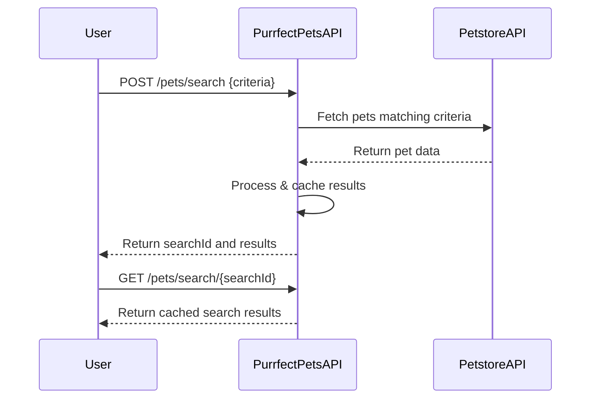
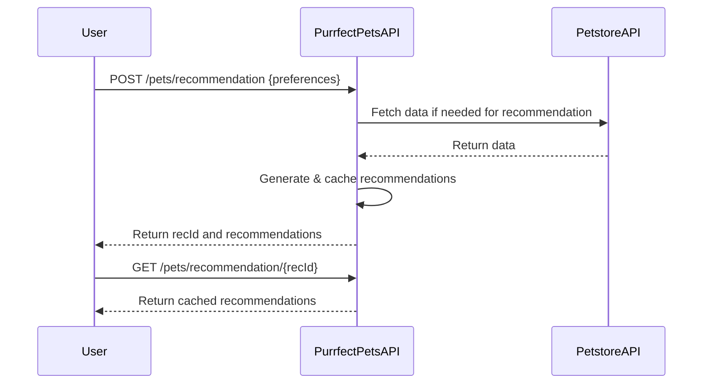

```markdown
# Purrfect Pets API - Functional Requirements

## Overview
The app integrates with the Petstore API as an external data source. All business logic involving external data retrieval or calculations is handled in POST endpoints. GET endpoints serve cached or processed results for clients.

---

## API Endpoints

### 1. POST /pets/search  
- **Purpose:** Search pets by criteria, fetch from Petstore API, process and cache results.  
- **Request:**  
```json
{
  "type": "dog",
  "status": "available",
  "tags": ["cute", "friendly"]
}
```  
- **Response:**  
```json
{
  "searchId": "uuid-generated",
  "count": 5,
  "pets": [
    {
      "id": 1,
      "name": "Fido",
      "status": "available",
      "tags": ["cute", "friendly"]
    }
  ]
}
```

### 2. GET /pets/search/{searchId}  
- **Purpose:** Retrieve cached search results by `searchId`.  
- **Response:**  
```json
{
  "searchId": "uuid-generated",
  "count": 5,
  "pets": [
    {
      "id": 1,
      "name": "Fido",
      "status": "available",
      "tags": ["cute", "friendly"]
    }
  ]
}
```

---

### 3. POST /pets/recommendation  
- **Purpose:** Generate pet recommendations based on preferences or random fun logic.  
- **Request:**  
```json
{
  "preferredType": "cat",
  "maxResults": 3
}
```  
- **Response:**  
```json
{
  "recId": "uuid-generated",
  "recommendations": [
    {
      "id": 12,
      "name": "Whiskers",
      "description": "A playful cat who loves cuddles."
    }
  ]
}
```

### 4. GET /pets/recommendation/{recId}  
- **Purpose:** Retrieve cached recommendation results by `recId`.  
- **Response:**  
```json
{
  "recId": "uuid-generated",
  "recommendations": [
    {
      "id": 12,
      "name": "Whiskers",
      "description": "A playful cat who loves cuddles."
    }
  ]
}
```

---

## User-App Interaction Sequence


```mermaid
sequenceDiagram
    participant User
    participant PurrfectPetsAPI
    participant PetstoreAPI

    User->>PurrfectPetsAPI: POST /pets/search {criteria}
    PurrfectPetsAPI->>PetstoreAPI: Fetch pets matching criteria
    PetstoreAPI-->>PurrfectPetsAPI: Return pet data
    PurrfectPetsAPI->>PurrfectPetsAPI: Process & cache results
    PurrfectPetsAPI-->>User: Return searchId and results

    User->>PurrfectPetsAPI: GET /pets/search/{searchId}
    PurrfectPetsAPI-->>User: Return cached search results
```


```mermaid
sequenceDiagram
    participant User
    participant PurrfectPetsAPI
    participant PetstoreAPI

    User->>PurrfectPetsAPI: POST /pets/recommendation {preferences}
    PurrfectPetsAPI->>PetstoreAPI: Fetch data if needed for recommendation
    PetstoreAPI-->>PurrfectPetsAPI: Return data
    PurrfectPetsAPI->>PurrfectPetsAPI: Generate & cache recommendations
    PurrfectPetsAPI-->>User: Return recId and recommendations

    User->>PurrfectPetsAPI: GET /pets/recommendation/{recId}
    PurrfectPetsAPI-->>User: Return cached recommendations
```
```