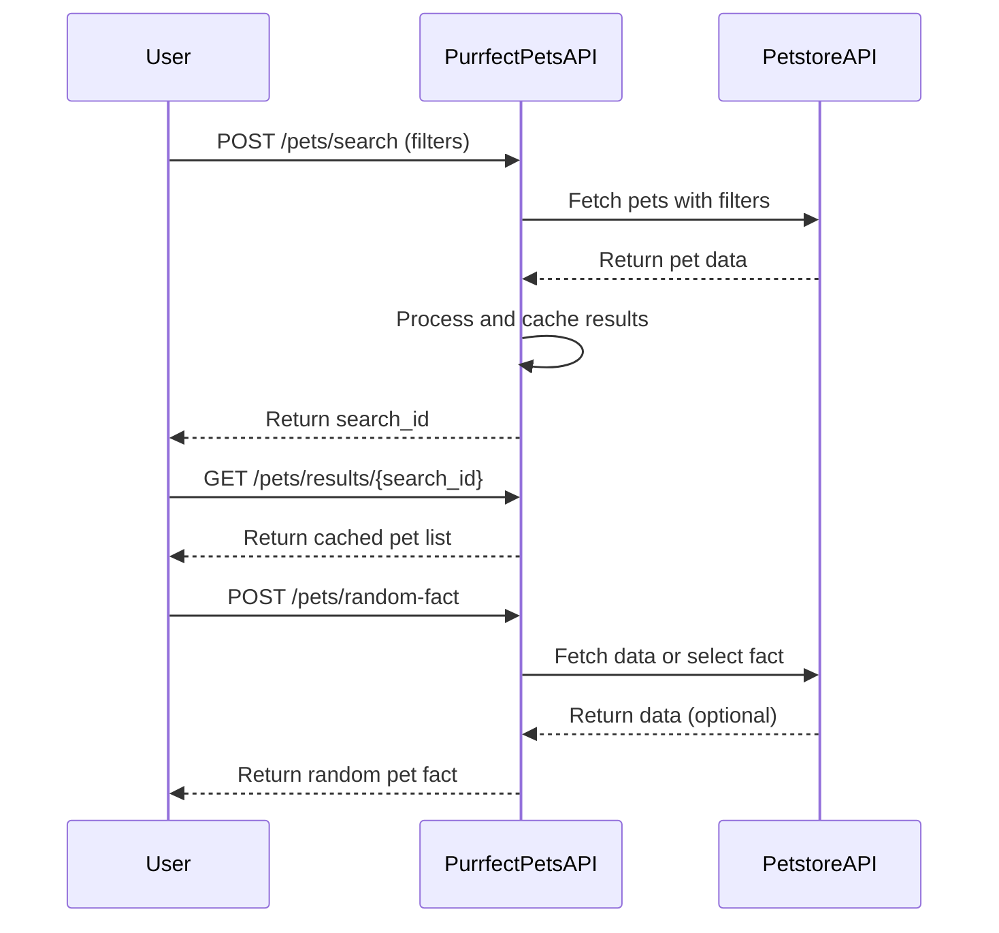

```markdown
# Purrfect Pets API - Functional Requirements

## Overview
The "Purrfect Pets" API app integrates with the Petstore API to provide pet-related data and fun features. It follows RESTful principles with:

- **POST endpoints**: Handle business logic, external API calls, data retrieval, and calculations.
- **GET endpoints**: Serve cached or processed data from our app for client retrieval.

---

## API Endpoints

### 1. `POST /pets/search`
**Purpose:** Search pets by filters (type, status, tags) using the Petstore API, process results, and store or cache them for retrieval.  
**Request JSON:**
```json
{
  "type": "string",          // optional, e.g., "cat", "dog"
  "status": "string",        // optional, e.g., "available", "sold"
  "tags": ["string"]         // optional list of tags
}
```
**Response JSON:**
```json
{
  "search_id": "string"      // unique ID to retrieve results later
}
```

---

### 2. `GET /pets/results/{search_id}`
**Purpose:** Retrieve cached or processed pet search results for a given search ID.  
**Response JSON:**
```json
{
  "pets": [
    {
      "id": "integer",
      "name": "string",
      "type": "string",
      "status": "string",
      "tags": ["string"],
      "photoUrls": ["string"]
    },
    ...
  ]
}
```

---

### 3. `POST /pets/random-fact`
**Purpose:** Generate a fun random pet fact or recommendation based on current Petstore data or predefined facts.  
**Request JSON:** *(Optional filters can be added later)*  
```json
{}
```
**Response JSON:**
```json
{
  "fact": "string"
}
```

---

## Business Logic Notes
- External Petstore API calls only happen during POST `/pets/search` and `/pets/random-fact`.
- GET endpoints serve data previously fetched and processed by POST endpoints.
- Search results should be cached or stored with a unique `search_id` for retrieval.

---

## User-App Interaction Sequence Diagram


```mermaid
sequenceDiagram
    participant User
    participant PurrfectPetsAPI
    participant PetstoreAPI

    User->>PurrfectPetsAPI: POST /pets/search (filters)
    PurrfectPetsAPI->>PetstoreAPI: Fetch pets with filters
    PetstoreAPI-->>PurrfectPetsAPI: Return pet data
    PurrfectPetsAPI->>PurrfectPetsAPI: Process and cache results
    PurrfectPetsAPI-->>User: Return search_id

    User->>PurrfectPetsAPI: GET /pets/results/{search_id}
    PurrfectPetsAPI-->>User: Return cached pet list

    User->>PurrfectPetsAPI: POST /pets/random-fact
    PurrfectPetsAPI->>PetstoreAPI: Fetch data or select fact
    PetstoreAPI-->>PurrfectPetsAPI: Return data (optional)
    PurrfectPetsAPI-->>User: Return random pet fact
```

---

## Summary
- POST endpoints trigger external data calls and processing.
- GET endpoints retrieve processed data only.
- The app supports searching pets and serving fun pet facts.
```
