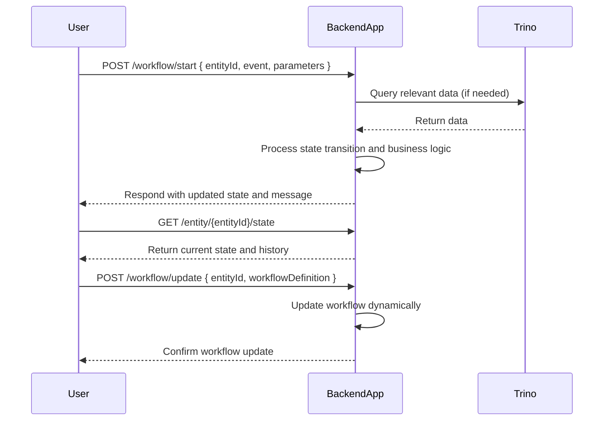

```markdown
# Functional Requirements and API Design for Cyoda-based "Hello World" Application

## Overview
This backend application is designed around Cyoda design values: an entity with a workflow triggered by events, demonstrating state machine, Trino integration, and dynamic workflows. The API follows RESTful principles with POST endpoints handling business logic and external data interactions, and GET endpoints used solely for retrieving application results.

---

## API Endpoints

### 1. Start Workflow (POST /workflow/start)
- **Purpose:** Trigger the workflow event to start the entity's state machine processing, including possible Trino queries or external data interactions.
- **Request:**
  ```json
  {
    "entityId": "string",          // Unique identifier for the entity instance
    "event": "string",             // Event name to trigger the workflow, e.g. "StartGreeting"
    "parameters": {                // Optional parameters for dynamic workflows or event context
      "language": "string"
    }
  }
  ```
- **Response:**
  ```json
  {
    "entityId": "string",
    "currentState": "string",      // Updated entity state after processing
    "message": "string"            // e.g. "Hello World" or status messages
  }
  ```

---

### 2. Update Workflow (POST /workflow/update)
- **Purpose:** Dynamically update or modify the workflow definition or parameters for an existing entity workflow.
- **Request:**
  ```json
  {
    "entityId": "string",
    "workflowDefinition": {        // New or updated workflow configuration
      "states": ["string"],
      "transitions": [
        {
          "from": "string",
          "to": "string",
          "event": "string"
        }
      ]
    }
  }
  ```
- **Response:**
  ```json
  {
    "entityId": "string",
    "status": "string"             // e.g. "Workflow updated successfully"
  }
  ```

---

### 3. Get Entity State (GET /entity/{entityId}/state)
- **Purpose:** Retrieve the current state and status information of the entity.
- **Response:**
  ```json
  {
    "entityId": "string",
    "currentState": "string",
    "history": [                   // Optional: list of past states with timestamps
      {
        "state": "string",
        "timestamp": "ISO8601 string"
      }
    ],
    "message": "string"
  }
  ```

---

## User-App Interaction Sequence


```mermaid
sequenceDiagram
  participant User
  participant BackendApp
  participant Trino

  User->>BackendApp: POST /workflow/start { entityId, event, parameters }
  BackendApp->>Trino: Query relevant data (if needed)
  Trino-->>BackendApp: Return data
  BackendApp->>BackendApp: Process state transition and business logic
  BackendApp-->>User: Respond with updated state and message

  User->>BackendApp: GET /entity/{entityId}/state
  BackendApp-->>User: Return current state and history

  User->>BackendApp: POST /workflow/update { entityId, workflowDefinition }
  BackendApp->>BackendApp: Update workflow dynamically
  BackendApp-->>User: Confirm workflow update
```

---

## Summary
- All business logic and external data retrieval (Trino) happen inside POST endpoints.
- GET endpoints serve only for retrieving current application states or results.
- The workflow is dynamic and event-driven, with the entity’s state machine at its core.
- The API supports starting workflows, updating workflows dynamically, and querying entity states.
```