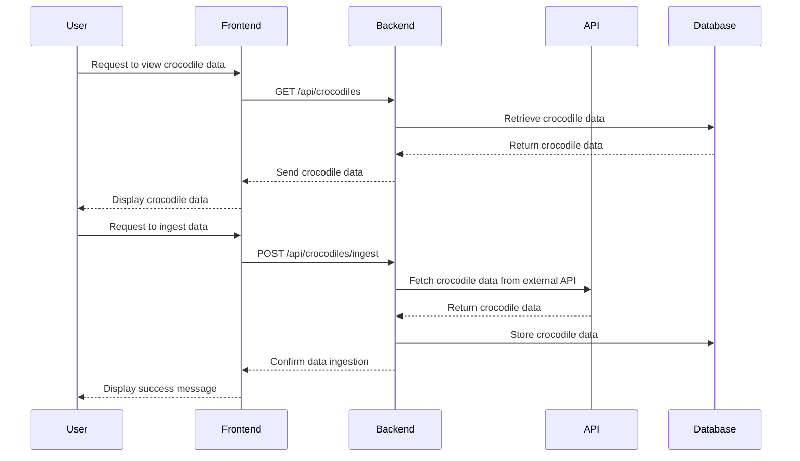

```markdown
# Functional Requirements for Crocodile Data Application

## API Endpoints

### 1. Ingest Crocodile Data
- **Endpoint**: `/api/crocodiles/ingest`
- **Method**: POST
- **Request Format**:
    - **Body**: No body, the application fetches data from the external API.
- **Response Format**:
    - **Status**: 200 OK
    - **Body**:
      ```json
      {
        "message": "Data ingested successfully.",
        "count": <number_of_crocodiles>
      }
      ```

### 2. Get Crocodile Data
- **Endpoint**: `/api/crocodiles`
- **Method**: GET
- **Request Format**:
    - **Query Parameters**:
        - `name` (optional): Filter by name (string)
        - `sex` (optional): Filter by sex (M or F)
        - `age_min` (optional): Minimum age (integer)
        - `age_max` (optional): Maximum age (integer)
- **Response Format**:
    - **Status**: 200 OK
    - **Body**:
      ```json
      [
        {
          "id": 1,
          "name": "Bert",
          "sex": "M",
          "date_of_birth": "2010-06-27",
          "age": 14
        },
        ...
      ]
      ```

### 3. Clear Crocodile Data
- **Endpoint**: `/api/crocodiles/clear`
- **Method**: POST
- **Request Format**:
    - **Body**: No body
- **Response Format**:
    - **Status**: 200 OK
    - **Body**:
      ```json
      {
        "message": "Data cleared successfully."
      }
      ```

## User-App Interaction Diagram


```mermaid
sequenceDiagram
    participant User
    participant Frontend
    participant Backend
    participant API

    User->>Frontend: Request to view crocodile data
    Frontend->>Backend: GET /api/crocodiles
    Backend->>Database: Retrieve crocodile data
    Database-->>Backend: Return crocodile data
    Backend-->>Frontend: Send crocodile data
    Frontend-->>User: Display crocodile data

    User->>Frontend: Request to ingest data
    Frontend->>Backend: POST /api/crocodiles/ingest
    Backend->>API: Fetch crocodile data from external API
    API-->>Backend: Return crocodile data
    Backend->>Database: Store crocodile data
    Backend-->>Frontend: Confirm data ingestion
    Frontend-->>User: Display success message
```
```