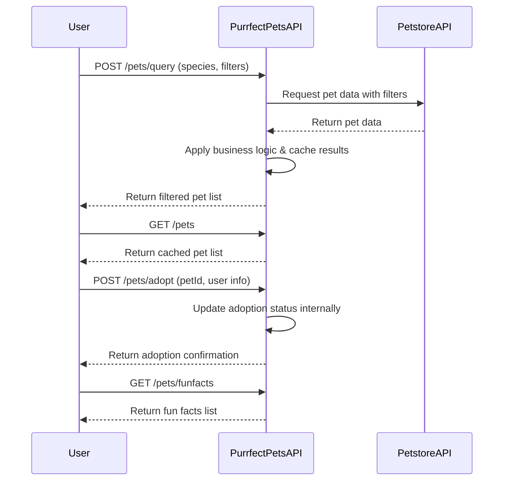

```markdown
# Purrfect Pets API Functional Requirements

## API Endpoints Overview

### 1. `POST /pets/query`
- **Description:** Fetch pet data from Petstore API based on query parameters, apply any business logic or filtering.
- **Request Body (JSON):**
  ```json
  {
    "species": "cat" | "dog" | "bird" | "all",
    "status": "available" | "pending" | "sold" | "all",
    "filters": {
      "ageRange": [minAge, maxAge],
      "color": "string",
      "nameContains": "string"
    }
  }
  ```
- **Response (JSON):**
  ```json
  {
    "pets": [
      {
        "id": "string",
        "name": "string",
        "species": "string",
        "age": "number",
        "color": "string",
        "status": "string",
        "description": "string"
      }
    ]
  }
  ```

### 2. `GET /pets`
- **Description:** Retrieve the last query result cached in the application (read-only).
- **Response (JSON):**
  ```json
  {
    "pets": [
      {
        "id": "string",
        "name": "string",
        "species": "string",
        "age": "number",
        "color": "string",
        "status": "string",
        "description": "string"
      }
    ]
  }
  ```

### 3. `POST /pets/adopt`
- **Description:** Simulate pet adoption by submitting pet ID and user info; update internal adoption status.
- **Request Body (JSON):**
  ```json
  {
    "petId": "string",
    "user": {
      "name": "string",
      "email": "string"
    }
  }
  ```
- **Response (JSON):**
  ```json
  {
    "success": true | false,
    "message": "string"
  }
  ```

### 4. `GET /pets/funfacts`
- **Description:** Retrieve a list of fun facts about pets (static or cached data).
- **Response (JSON):**
  ```json
  {
    "funFacts": [
      "Cats sleep for 70% of their lives",
      "Dogs have three eyelids"
    ]
  }
  ```

---

## User-App Interaction Sequence Diagram


```mermaid
sequenceDiagram
    participant User
    participant PurrfectPetsAPI
    participant PetstoreAPI

    User->>PurrfectPetsAPI: POST /pets/query (species, filters)
    PurrfectPetsAPI->>PetstoreAPI: Request pet data with filters
    PetstoreAPI-->>PurrfectPetsAPI: Return pet data
    PurrfectPetsAPI->>PurrfectPetsAPI: Apply business logic & cache results
    PurrfectPetsAPI-->>User: Return filtered pet list

    User->>PurrfectPetsAPI: GET /pets
    PurrfectPetsAPI-->>User: Return cached pet list

    User->>PurrfectPetsAPI: POST /pets/adopt (petId, user info)
    PurrfectPetsAPI->>PurrfectPetsAPI: Update adoption status internally
    PurrfectPetsAPI-->>User: Return adoption confirmation

    User->>PurrfectPetsAPI: GET /pets/funfacts
    PurrfectPetsAPI-->>User: Return fun facts list
```
```