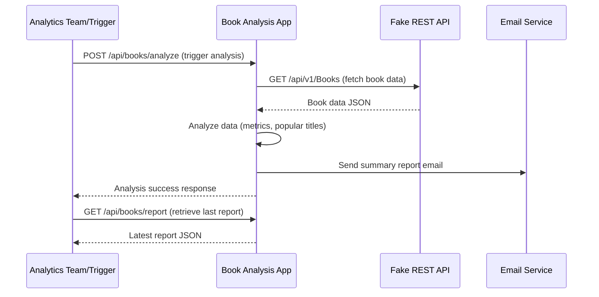

```markdown
# Functional Requirements for Book Data Analysis Application

## API Endpoints

### 1. POST /api/books/analyze
- **Purpose:** Trigger retrieval of book data from the Fake REST API, analyze key metrics, generate a summary report, and email it to the analytics team.
- **Request:**
  ```json
  {
    "triggerDate": "YYYY-MM-DD"  // Optional, defaults to current date if omitted
  }
  ```
- **Response:**
  ```json
  {
    "status": "success",
    "message": "Analysis complete, report sent via email",
    "reportSummary": {
      "totalBooks": 123,
      "totalPageCount": 45678,
      "popularTitlesCount": 5
    }
  }
  ```

### 2. GET /api/books/report
- **Purpose:** Retrieve the latest generated summary report.
- **Response:**
  ```json
  {
    "generatedAt": "YYYY-MM-DDTHH:mm:ssZ",
    "totalBooks": 123,
    "totalPageCount": 45678,
    "publicationDateRange": {
      "earliest": "YYYY-MM-DD",
      "latest": "YYYY-MM-DD"
    },
    "popularTitles": [
      {
        "id": 1,
        "title": "Book Title 1",
        "description": "Brief description",
        "excerpt": "Excerpt text",
        "pageCount": 500,
        "publishDate": "YYYY-MM-DD"
      }
      // ... additional popular titles
    ]
  }
  ```

---

## Business Logic Flow

- The POST endpoint:
  - Fetches all books data from the Fake REST API.
  - Calculates total page counts.
  - Identifies popular titles based on highest pageCount.
  - Generates a summary report.
  - Emails the report to the analytics team.
  - Stores the report for retrieval.

- The GET endpoint:
  - Returns the most recently generated report.

---

## User-App Interaction Sequence Diagram


```mermaid
sequenceDiagram
    participant User as Analytics Team/Trigger
    participant App as Book Analysis App
    participant API as Fake REST API
    participant Mail as Email Service

    User->>App: POST /api/books/analyze (trigger analysis)
    App->>API: GET /api/v1/Books (fetch book data)
    API-->>App: Book data JSON
    App->>App: Analyze data (metrics, popular titles)
    App->>Mail: Send summary report email
    App-->>User: Analysis success response

    User->>App: GET /api/books/report (retrieve last report)
    App-->>User: Latest report JSON
```

---

## Summary

- POST endpoint handles external data retrieval, analysis, report generation, and email dispatch.
- GET endpoint serves the latest report to users.
- Report includes total books, total page counts, publication date range, and details of popular titles.
- Popular titles are defined by the highest pageCount.

```
If you have no further changes, I’m ready to proceed with implementation!