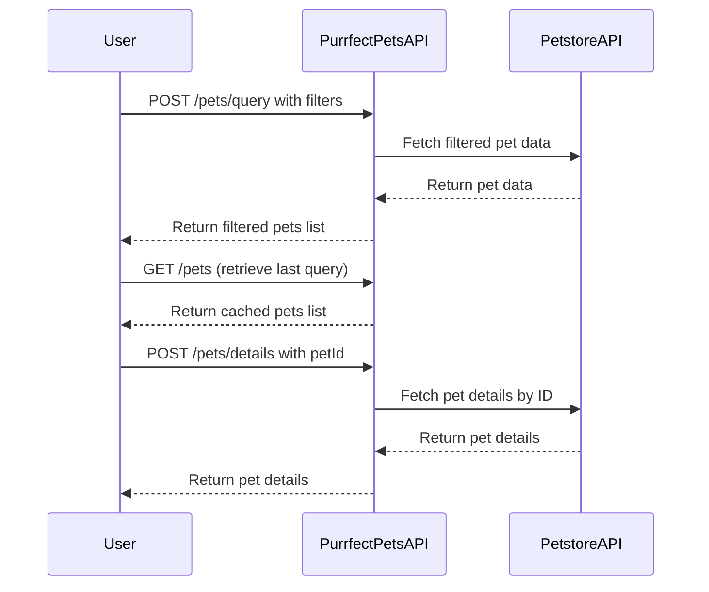

```markdown
# Purrfect Pets API - Functional Requirements

## API Endpoints

### 1. POST `/pets/query`
- **Purpose:** Query pets data from Petstore API with filters and business logic.
- **Request Body (JSON):**
  ```json
  {
    "filters": {
      "type": "string",        // optional, e.g. "dog", "cat"
      "status": "string",      // optional, e.g. "available", "sold"
      "name": "string"         // optional, partial or full pet name
    }
  }
  ```
- **Response Body (JSON):**
  ```json
  {
    "pets": [
      {
        "id": "integer",
        "name": "string",
        "type": "string",
        "status": "string",
        "photoUrls": ["string"]
      }
    ]
  }
  ```

### 2. GET `/pets`
- **Purpose:** Retrieve the last queried pets results stored in the application.
- **Response Body (JSON):**
  ```json
  {
    "pets": [
      {
        "id": "integer",
        "name": "string",
        "type": "string",
        "status": "string",
        "photoUrls": ["string"]
      }
    ]
  }
  ```

### 3. POST `/pets/details`
- **Purpose:** Retrieve detailed info for a specific pet by ID, invoking Petstore API.
- **Request Body (JSON):**
  ```json
  {
    "petId": "integer"
  }
  ```
- **Response Body (JSON):**
  ```json
  {
    "id": "integer",
    "name": "string",
    "type": "string",
    "status": "string",
    "photoUrls": ["string"],
    "tags": ["string"],
    "description": "string"
  }
  ```

---

## Business Logic Notes
- All external API calls to Petstore happen inside POST endpoints.
- GET endpoints serve cached or stored data results only.
- Filters in `/pets/query` are optional; if absent, all pets returned.
- Detailed pet info fetched separately via `/pets/details` to keep queries lightweight.

---

## User-App Interaction Sequence


```mermaid
sequenceDiagram
    participant User
    participant PurrfectPetsAPI
    participant PetstoreAPI

    User->>PurrfectPetsAPI: POST /pets/query with filters
    PurrfectPetsAPI->>PetstoreAPI: Fetch filtered pet data
    PetstoreAPI-->>PurrfectPetsAPI: Return pet data
    PurrfectPetsAPI-->>User: Return filtered pets list

    User->>PurrfectPetsAPI: GET /pets (retrieve last query)
    PurrfectPetsAPI-->>User: Return cached pets list

    User->>PurrfectPetsAPI: POST /pets/details with petId
    PurrfectPetsAPI->>PetstoreAPI: Fetch pet details by ID
    PetstoreAPI-->>PurrfectPetsAPI: Return pet details
    PurrfectPetsAPI-->>User: Return pet details
```

---

## User Journey Overview

```mermaid
flowchart TD
    A[User] --> B[Query pets with filters (POST /pets/query)]
    B --> C[API fetches pets from Petstore]
    C --> D[API returns filtered pets list]
    D --> E[User views pets list]

    E --> F{Select pet for details?}
    F -- Yes --> G[Request pet details (POST /pets/details)]
    G --> H[API fetches pet details from Petstore]
    H --> I[API returns pet details]
    I --> J[User views pet details]
    
    F -- No --> K[End]
```
```