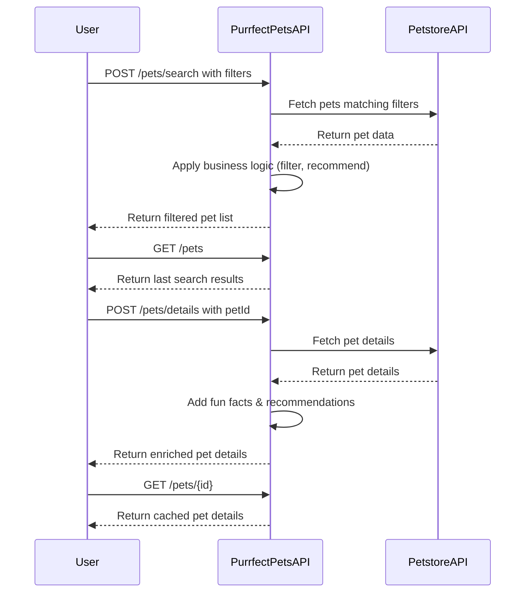

```markdown
# Functional Requirements for 'Purrfect Pets' API App

## API Endpoints

### 1. POST /pets/search  
- **Purpose:** Search pets by criteria, retrieve data from Petstore API, and apply business logic (e.g., filtering, sorting, recommendations).  
- **Request:**  
```json
{
  "type": "dog",          // optional, pet type filter
  "status": "available",  // optional, availability filter
  "ageRange": {           // optional, age filter
    "min": 1,
    "max": 5
  }
}
```  
- **Response:**  
```json
{
  "pets": [
    {
      "id": 123,
      "name": "Fluffy",
      "type": "dog",
      "age": 3,
      "status": "available",
      "description": "A playful dog who loves fetch"
    }
  ]
}
```

---

### 2. GET /pets  
- **Purpose:** Retrieve cached or last searched pets list (results from previous POST search).  
- **Request:** None  
- **Response:** Same format as POST /pets/search response.

---

### 3. POST /pets/details  
- **Purpose:** Get detailed information about a specific pet by ID, possibly enriched with fun facts or recommendations.  
- **Request:**  
```json
{
  "petId": 123
}
```  
- **Response:**  
```json
{
  "id": 123,
  "name": "Fluffy",
  "type": "dog",
  "age": 3,
  "status": "available",
  "description": "A playful dog who loves fetch",
  "funFact": "Dogs have about 1,700 taste buds!",
  "recommendedToys": ["ball", "frisbee"]
}
```

---

### 4. GET /pets/{id}  
- **Purpose:** Retrieve cached detailed pet information by pet ID.  
- **Response:** Same as POST /pets/details response.

---

## User-App Interaction Sequence


```mermaid
sequenceDiagram
  participant User
  participant PurrfectPetsAPI
  participant PetstoreAPI

  User->>PurrfectPetsAPI: POST /pets/search with filters
  PurrfectPetsAPI->>PetstoreAPI: Fetch pets matching filters
  PetstoreAPI-->>PurrfectPetsAPI: Return pet data
  PurrfectPetsAPI->>PurrfectPetsAPI: Apply business logic (filter, recommend)
  PurrfectPetsAPI-->>User: Return filtered pet list

  User->>PurrfectPetsAPI: GET /pets
  PurrfectPetsAPI-->>User: Return last search results

  User->>PurrfectPetsAPI: POST /pets/details with petId
  PurrfectPetsAPI->>PetstoreAPI: Fetch pet details
  PetstoreAPI-->>PurrfectPetsAPI: Return pet details
  PurrfectPetsAPI->>PurrfectPetsAPI: Add fun facts & recommendations
  PurrfectPetsAPI-->>User: Return enriched pet details

  User->>PurrfectPetsAPI: GET /pets/{id}
  PurrfectPetsAPI-->>User: Return cached pet details
```

---

## Notes  
- All POST endpoints handle external API calls and business logic.  
- GET endpoints serve cached or previously computed data for faster retrieval.  
- Request/response formats use JSON.  
- Business logic includes filtering, enrichment, and recommendations.
```