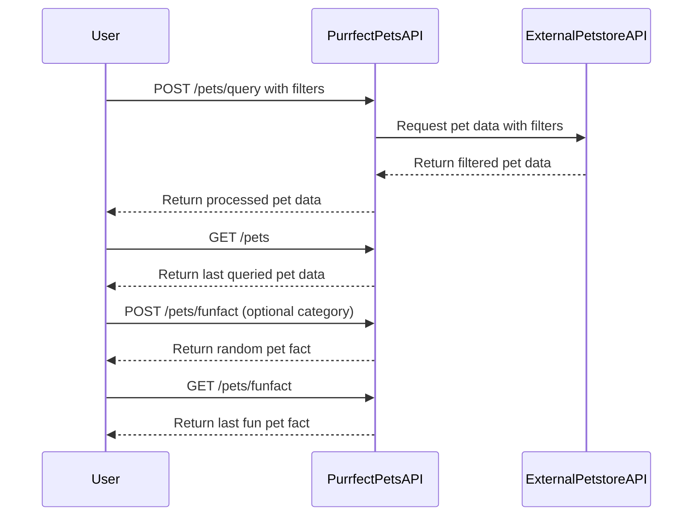

```markdown
# Purrfect Pets API - Functional Requirements

## API Endpoints

### 1. POST /pets/query
- **Purpose:** Query pet data from external Petstore API, apply any business logic or calculations.
- **Request:**
  ```json
  {
    "filter": {
      "status": "available" | "pending" | "sold",
      "category": "string",
      "tags": ["string"]
    }
  }
  ```
- **Response:**
  ```json
  {
    "pets": [
      {
        "id": "integer",
        "name": "string",
        "category": "string",
        "status": "string",
        "tags": ["string"]
      }
    ],
    "count": "integer"
  }
  ```

### 2. GET /pets
- **Purpose:** Retrieve the latest pet query results stored in the application (results from last POST /pets/query).
- **Response:**
  ```json
  {
    "pets": [
      {
        "id": "integer",
        "name": "string",
        "category": "string",
        "status": "string",
        "tags": ["string"]
      }
    ],
    "count": "integer"
  }
  ```

### 3. POST /pets/funfact
- **Purpose:** Generate and return a random fun pet fact (business logic handled internally).
- **Request:** Optional category filter:
  ```json
  {
    "category": "string" // optional, e.g., "cat", "dog"
  }
  ```
- **Response:**
  ```json
  {
    "fact": "string"
  }
  ```

### 4. GET /pets/funfact
- **Purpose:** Retrieve the last generated fun pet fact.
- **Response:**
  ```json
  {
    "fact": "string"
  }
  ```

---

## User-App Interaction Sequence Diagram


```mermaid
sequenceDiagram
    participant User
    participant PurrfectPetsAPI
    participant ExternalPetstoreAPI

    User->>PurrfectPetsAPI: POST /pets/query with filters
    PurrfectPetsAPI->>ExternalPetstoreAPI: Request pet data with filters
    ExternalPetstoreAPI-->>PurrfectPetsAPI: Return filtered pet data
    PurrfectPetsAPI-->>User: Return processed pet data

    User->>PurrfectPetsAPI: GET /pets
    PurrfectPetsAPI-->>User: Return last queried pet data

    User->>PurrfectPetsAPI: POST /pets/funfact (optional category)
    PurrfectPetsAPI-->>User: Return random pet fact

    User->>PurrfectPetsAPI: GET /pets/funfact
    PurrfectPetsAPI-->>User: Return last fun pet fact
```

---

## User Journey Diagram

```mermaid
graph LR
    A[User] --> B[Query pets (POST /pets/query)]
    B --> C[App fetches data from Petstore API]
    C --> D[App processes & stores results]
    D --> E[User retrieves pet data (GET /pets)]
    A --> F[Request fun pet fact (POST /pets/funfact)]
    F --> G[App generates fun fact]
    G --> H[User retrieves last fun fact (GET /pets/funfact)]
```
```