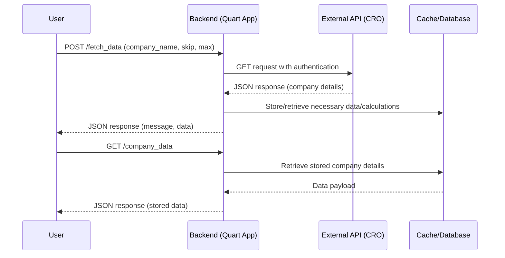

# Functional Requirements Document

## 1. Overview

This document outlines the functional requirements for a backend application developed using Quart. The application will interact with an external API to retrieve company details and provide a user interface to display these details.

## 2. API Endpoints

### 2.1 POST /fetch_data

- **Purpose**:  
  Invokes the external data source (CRO API) to retrieve company details and perform any necessary data calculations.

- **Request Format**:  
  - **Content-Type**: application/json  
  - **Body**:  
    ```json
    {
      "company_name": "ryanair",    // Name of the company to fetch data for.
      "skip": 0,                    // Pagination parameter for the external API.
      "max": 5                      // Maximum number of results to retrieve.
    }
    ```

- **Response Format**:  
  - **Content-Type**: application/json  
  - **Body (Success – HTTP 201 Created)**:  
    ```json
    {
      "message": "Data retrieved successfully",
      "data": { 
        // External API response data as a JSON object.
      }
    }
    ```
  - **Body (Error – HTTP 4xx/5xx)**:  
    ```json
    {
      "message": "Error description",
      "details": "Any additional error information"
    }
    ```

### 2.2 GET /company_data

- **Purpose**:  
  Retrieves the company details previously fetched by the POST endpoint.

- **Request Format**:  
  - No body required.

- **Response Format**:  
  - **Content-Type**: application/json  
  - **Body (Success – HTTP 200 OK)**:  
    ```json
    {
      "data": { 
        // Stored or cached company data retrieved from previous POST request.
      }
    }
    ```
  - **Body (Error – HTTP 4xx/5xx)**:  
    ```json
    {
      "message": "Error description",
      "details": "Any additional error information"
    }
    ```

## 3. Business Logic

- The **POST /fetch_data** endpoint directly interacts with the external API, initiating an HTTP GET request with basic authentication and parsing the JSON response.
- The **GET /company_data** endpoint retrieves processed or cached results from the application without making external API calls.
- Implement error handling, logging, and caching strategies to enhance performance and reliability.

## 4. User-App Interaction Diagrams

### 4.1 Journey Diagram


```mermaid
journey
    title User Journey for Company Data Retrieval
    section Data Fetch
      User: Initiates data fetch via POST /fetch_data: 5: Backend
      Backend: Calls external CRO API: 4: API Service
      API Service: Returns company data: 4: Backend
      Backend: Processes and stores data: 4: Database/Cache

    section Data Retrieval
      User: Requests data via GET /company_data: 5: Backend
      Backend: Retrieves stored data: 4: Database/Cache
      Backend: Returns data: 4: User
```

### 4.2 Sequence Diagram


```mermaid
sequenceDiagram
    participant U as User
    participant B as Backend (Quart App)
    participant E as External API (CRO)
    participant DB as Cache/Database

    U->>B: POST /fetch_data (company_name, skip, max)
    B->>E: GET request with authentication
    E-->>B: JSON response (company details)
    B->>DB: Store/retrieve necessary data/calculations
    B-->>U: JSON response (message, data)

    U->>B: GET /company_data
    B->>DB: Retrieve stored company details
    DB-->>B: Data payload
    B-->>U: JSON response (stored data)
```

## 5. Summary

This document provides a clear outline of the functional requirements necessary for building the backend application. By adhering to these specifications, the development process can be streamlined, ensuring that all critical aspects are addressed.