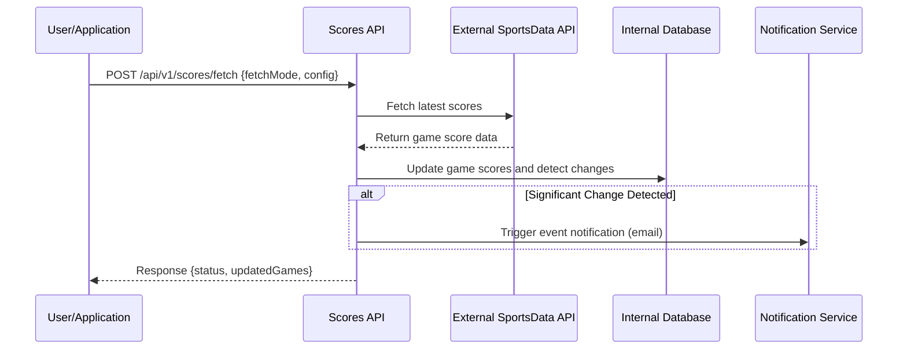
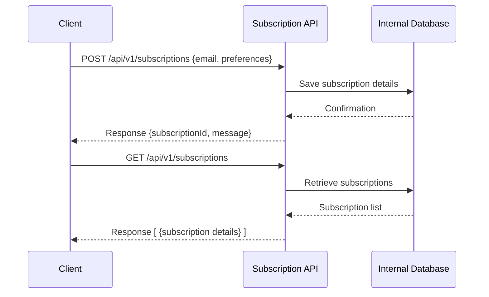

# Functional Requirements Document

## 1. Overview

This document outlines the functional requirements for the NBA Game Score Data Ingestion application. The application aims to fetch real-time NBA game score data from an external API, process the data, and notify users of significant updates via email.

## 2. API Endpoints

All external data retrieval or business logic calculations are performed on POST endpoints. GET endpoints are used only for retrieving results from the system’s internal storage.

### 2.1. Score Data Endpoints

#### POST /api/v1/scores/fetch
- **Description:** 
  - Triggers the external data retrieval from the NBA SportsData API and processes the response. 
  - Fetches the latest game scores, analyzes the data for significant changes, updates the internal database, and triggers event notifications (e.g., email).
  
- **Request Format (application/json):**
  ```json
  {
    "fetchMode": "manual",        
    "config": {
      "interval": 60,             
      "date": "YYYY-MM-DD"        
    }
  }
  ```

- **Response Format (application/json):**
  ```json
  {
    "status": "success",
    "updatedGames": [
      {
        "gameId": 12345,
        "awayTeam": "BKN",
        "homeTeam": "PHI",
        "awayTeamScore": 101,
        "homeTeamScore": 102,
        "status": "In Progress",
        "eventTriggered": true
      }
    ]
  }
  ```

#### GET /api/v1/scores
- **Description:** 
  - Retrieves the current NBA game score data stored in the internal system.

- **Response Format (application/json):**
  ```json
  [
    {
      "gameId": 12345,
      "awayTeam": "BKN",
      "homeTeam": "PHI",
      "awayTeamScore": 101,
      "homeTeamScore": 102,
      "status": "In Progress",
      "updatedAt": "2023-10-10T12:34:56Z"
    }
  ]
  ```

### 2.2. Subscription Management Endpoints

#### POST /api/v1/subscriptions
- **Description:** 
  - Creates a new subscription for receiving event notifications via email.

- **Request Format (application/json):**
  ```json
  {
    "email": "user@example.com",
    "preferences": ["scoreUpdates", "gameStart", "gameEnd"]
  }
  ```

- **Response Format (application/json):**
  ```json
  {
    "subscriptionId": "abc123",
    "message": "Subscription created successfully."
  }
  ```

#### GET /api/v1/subscriptions
- **Description:** 
  - Retrieves a list of active subscriptions.

- **Response Format (application/json):**
  ```json
  [
    {
      "subscriptionId": "abc123",
      "email": "user@example.com",
      "preferences": ["scoreUpdates", "gameStart", "gameEnd"],
      "createdAt": "2023-10-10T10:20:30Z"
    }
  ]
  ```

#### PUT /api/v1/subscriptions/{subscriptionId}
- **Description:** 
  - Updates an existing subscription.

- **Request Format (application/json):**
  ```json
  {
    "email": "user@example.com",
    "preferences": ["scoreUpdates"]
  }
  ```

- **Response Format (application/json):**
  ```json
  {
    "subscriptionId": "abc123",
    "message": "Subscription updated successfully."
  }
  ```

#### DELETE /api/v1/subscriptions/{subscriptionId}
- **Description:** 
  - Deletes an existing subscription.

- **Response Format (application/json):**
  ```json
  {
    "subscriptionId": "abc123",
    "message": "Subscription deleted successfully."
  }
  ```

## 3. User-App Interaction Diagrams

### 3.1. Score Data Fetch and Event Publishing Flow


```mermaid
sequenceDiagram
    participant U as User/Application
    participant API as Scores API
    participant Ext as External SportsData API
    participant DB as Internal Database
    participant N as Notification Service

    U->>API: POST /api/v1/scores/fetch {fetchMode, config}
    API->>Ext: Fetch latest scores
    Ext-->>API: Return game score data
    API->>DB: Update game scores and detect changes
    alt Significant Change Detected
      API->>N: Trigger event notification (email)
    end
    API-->>U: Response {status, updatedGames}
```

### 3.2. Subscription Management Flow


```mermaid
sequenceDiagram
    participant C as Client
    participant API as Subscription API
    participant DB as Internal Database

    C->>API: POST /api/v1/subscriptions {email, preferences}
    API->>DB: Save subscription details
    DB-->>API: Confirmation
    API-->>C: Response {subscriptionId, message}

    C->>API: GET /api/v1/subscriptions
    API->>DB: Retrieve subscriptions
    DB-->>API: Subscription list
    API-->>C: Response [ {subscription details} ]
```

## 4. Business Logic Considerations

- External API calls, data aggregation, and calculations are triggered only via POST endpoints.
- GET endpoints provide read-only access to pre-calculated/stored results.
- Consistent JSON request/response formats are enforced across all endpoints.
- Retry logic, error logging, and failure notifications (via email) are integrated into the POST /api/v1/scores/fetch endpoint.