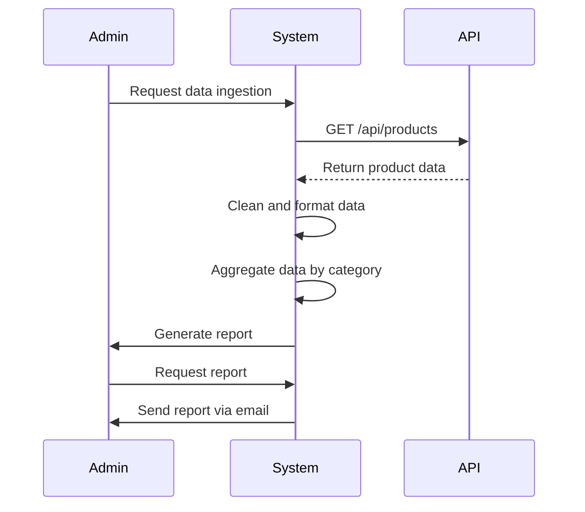

Here is a well-formatted final list of functional requirements for your application:

### Functional Requirements

#### 1. Data Ingestion
- **User Story**: As a system, I want to retrieve product data from the Automation Exercise API so that I can have the latest product information for analysis.
- **API Endpoint**: `GET /api/products`
  - **Request**: No parameters required.
  - **Response Format**:
    ```json
    {
      "products": [
        {
          "id": 1,
          "name": "Product A",
          "category": "Category 1",
          "price": 100,
          "stock": 50
        },
        ...
      ]
    }
    ```

#### 2. Data Transformation
- **User Story**: As a system, I want to clean and format the product data so that it is ready for aggregation.
- **Transformation Rules**: 
  - Remove duplicates.
  - Standardize currency format.
  - Handle missing values.

#### 3. Aggregation
- **User Story**: As a system, I want to aggregate product data by category to summarize total stock and average price.
- **API Endpoint**: `POST /api/aggregate`
  - **Request**:
    ```json
    {
      "criteria": "category"
    }
    ```
  - **Response Format**:
    ```json
    {
      "aggregatedData": [
        {
          "category": "Category 1",
          "totalStock": 200,
          "averagePrice": 150
        },
        ...
      ]
    }
    ```

#### 4. Reporting
- **User Story**: As an admin, I want to receive a report summarizing the aggregated data so that I can make informed decisions.
- **API Endpoint**: `GET /api/report`
  - **Response Format**: Report in a specified format (e.g., CSV or JSON).

#### 5. Publishing
- **User Story**: As a system, I want to send the generated report to the admin email so that they can review it.
- **API Endpoint**: `POST /api/send-report`
  - **Request**:
    ```json
    {
      "email": "admin@example.com",
      "reportFormat": "CSV"
    }
    ```
  - **Response Format**:
    ```json
    {
      "status": "success",
      "message": "Report sent successfully."
    }
    ```

#### 6. Scheduling
- **User Story**: As a system, I want to schedule the data ingestion process to occur once a day automatically.
- **Implementation**: Use a task scheduler such as Celery or cron jobs to handle daily ingestion.

### User Interaction Diagram


```mermaid
sequenceDiagram
    participant Admin
    participant System
    participant API

    Admin->>System: Request data ingestion
    System->>API: GET /api/products
    API-->>System: Return product data
    System->>System: Clean and format data
    System->>System: Aggregate data by category
    System->>Admin: Generate report
    Admin->>System: Request report
    System->>Admin: Send report via email
```

This structured format clearly outlines the functional requirements, making it easier to understand and implement your application. If you have