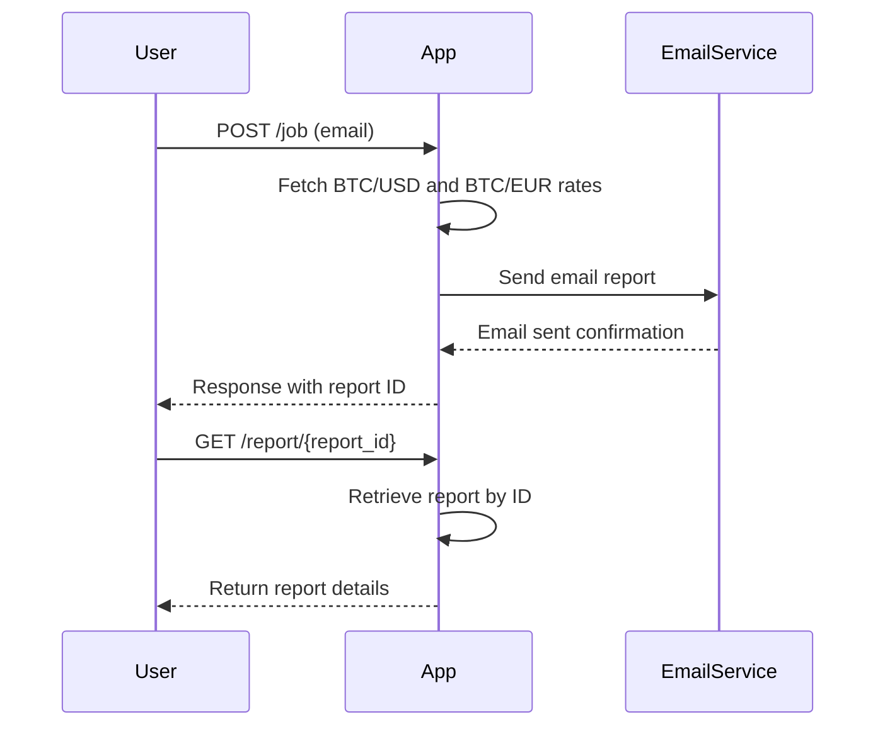

Here are the final functional requirements for your application, structured clearly and concisely:

### Functional Requirements

---

#### User Story 1: Initiate Report Creation

- **Description**: As a user, I want to initiate a report creation process so that I can receive the latest Bitcoin conversion rates.
- **Endpoint**: `POST /job`
- **Request Format**:
  ```json
  {
    "email": "user@example.com"
  }
  ```
- **Response Format**:
  ```json
  {
    "report_id": "12345",
    "status": "Report is being generated."
  ```
- **Processing**:
  - Fetch the latest BTC/USD and BTC/EUR conversion rates from a specified API.
  - Trigger the sending of an email report to the provided email address.

---

#### User Story 2: Retrieve Report by ID

- **Description**: As a user, I want to retrieve my report using its ID so that I can view the conversion rates.
- **Endpoint**: `GET /report/{report_id}`
- **Request Format**: N/A (report_id is part of the URL)
- **Response Format**:
  ```json
  {
    "report_id": "12345",
    "btc_usd_rate": "X.XX",
    "btc_eur_rate": "Y.YY",
    "timestamp": "2023-10-01T12:00:00Z",
    "email_sent": true
  }
  ```
- **Processing**:
  - Retrieve the stored report using the provided report ID.
  - Return the conversion rates and relevant metadata.

---

### Additional Considerations

- **Email Configuration**: The application should support SMTP configuration for sending email reports.
- **Error Handling**: Proper error handling should be implemented for scenarios such as failed rate retrieval or email sending.
- **Storage Mechanism**: Reports should be stored in a database for retrieval by ID.
- **Rate Retrieval Source**: Identify and integrate with a reliable API for fetching Bitcoin rates.
- **Security**: Consider implementing authentication and authorization for accessing the endpoints.

### Diagram


```mermaid
sequenceDiagram
    participant User
    participant App
    participant EmailService

    User->>App: POST /job (email)
    App->>App: Fetch BTC/USD and BTC/EUR rates
    App->>EmailService: Send email report
    EmailService-->>App: Email sent confirmation
    App-->>User: Response with report ID

    User->>App: GET /report/{report_id}
    App->>App: Retrieve report by ID
    App-->>User: Return report details
```

These requirements provide a solid foundation for the development of your application. Please let me know if you would like to add or modify any aspects!