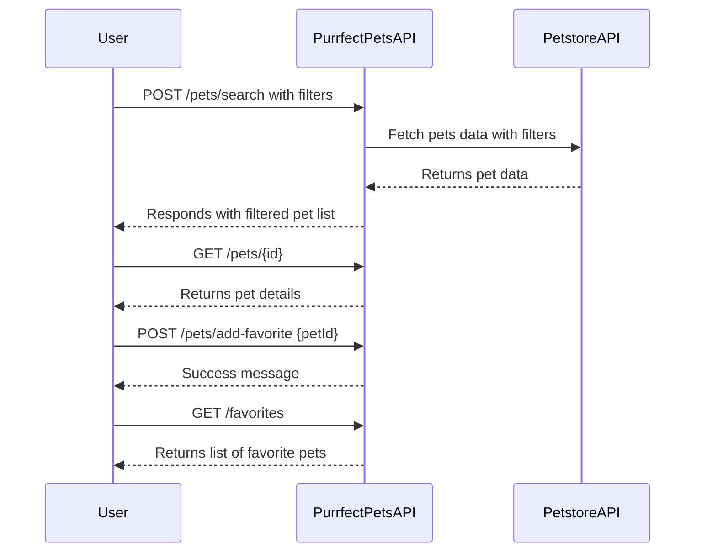

```markdown
# Functional Requirements for Purrfect Pets API App

## API Endpoints

### 1. POST /pets/search
- **Description:** Search pets using criteria; fetches data from Petstore API and applies business logic.
- **Request Body:**
```json
{
  "type": "string (optional)",      // e.g., "dog", "cat"
  "status": "string (optional)",    // e.g., "available", "sold"
  "name": "string (optional)"       // partial or full pet name
}
```
- **Response Body:**
```json
{
  "pets": [
    {
      "id": "integer",
      "name": "string",
      "type": "string",
      "status": "string",
      "description": "string (optional)"
    }
  ]
}
```

---

### 2. GET /pets/{id}
- **Description:** Retrieve detailed pet information from the app cache or previously fetched data.
- **Response Body:**
```json
{
  "id": "integer",
  "name": "string",
  "type": "string",
  "status": "string",
  "description": "string (optional)"
}
```

---

### 3. POST /pets/add-favorite
- **Description:** Add a pet to user's favorites (business logic handled internally).
- **Request Body:**
```json
{
  "petId": "integer"
}
```
- **Response Body:**
```json
{
  "success": true,
  "message": "Pet added to favorites"
}
```

---

### 4. GET /favorites
- **Description:** Retrieve user's favorite pets.
- **Response Body:**
```json
{
  "favorites": [
    {
      "id": "integer",
      "name": "string",
      "type": "string",
      "status": "string"
    }
  ]
}
```

---

## User-App Interaction Sequence Diagram


```mermaid
sequenceDiagram
    participant User
    participant PurrfectPetsAPI
    participant PetstoreAPI

    User->>PurrfectPetsAPI: POST /pets/search with filters
    PurrfectPetsAPI->>PetstoreAPI: Fetch pets data with filters
    PetstoreAPI-->>PurrfectPetsAPI: Returns pet data
    PurrfectPetsAPI-->>User: Responds with filtered pet list

    User->>PurrfectPetsAPI: GET /pets/{id}
    PurrfectPetsAPI-->>User: Returns pet details

    User->>PurrfectPetsAPI: POST /pets/add-favorite {petId}
    PurrfectPetsAPI-->>User: Success message

    User->>PurrfectPetsAPI: GET /favorites
    PurrfectPetsAPI-->>User: Returns list of favorite pets
```

---

## Summary

- POST endpoints are used for any operation involving external data fetching or business logic.
- GET endpoints are used only for retrieving app-stored results.
- Request and response formats use JSON.
- Basic favorite management is included for user interaction.
```
