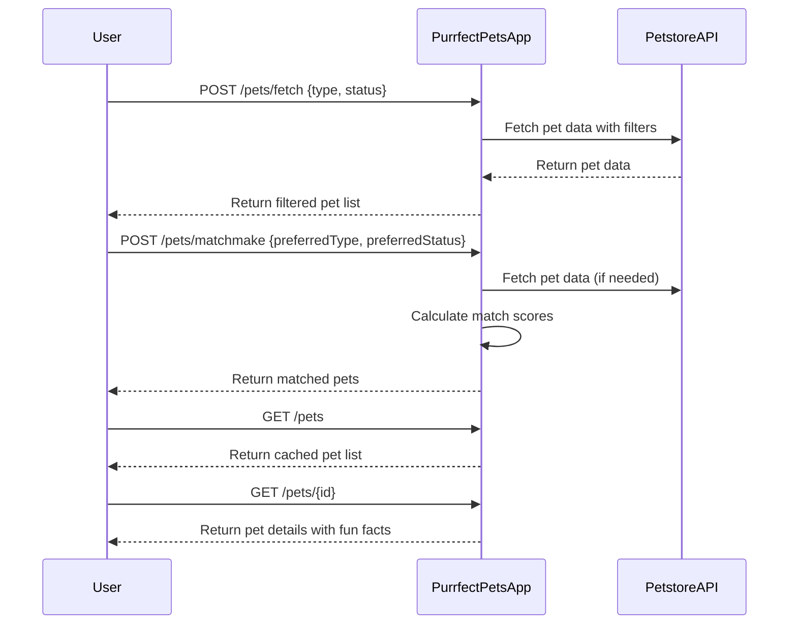

```markdown
# Purrfect Pets API - Functional Requirements

## Overview
The API provides pet-related functionality based on Petstore API data, focusing on fun and interactive features. All external data retrieval or business logic is done via POST endpoints, while GET endpoints serve cached or processed application results.

---

## API Endpoints

### 1. POST /pets/fetch
- **Purpose:** Retrieve pet data from the external Petstore API based on filters.
- **Request:**
  ```json
  {
    "type": "string",      // optional, e.g., "cat", "dog"
    "status": "string"     // optional, e.g., "available", "sold"
  }
  ```
- **Response:**
  ```json
  {
    "pets": [
      {
        "id": "integer",
        "name": "string",
        "type": "string",
        "status": "string",
        "photoUrls": ["string"]
      },
      ...
    ]
  }
  ```

### 2. POST /pets/matchmake
- **Purpose:** Perform a fun matchmaking logic to suggest pets based on user preferences.
- **Request:**
  ```json
  {
    "preferredType": "string",    // e.g., "cat"
    "preferredStatus": "string"   // e.g., "available"
  }
  ```
- **Response:**
  ```json
  {
    "matchedPets": [
      {
        "id": "integer",
        "name": "string",
        "type": "string",
        "status": "string",
        "matchScore": "number"
      },
      ...
    ]
  }
  ```

### 3. GET /pets
- **Purpose:** Retrieve the list of pets currently stored or cached in the app.
- **Response:**
  ```json
  {
    "pets": [
      {
        "id": "integer",
        "name": "string",
        "type": "string",
        "status": "string",
        "photoUrls": ["string"]
      },
      ...
    ]
  }
  ```

### 4. GET /pets/{id}
- **Purpose:** Retrieve details of a specific pet by ID.
- **Response:**
  ```json
  {
    "id": "integer",
    "name": "string",
    "type": "string",
    "status": "string",
    "photoUrls": ["string"],
    "description": "string"  // Optional, fun facts or notes
  }
  ```

---

## Business Logic Notes
- External Petstore API calls happen only inside POST endpoints (e.g., `/pets/fetch`, `/pets/matchmake`).
- GET endpoints serve cached or processed data from the application database or memory.
- Matchmaking logic uses simple scoring based on user preferences.
- Fun facts or descriptions can be generated or fetched internally.

---

## User-App Interaction Sequence


```mermaid
sequenceDiagram
  participant User
  participant PurrfectPetsApp
  participant PetstoreAPI
  
  User->>PurrfectPetsApp: POST /pets/fetch {type, status}
  PurrfectPetsApp->>PetstoreAPI: Fetch pet data with filters
  PetstoreAPI-->>PurrfectPetsApp: Return pet data
  PurrfectPetsApp-->>User: Return filtered pet list

  User->>PurrfectPetsApp: POST /pets/matchmake {preferredType, preferredStatus}
  PurrfectPetsApp->>PetstoreAPI: Fetch pet data (if needed)
  PurrfectPetsApp->>PurrfectPetsApp: Calculate match scores
  PurrfectPetsApp-->>User: Return matched pets

  User->>PurrfectPetsApp: GET /pets
  PurrfectPetsApp-->>User: Return cached pet list

  User->>PurrfectPetsApp: GET /pets/{id}
  PurrfectPetsApp-->>User: Return pet details with fun facts
```
```