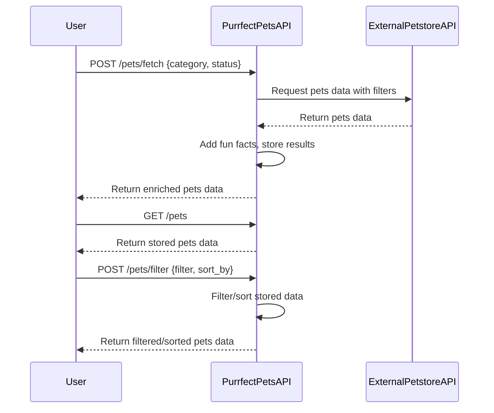

```markdown
# Purrfect Pets API - Functional Requirements

## Overview  
The app interacts with an external Petstore API to fetch pet data. All external data fetching or business logic happens via POST endpoints. GET endpoints are used only to retrieve processed or stored results from our app.

---

## API Endpoints

### 1. POST /pets/fetch  
**Purpose:** Fetch pets data from external Petstore API with optional filters and enrich response with fun facts.  
**Request:**  
```json
{
  "category": "string",       // optional, e.g., "cats", "dogs"
  "status": "string"          // optional, e.g., "available", "sold"
}
```  
**Response:**  
```json
{
  "pets": [
    {
      "id": integer,
      "name": "string",
      "category": "string",
      "status": "string",
      "fun_fact": "string"      // custom field added by app
    },
    ...
  ]
}
```

### 2. GET /pets  
**Purpose:** Retrieve the last fetched and processed pets data stored in the app.  
**Response:**  
```json
{
  "pets": [
    {
      "id": integer,
      "name": "string",
      "category": "string",
      "status": "string",
      "fun_fact": "string"
    },
    ...
  ]
}
```

### 3. POST /pets/filter  
**Purpose:** Apply additional filtering or sorting on the stored pets data.  
**Request:**  
```json
{
  "filter": {
    "category": "string",    // optional
    "status": "string"       // optional
  },
  "sort_by": "string"        // optional, e.g., "name", "category"
}
```  
**Response:**  
```json
{
  "pets": [ ...filtered and/or sorted pet list... ]
}
```

---

## Business Logic Notes  
- POST endpoints invoke external Petstore API or perform calculations/processing.  
- GET endpoints serve cached or last processed results.  
- Fun facts are generated internally and added to pets data on fetch.

---

## User-App Interaction Sequence


```mermaid
sequenceDiagram
  participant User
  participant PurrfectPetsAPI
  participant ExternalPetstoreAPI

  User->>PurrfectPetsAPI: POST /pets/fetch {category, status}
  PurrfectPetsAPI->>ExternalPetstoreAPI: Request pets data with filters
  ExternalPetstoreAPI-->>PurrfectPetsAPI: Return pets data
  PurrfectPetsAPI->>PurrfectPetsAPI: Add fun facts, store results
  PurrfectPetsAPI-->>User: Return enriched pets data

  User->>PurrfectPetsAPI: GET /pets
  PurrfectPetsAPI-->>User: Return stored pets data

  User->>PurrfectPetsAPI: POST /pets/filter {filter, sort_by}
  PurrfectPetsAPI->>PurrfectPetsAPI: Filter/sort stored data
  PurrfectPetsAPI-->>User: Return filtered/sorted pets data
```
```