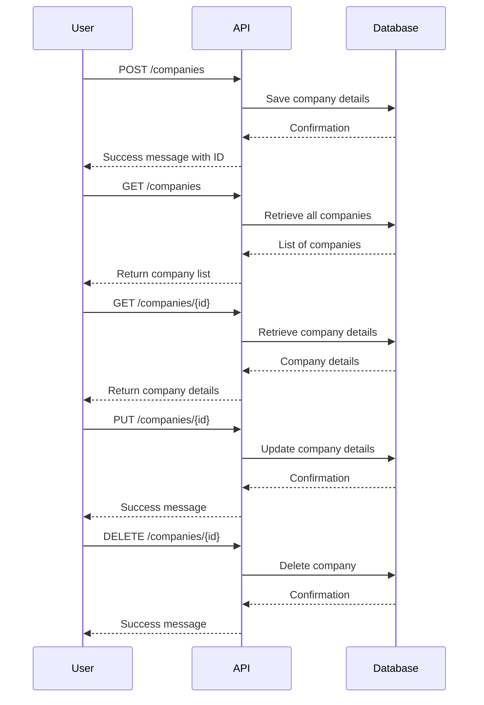

Here are the well-formatted final functional requirements for your project:

### Functional Requirements

#### User Stories

1. **User Story: Save Company Details**
   - **As a user**, I want to save company details so that I can store relevant information in the database.
   - **Endpoint**: `POST /companies`
   - **Request Format**:
     ```json
     {
       "name": "Company Name",
       "address": "Company Address",
       "contact_number": "1234567890"
     }
     ```
   - **Response Format**:
     ```json
     {
       "message": "Company created successfully",
       "id": 1
     }
     ```

2. **User Story: Retrieve All Companies**
   - **As a user**, I want to retrieve a list of all companies so that I can view stored information.
   - **Endpoint**: `GET /companies`
   - **Response Format**:
     ```json
     [
       {
         "id": 1,
         "name": "Company Name",
         "address": "Company Address",
         "contact_number": "1234567890"
       },
       ...
     ]
     ```

3. **User Story: Retrieve Specific Company Details**
   - **As a user**, I want to retrieve details of a specific company so that I can view its information.
   - **Endpoint**: `GET /companies/{id}`
   - **Response Format**:
     ```json
     {
       "id": 1,
       "name": "Company Name",
       "address": "Company Address",
       "contact_number": "1234567890"
     }
     ```

4. **User Story: Update Company Details**
   - **As a user**, I want to update company details so that I can modify existing information.
   - **Endpoint**: `PUT /companies/{id}`
   - **Request Format**:
     ```json
     {
       "name": "Updated Company Name",
       "address": "Updated Company Address",
       "contact_number": "0987654321"
     }
     ```
   - **Response Format**:
     ```json
     {
       "message": "Company updated successfully"
     }
     ```

5. **User Story: Delete Company**
   - **As a user**, I want to delete a company so that I can remove unnecessary information.
   - **Endpoint**: `DELETE /companies/{id}`
   - **Response Format**:
     ```json
     {
       "message": "Company deleted successfully"
     }
     ```

### Visual Representation of User-App Interaction


```mermaid
sequenceDiagram
    participant User
    participant API
    participant Database

    User->>API: POST /companies
    API->>Database: Save company details
    Database-->>API: Confirmation
    API-->>User: Success message with ID

    User->>API: GET /companies
    API->>Database: Retrieve all companies
    Database-->>API: List of companies
    API-->>User: Return company list

    User->>API: GET /companies/{id}
    API->>Database: Retrieve company details
    Database-->>API: Company details
    API-->>User: Return company details

    User->>API: PUT /companies/{id}
    API->>Database: Update company details
    Database-->>API: Confirmation
    API-->>User: Success message

    User->>API: DELETE /companies/{id}
    API->>Database: Delete company
    Database-->>API: Confirmation
    API-->>User: Success message
```

This layout presents a clear, concise representation of your functional requirements, API endpoints, and user interactions. If you need further adjustments or additional information, feel free to ask!