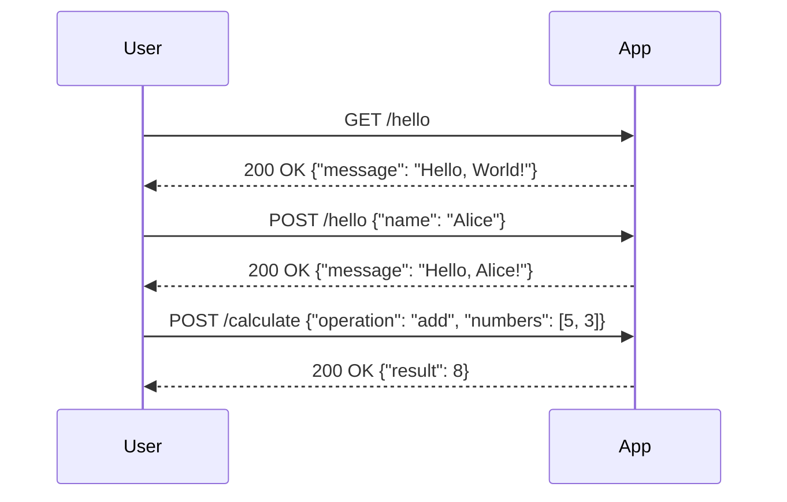

```markdown
# Final Functional Requirements for Hello World App

## API Endpoints

### 1. **GET /hello**
- **Description**: Retrieve a simple "Hello World" message.
- **Request Format**: 
  - No request body.
- **Response Format**: 
  - **200 OK**
    ```json
    {
      "message": "Hello, World!"
    }
    ```

### 2. **POST /hello**
- **Description**: Generate a customized greeting message based on user input.
- **Request Format**: 
  - **Body**:
    ```json
    {
      "name": "string"
    }
    ```
- **Response Format**: 
  - **200 OK**
    ```json
    {
      "message": "Hello, {name}!"
    }
    ```

### 3. **POST /calculate**
- **Description**: Perform calculations based on user input.
- **Request Format**: 
  - **Body**:
    ```json
    {
      "operation": "string", // e.g., "add", "subtract"
      "numbers": [number1, number2]
    }
    ```
- **Response Format**: 
  - **200 OK**
    ```json
    {
      "result": number
    }
    ```

## User-App Interaction Diagram


```mermaid
sequenceDiagram
    participant User
    participant App

    User->>App: GET /hello
    App-->>User: 200 OK {"message": "Hello, World!"}

    User->>App: POST /hello {"name": "Alice"}
    App-->>User: 200 OK {"message": "Hello, Alice!"}

    User->>App: POST /calculate {"operation": "add", "numbers": [5, 3]}
    App-->>User: 200 OK {"result": 8}
```
```