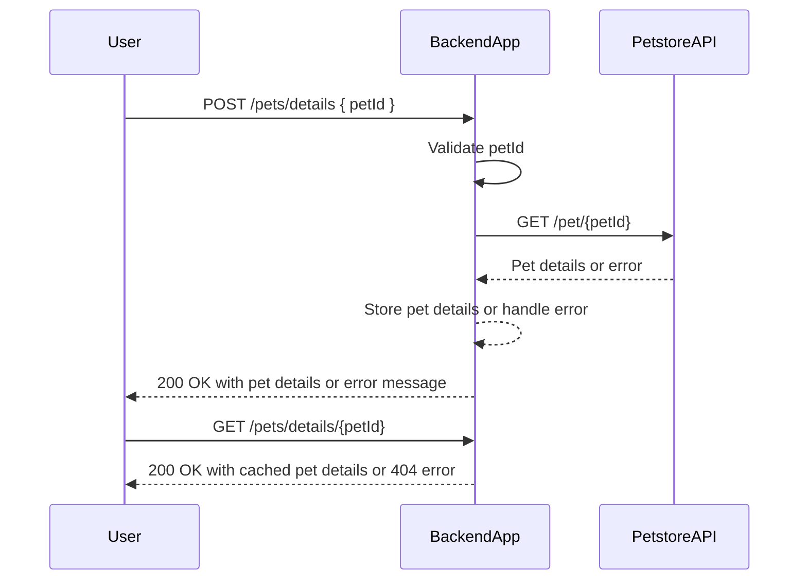
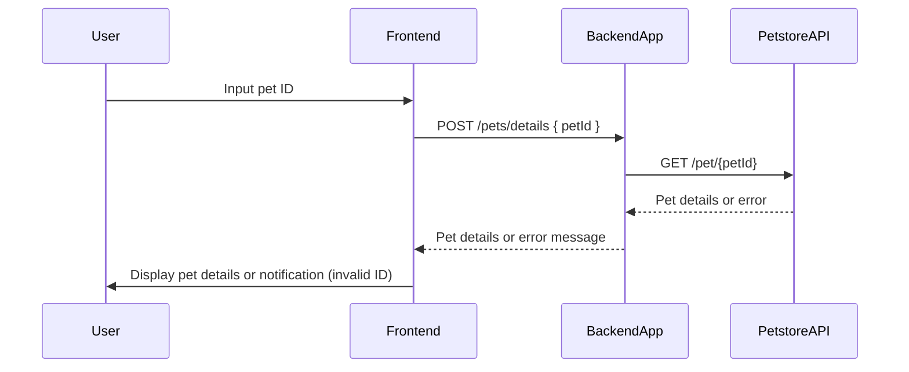

```markdown
# Functional Requirements for Pet Details Viewer Backend Application

## Overview
The backend application provides a RESTful API that allows users to input a pet ID, retrieve pet details from the external Petstore API, and view the results. All external API calls and business logic are performed in POST endpoints, while GET endpoints serve cached or retrieved results.

---

## API Endpoints

### 1. Retrieve Pet Details (POST `/pets/details`)

- **Purpose:** Accept a pet ID, validate it, query the Petstore API to retrieve pet details, and store/cache the result for later retrieval.
- **Request:**
  ```json
  {
    "petId": 123
  }
  ```
- **Response (Success - 200 OK):**
  ```json
  {
    "petId": 123,
    "name": "Fluffy",
    "category": "Dog",
    "status": "available",
    "photoUrls": [
      "https://example.com/photo1.jpg"
    ]
  }
  ```
- **Response (Error - 400 Bad Request):**
  ```json
  {
    "error": "Invalid pet ID format."
  }
  ```
- **Response (Error - 404 Not Found):**
  ```json
  {
    "error": "Pet not found."
  }
  ```

### 2. Get Cached Pet Details (GET `/pets/details/{petId}`)

- **Purpose:** Retrieve previously fetched pet details by pet ID.
- **Request:** No body, pet ID in URL path.
- **Response (Success - 200 OK):**
  ```json
  {
    "petId": 123,
    "name": "Fluffy",
    "category": "Dog",
    "status": "available",
    "photoUrls": [
      "https://example.com/photo1.jpg"
    ]
  }
  ```
- **Response (Error - 404 Not Found):**
  ```json
  {
    "error": "Pet details not found. Please submit a POST request first."
  }
  ```

---

## Business Logic Summary

- POST `/pets/details` performs:
  - Input validation for pet ID.
  - Calls the external Petstore API GET `/pet/{petId}`.
  - Handles errors from the external API (e.g., 404).
  - Extracts required fields: name, category, status, photoUrls.
  - Stores the retrieved data in the backend cache or database.
  
- GET `/pets/details/{petId}`:
  - Returns cached/stored pet details.
  - Does not call external API.

---

## User-App Interaction Sequence Diagram


```mermaid
sequenceDiagram
    participant User
    participant BackendApp
    participant PetstoreAPI

    User->>BackendApp: POST /pets/details { petId }
    BackendApp->>BackendApp: Validate petId
    BackendApp->>PetstoreAPI: GET /pet/{petId}
    PetstoreAPI-->>BackendApp: Pet details or error
    BackendApp-->>BackendApp: Store pet details or handle error
    BackendApp-->>User: 200 OK with pet details or error message

    User->>BackendApp: GET /pets/details/{petId}
    BackendApp-->>User: 200 OK with cached pet details or 404 error
```

---

## User Input and Notification Flow


```mermaid
sequenceDiagram
    participant User
    participant Frontend
    participant BackendApp
    participant PetstoreAPI

    User->>Frontend: Input pet ID
    Frontend->>BackendApp: POST /pets/details { petId }
    BackendApp->>PetstoreAPI: GET /pet/{petId}
    PetstoreAPI-->>BackendApp: Pet details or error
    BackendApp-->>Frontend: Pet details or error message
    Frontend->>User: Display pet details or notification (invalid ID)
```
```
