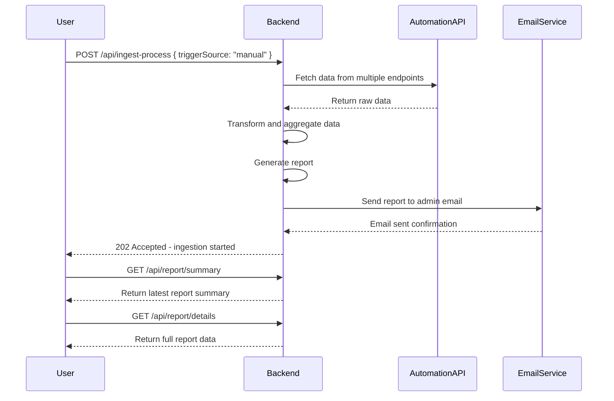
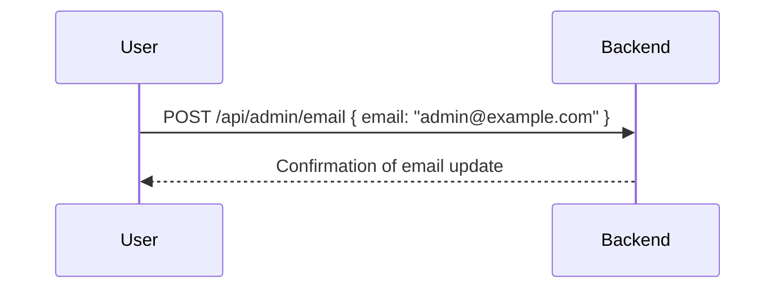

```markdown
# Functional Requirements and API Design

## API Endpoints

### 1. Trigger Data Ingestion and Processing  
**POST** `/api/ingest-process`  
- **Description:** Starts the data ingestion from Automation Exercise API, performs data transformation, aggregation, and generates the report.  
- **Request:**  
```json
{
  "triggerSource": "manual" | "scheduler"
}
```  
- **Response:**  
```json
{
  "status": "started",
  "message": "Data ingestion and processing initiated"
}
```

### 2. Retrieve Aggregated Report Summary  
**GET** `/api/report/summary`  
- **Description:** Retrieves the latest aggregated report summary (e.g., total sales, category-wise products).  
- **Response:**  
```json
{
  "reportDate": "YYYY-MM-DD",
  "totalSales": 12345.67,
  "categoryWiseProducts": {
    "Category A": 100,
    "Category B": 150
  }
}
```

### 3. Retrieve Full Report Details  
**GET** `/api/report/details`  
- **Description:** Retrieves the full detailed report including raw data, transformations, and aggregations.  
- **Response:**  
```json
{
  "reportDate": "YYYY-MM-DD",
  "products": [...],
  "categories": [...],
  "aggregations": {...}
}
```

### 4. Configure Admin Email  
**POST** `/api/admin/email`  
- **Description:** Set or update the admin email address to which reports will be sent.  
- **Request:**  
```json
{
  "email": "admin@example.com"
}
```  
- **Response:**  
```json
{
  "status": "success",
  "message": "Admin email updated"
}
```

---

## Business Logic Notes  
- All external data retrieval from Automation Exercise API and data processing is performed inside the **POST** `/api/ingest-process` endpoint.  
- GET endpoints are strictly for fetching already processed results or configuration.  
- The ingestion process can be triggered manually or by the scheduler (once a day).  
- Email sending is triggered automatically after successful report generation during ingestion.  

---

## User-App Interaction Sequence Diagram


```mermaid
sequenceDiagram
    participant User
    participant Backend
    participant AutomationAPI
    participant EmailService

    User->>Backend: POST /api/ingest-process { triggerSource: "manual" }
    Backend->>AutomationAPI: Fetch data from multiple endpoints
    AutomationAPI-->>Backend: Return raw data
    Backend->>Backend: Transform and aggregate data
    Backend->>Backend: Generate report
    Backend->>EmailService: Send report to admin email
    EmailService-->>Backend: Email sent confirmation
    Backend-->>User: 202 Accepted - ingestion started

    User->>Backend: GET /api/report/summary
    Backend-->>User: Return latest report summary

    User->>Backend: GET /api/report/details
    Backend-->>User: Return full report data
```

---

## Admin Email Configuration Sequence


```mermaid
sequenceDiagram
    participant User
    participant Backend

    User->>Backend: POST /api/admin/email { email: "admin@example.com" }
    Backend-->>User: Confirmation of email update
```
```