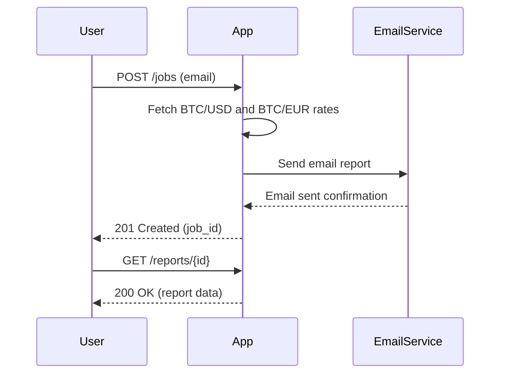

Here are the well-formatted final functional requirements for your application:

### Functional Requirements

#### User Stories

1. **Report Creation Initiation**
   - **As a user**, I want to initiate a report creation process so that I can receive the latest Bitcoin conversion rates.
   - **Endpoint**: `POST /jobs`
   - **Request Format**:
     ```json
     {
       "email": "user@example.com"
     }
     ```
   - **Response Format**:
     ```json
     {
       "job_id": "12345",
       "status": "processing"
     }
     ```

2. **Retrieve Stored Report**
   - **As a user**, I want to retrieve a stored report by its ID so that I can view the conversion rates.
   - **Endpoint**: `GET /reports/{id}`
   - **Response Format**:
     ```json
     {
       "id": "12345",
       "btc_usd": "50000.00",
       "btc_eur": "42000.00",
       "timestamp": "2023-10-01T12:00:00Z"
     }
     ```

#### API Endpoints

- **POST /jobs**
  - **Description**: Initiates the report creation process.
  - **Request Body**: Contains the user's email address.
  - **Response**: Returns the job ID and the status of the job.

- **GET /reports/{id}**
  - **Description**: Retrieves the stored report by its ID.
  - **Response**: Returns the conversion rates and metadata of the report.

#### Persistence Service Recommendation

- **Suggested Service**: PostgreSQL (or MongoDB based on flexibility needs)
  - **Reason**: Offers a robust structure for managing user data and reports, ensuring data integrity and supporting complex queries.

### User-App Interaction

#### Sequence Diagram


```mermaid
sequenceDiagram
    participant User
    participant App
    participant EmailService

    User->>App: POST /jobs (email)
    App->>App: Fetch BTC/USD and BTC/EUR rates
    App->>EmailService: Send email report
    EmailService-->>App: Email sent confirmation
    App-->>User: 201 Created (job_id)

    User->>App: GET /reports/{id}
    App-->>User: 200 OK (report data)
```

This comprehensive document outlines the functional requirements for your application, including user stories, API endpoints, persistence recommendations, and a visual representation of user interaction. Let me know if you need any further adjustments or additional details!