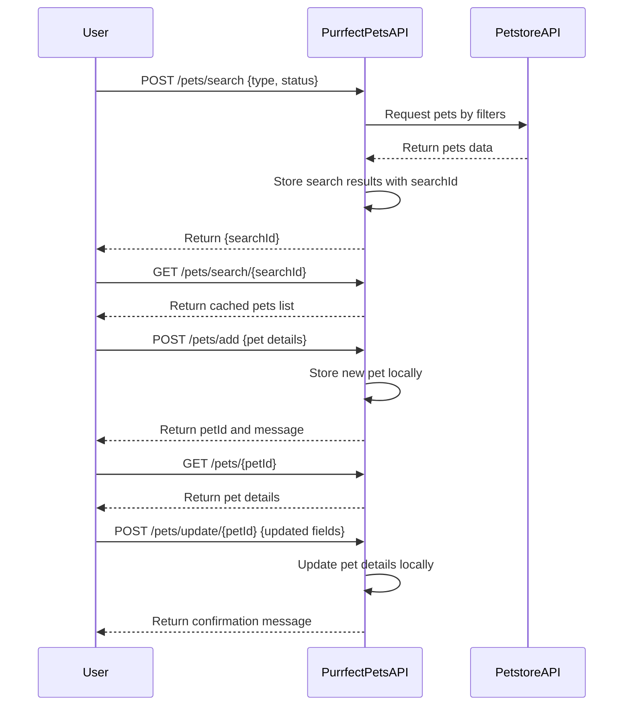
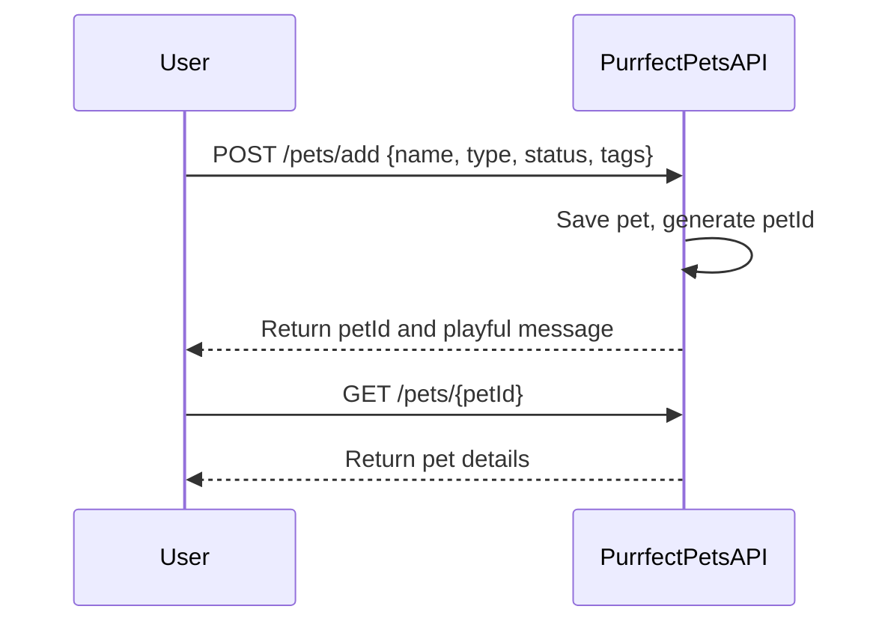

```markdown
# Purrfect Pets API - Functional Requirements

## API Endpoints

### 1. POST /pets/search  
**Description:** Search pets by type or status via Petstore API and store results internally for retrieval.  
**Request JSON:**  
```json
{
  "type": "string",      // optional - e.g. "cat", "dog"
  "status": "string"     // optional - e.g. "available", "sold"
}
```  
**Response JSON:**  
```json
{
  "searchId": "string"   // ID to retrieve search results
}
```

---

### 2. GET /pets/search/{searchId}  
**Description:** Retrieve the stored search results by searchId.  
**Response JSON:**  
```json
{
  "pets": [
    {
      "id": "integer",
      "name": "string",
      "type": "string",
      "status": "string",
      "tags": ["string"]
    }
  ]
}
```

---

### 3. POST /pets/add  
**Description:** Add a new pet (simulate adding to Petstore API, store locally).  
**Request JSON:**  
```json
{
  "name": "string",
  "type": "string",
  "status": "string",
  "tags": ["string"]
}
```  
**Response JSON:**  
```json
{
  "petId": "integer",
  "message": "string"    // playful confirmation message
}
```

---

### 4. GET /pets/{petId}  
**Description:** Retrieve a pet’s details by ID (from local store).  
**Response JSON:**  
```json
{
  "id": "integer",
  "name": "string",
  "type": "string",
  "status": "string",
  "tags": ["string"]
}
```

---

### 5. POST /pets/update/{petId}  
**Description:** Update pet details locally.  
**Request JSON:**  
```json
{
  "name": "string",     // optional
  "status": "string",   // optional
  "tags": ["string"]    // optional
}
```  
**Response JSON:**  
```json
{
  "message": "string"   // confirmation message
}
```

---

## Business Logic Notes

- POST endpoints invoke Petstore API or update local store; GET endpoints only retrieve stored data.  
- Each POST response returns identifiers or confirmation messages.  
- Data from Petstore API is cached/stored internally for retrieval.  
- Playful messages included in responses to match the "Purrfect Pets" theme.

---

## User-App Interaction Sequence


```mermaid
sequenceDiagram
    participant User
    participant PurrfectPetsAPI
    participant PetstoreAPI

    User->>PurrfectPetsAPI: POST /pets/search {type, status}
    PurrfectPetsAPI->>PetstoreAPI: Request pets by filters
    PetstoreAPI-->>PurrfectPetsAPI: Return pets data
    PurrfectPetsAPI->>PurrfectPetsAPI: Store search results with searchId
    PurrfectPetsAPI-->>User: Return {searchId}

    User->>PurrfectPetsAPI: GET /pets/search/{searchId}
    PurrfectPetsAPI-->>User: Return cached pets list

    User->>PurrfectPetsAPI: POST /pets/add {pet details}
    PurrfectPetsAPI->>PurrfectPetsAPI: Store new pet locally
    PurrfectPetsAPI-->>User: Return petId and message

    User->>PurrfectPetsAPI: GET /pets/{petId}
    PurrfectPetsAPI-->>User: Return pet details

    User->>PurrfectPetsAPI: POST /pets/update/{petId} {updated fields}
    PurrfectPetsAPI->>PurrfectPetsAPI: Update pet details locally
    PurrfectPetsAPI-->>User: Return confirmation message
```

---

## Alternative User Journey: Adding and Retrieving a Pet


```mermaid
sequenceDiagram
    participant User
    participant PurrfectPetsAPI

    User->>PurrfectPetsAPI: POST /pets/add {name, type, status, tags}
    PurrfectPetsAPI->>PurrfectPetsAPI: Save pet, generate petId
    PurrfectPetsAPI-->>User: Return petId and playful message

    User->>PurrfectPetsAPI: GET /pets/{petId}
    PurrfectPetsAPI-->>User: Return pet details
```
```