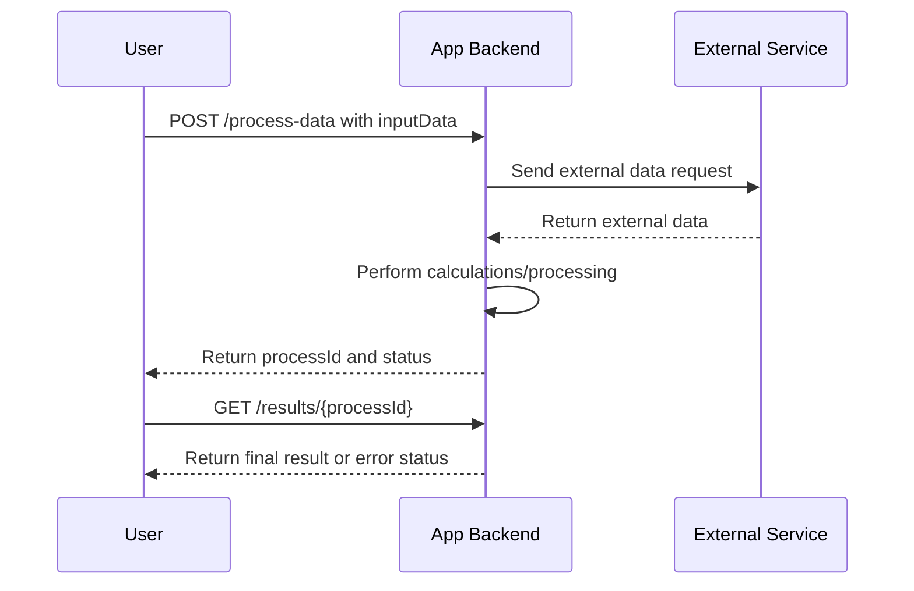
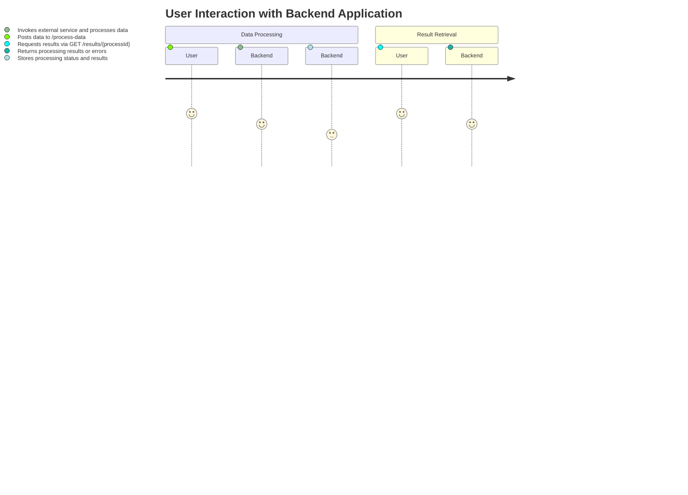

```markdown
# Final Functional Requirements Specification

## Overview
The backend application adheres to RESTful principles with clear separation between POST and GET endpoints:

- **POST endpoints**: Handle all business logic, including invoking external data sources, performing calculations, and processing input data.
- **GET endpoints**: Used exclusively for retrieving application results or stored data.

---

## API Endpoints

### 1. POST /process-data
- **Purpose**: Receive input data, invoke external services, perform calculations or data transformations.
- **Request Format** (JSON):
  ```json
  {
    "inputData": { "type": "object", "description": "Data required for processing" }
  }
  ```
- **Response Format** (JSON):
  ```json
  {
    "processId": "string",
    "status": "processing|completed|failed",
    "message": "optional status message"
  }
  ```
- **Notes**: Initiates backend workflows and stores intermediate or final results linked to `processId`.

---

### 2. GET /results/{processId}
- **Purpose**: Retrieve results of a previously processed request.
- **Path Parameter**:
  - `processId` (string): Identifier for the processing task.
- **Response Format** (JSON):
  ```json
  {
    "processId": "string",
    "status": "completed|failed",
    "result": { "type": "object", "description": "Final processed data or error details" }
  }
  ```
- **Notes**: Returns stored results or error information for the given `processId`.

---

## User-App Interaction Sequence Diagram


```mermaid
sequenceDiagram
    participant User
    participant App Backend
    participant External Service

    User->>App Backend: POST /process-data with inputData
    App Backend->>External Service: Send external data request
    External Service-->>App Backend: Return external data
    App Backend->>App Backend: Perform calculations/processing
    App Backend-->>User: Return processId and status

    User->>App Backend: GET /results/{processId}
    App Backend-->>User: Return final result or error status
```

---

## User Journey Diagram


```mermaid
journey
    title User Interaction with Backend Application
    section Data Processing
      User: 5: Posts data to /process-data
      Backend: 4: Invokes external service and processes data
      Backend: 3: Stores processing status and results
    section Result Retrieval
      User: 5: Requests results via GET /results/{processId}
      Backend: 4: Returns processing results or errors
```
```