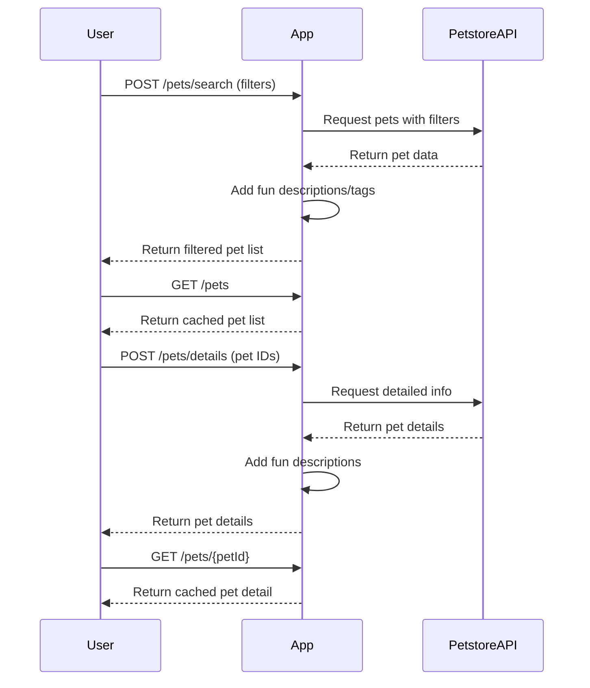

```markdown
# Purrfect Pets API - Functional Requirements

## API Endpoints

### 1. `POST /pets/search`
- **Purpose:** Search pets by filters (type, status, name, etc.) using Petstore API data.
- **Request:**
  ```json
  {
    "type": "string",        // optional, e.g. "dog", "cat"
    "status": "string",      // optional, e.g. "available", "sold"
    "name": "string"         // optional, partial or full pet name
  }
  ```
- **Response:**
  ```json
  {
    "pets": [
      {
        "id": "integer",
        "name": "string",
        "type": "string",
        "status": "string",
        "photoUrls": ["string"],
        "tags": ["string"]
      },
      ...
    ]
  }
  ```
- **Notes:** This endpoint calls the external Petstore API, applies filters, and returns matching pets.

---

### 2. `POST /pets/details`
- **Purpose:** Retrieve detailed info about one or more pets by IDs.
- **Request:**
  ```json
  {
    "ids": ["integer"]
  }
  ```
- **Response:**
  ```json
  {
    "pets": [
      {
        "id": "integer",
        "name": "string",
        "type": "string",
        "status": "string",
        "photoUrls": ["string"],
        "tags": ["string"],
        "description": "string"   // added fun/custom description field
      },
      ...
    ]
  }
  ```
- **Notes:** Fetches pet details from external API and enhances response with custom info.

---

### 3. `GET /pets`
- **Purpose:** Retrieve cached or last searched pet list results.
- **Request:** None
- **Response:**
  ```json
  {
    "pets": [ /* last search results or cached data in same format as /pets/search response */ ]
  }
  ```
- **Notes:** GET only returns data stored in the app, no external calls.

---

### 4. `GET /pets/{petId}`
- **Purpose:** Get details for a single pet from app cache.
- **Request:** None
- **Response:** Same format as one pet object in `/pets/details`.

---

## Business Logic Summary
- All external Petstore API calls and any filtering/searching/calculations happen in POST endpoints.
- GET endpoints serve only cached or previously fetched data.
- The app enhances Petstore data with fun "Purrfect Pets" descriptions or tags.

---

## User-App Interaction Sequence Diagram


```mermaid
sequenceDiagram
    participant User
    participant App
    participant PetstoreAPI

    User->>App: POST /pets/search (filters)
    App->>PetstoreAPI: Request pets with filters
    PetstoreAPI-->>App: Return pet data
    App->>App: Add fun descriptions/tags
    App-->>User: Return filtered pet list

    User->>App: GET /pets
    App-->>User: Return cached pet list

    User->>App: POST /pets/details (pet IDs)
    App->>PetstoreAPI: Request detailed info
    PetstoreAPI-->>App: Return pet details
    App->>App: Add fun descriptions
    App-->>User: Return pet details

    User->>App: GET /pets/{petId}
    App-->>User: Return cached pet detail
```

---

## Summary Table

| Method | Endpoint         | Purpose                                    | External API Call? |
|--------|------------------|--------------------------------------------|--------------------|
| POST   | /pets/search     | Search pets with filters                   | Yes                |
| POST   | /pets/details    | Get detailed info for pets by ID(s)       | Yes                |
| GET    | /pets            | Get last cached search results             | No                 |
| GET    | /pets/{petId}    | Get cached details for single pet          | No                 |

---

If you want, I can help next with entity/workflow design based on these requirements!
```