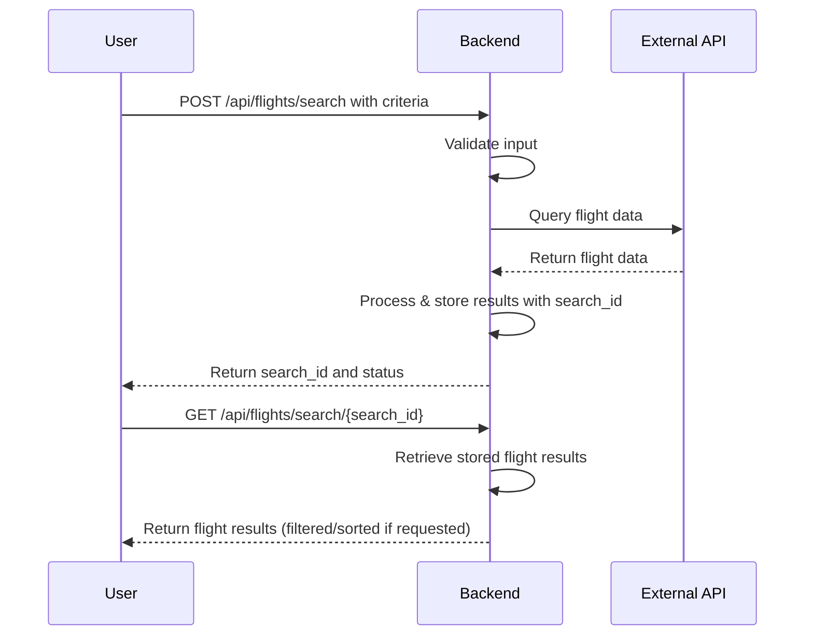

```markdown
# Flight Search Application - Functional Requirements

## API Endpoints

### 1. Search Flights  
**Endpoint:** `POST /api/flights/search`  
**Description:** Accepts search criteria, invokes external flight data sources, processes and stores results for retrieval.  
**Request Body (JSON):**
```json
{
  "departure_airport": "IATA_CODE",
  "arrival_airport": "IATA_CODE",
  "departure_date": "YYYY-MM-DD",
  "return_date": "YYYY-MM-DD",         // Optional for one-way
  "passengers": {
    "adults": 1,
    "children": 0,
    "infants": 0
  },
  "filters": {                         // Optional
    "airlines": ["AA", "DL"],
    "max_price": 500,
    "stops": 0
  },
  "sort_by": "price"                   // e.g. price, duration, departure_time
}
```
**Response (JSON):**
```json
{
  "search_id": "string",               // Unique ID for this search
  "status": "completed",
  "result_count": 25
}
```

---

### 2. Retrieve Search Results  
**Endpoint:** `GET /api/flights/search/{search_id}`  
**Description:** Returns stored flight search results and supports filtering/sorting on stored data (if applicable).  
**Response (JSON):**
```json
{
  "search_id": "string",
  "flights": [
    {
      "flight_number": "AA123",
      "airline": "American Airlines",
      "departure_airport": "JFK",
      "arrival_airport": "LAX",
      "departure_time": "2024-07-01T08:00:00Z",
      "arrival_time": "2024-07-01T11:00:00Z",
      "price": 350.00,
      "duration": 180,
      "stops": 0
    }
    // ... more flights
  ]
}
```

---

### 3. Error Handling  
- If no flights are found, `POST /api/flights/search` responds with:
```json
{
  "search_id": null,
  "status": "no_results",
  "message": "No flights found for the given criteria."
}
```
- For external API failures:
```json
{
  "search_id": null,
  "status": "error",
  "message": "External service unavailable, please try again later."
}
```

---

## Business Logic Notes  
- The `POST /api/flights/search` endpoint:  
  - Validates input data.  
  - Calls external flight data APIs (Airport Gap and others if needed).  
  - Processes and stores flight results linked to `search_id`.  
- The `GET /api/flights/search/{search_id}` endpoint:  
  - Retrieves and returns stored results without calling external APIs.  

---

## User-App Interaction Sequence


```mermaid
sequenceDiagram
    participant User
    participant Backend

    User->>Backend: POST /api/flights/search with criteria
    Backend->>Backend: Validate input
    Backend->>External API: Query flight data
    External API-->>Backend: Return flight data
    Backend->>Backend: Process & store results with search_id
    Backend-->>User: Return search_id and status

    User->>Backend: GET /api/flights/search/{search_id}
    Backend->>Backend: Retrieve stored flight results
    Backend-->>User: Return flight results (filtered/sorted if requested)
```

---

## User Journey Overview

```mermaid
graph TD
    A[User enters search criteria] --> B[Submit POST /api/flights/search]
    B --> C[Backend validates & queries external APIs]
    C --> D[Backend stores results with search_id]
    D --> E[Backend returns search_id to User]
    E --> F[User requests results using GET /api/flights/search/{search_id}]
    F --> G[Backend returns stored flight results]
    G --> H[User views, sorts, and filters results]
```
```