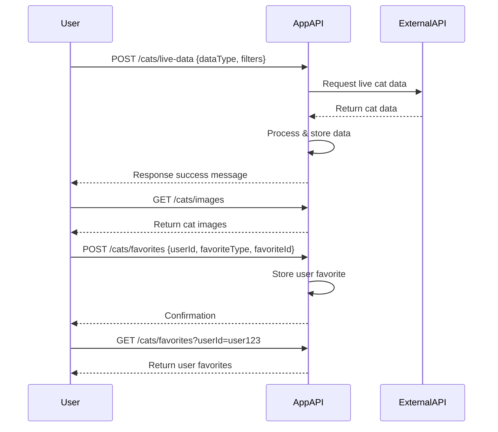

```markdown
# Purrfect Pets API - Functional Requirements

## API Endpoints

### 1. POST /cats/live-data
- **Purpose:** Fetch live cat data from external sources, process it, and store/update internal state.
- **Request Body:**  
```json
{
  "dataType": "images|breeds|facts",
  "filters": {
    "breed": "optional string",
    "limit": "optional integer"
  }
}
```
- **Response:**  
```json
{
  "status": "success",
  "message": "Data fetched and processed",
  "count": 10
}
```
- **Business Logic:**  
  - Calls external API(s) for requested data type.
  - Applies any filters and processes results.
  - Stores or updates internal entities with new data.

---

### 2. GET /cats/images
- **Purpose:** Retrieve stored cat images.
- **Response:**  
```json
{
  "images": [
    {"id": "abc123", "url": "https://...", "breed": "Siamese"},
    ...
  ]
}
```

---

### 3. GET /cats/breeds
- **Purpose:** Retrieve stored cat breed information.
- **Response:**  
```json
{
  "breeds": [
    {"id": "b1", "name": "Siamese", "origin": "Thailand", "description": "..."},
    ...
  ]
}
```

---

### 4. GET /cats/facts
- **Purpose:** Retrieve fun cat facts stored in the system.
- **Response:**  
```json
{
  "facts": [
    "Cats sleep 12-16 hours a day.",
    "A group of cats is called a clowder.",
    ...
  ]
}
```

---

### 5. POST /cats/favorites
- **Purpose:** Submit user favorite cats (images or breeds).
- **Request Body:**  
```json
{
  "userId": "user123",
  "favoriteType": "image|breed",
  "favoriteId": "abc123"
}
```
- **Response:**  
```json
{
  "status": "success",
  "message": "Favorite saved"
}
```

---

### 6. GET /cats/favorites?userId=user123
- **Purpose:** Retrieve a user's favorite cats.
- **Response:**  
```json
{
  "favorites": [
    {"type": "image", "id": "abc123", "url": "..."},
    {"type": "breed", "id": "b1", "name": "Siamese"}
  ]
}
```

---

## User-App Interaction Sequence


```mermaid
sequenceDiagram
    participant User
    participant AppAPI
    participant ExternalAPI

    User->>AppAPI: POST /cats/live-data {dataType, filters}
    AppAPI->>ExternalAPI: Request live cat data
    ExternalAPI-->>AppAPI: Return cat data
    AppAPI->>AppAPI: Process & store data
    AppAPI-->>User: Response success message

    User->>AppAPI: GET /cats/images
    AppAPI-->>User: Return cat images

    User->>AppAPI: POST /cats/favorites {userId, favoriteType, favoriteId}
    AppAPI->>AppAPI: Store user favorite
    AppAPI-->>User: Confirmation

    User->>AppAPI: GET /cats/favorites?userId=user123
    AppAPI-->>User: Return user favorites
```
```