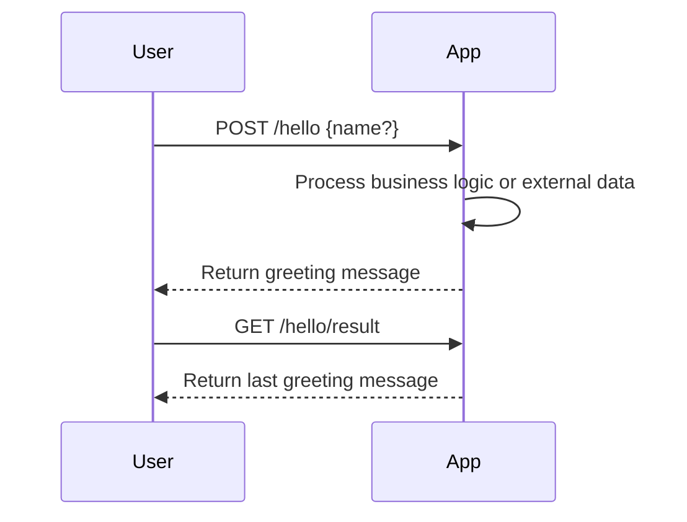
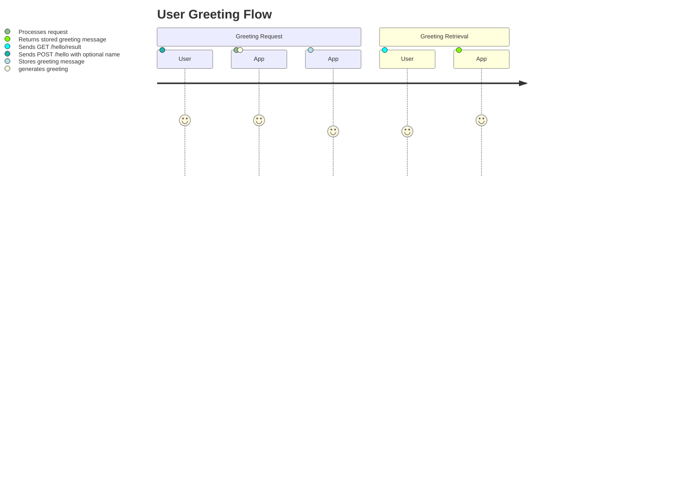

```markdown
# Functional Requirements for Hello World App

## API Endpoints

### 1. POST /hello
- **Purpose:** Trigger business logic or external data retrieval/calculation.
- **Request:**
  ```json
  {
    "name": "string"  // optional, name to personalize greeting
  }
  ```
- **Response:**
  ```json
  {
    "message": "string"  // greeting message, e.g. "Hello World" or "Hello, {name}!"
  }
  ```

### 2. GET /hello/result
- **Purpose:** Retrieve the latest greeting message generated by the POST endpoint.
- **Request:** No body required.
- **Response:**
  ```json
  {
    "message": "string"  // last greeting message
  }
  ```

---

## User-App Interaction Sequence Diagram


```mermaid
sequenceDiagram
    participant User
    participant App

    User->>App: POST /hello {name?}
    App->>App: Process business logic or external data
    App-->>User: Return greeting message

    User->>App: GET /hello/result
    App-->>User: Return last greeting message
```

---

## User Journey Diagram


```mermaid
journey
    title User Greeting Flow
    section Greeting Request
      User: 5: Sends POST /hello with optional name
      App: 5: Processes request, generates greeting
      App: 4: Stores greeting message
    section Greeting Retrieval
      User: 4: Sends GET /hello/result
      App: 5: Returns stored greeting message
```
```