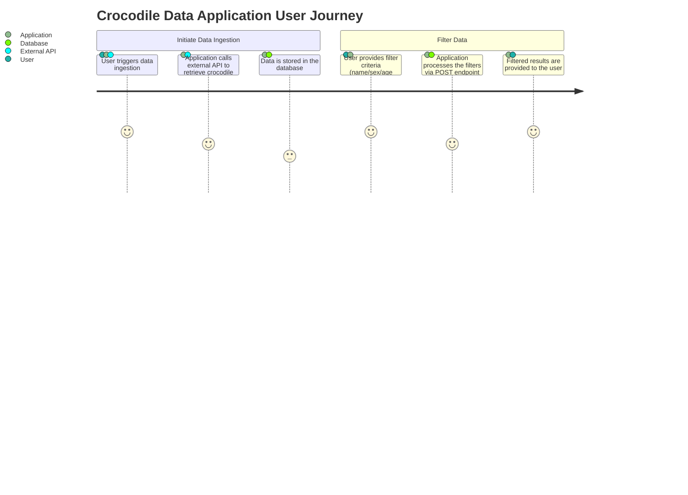
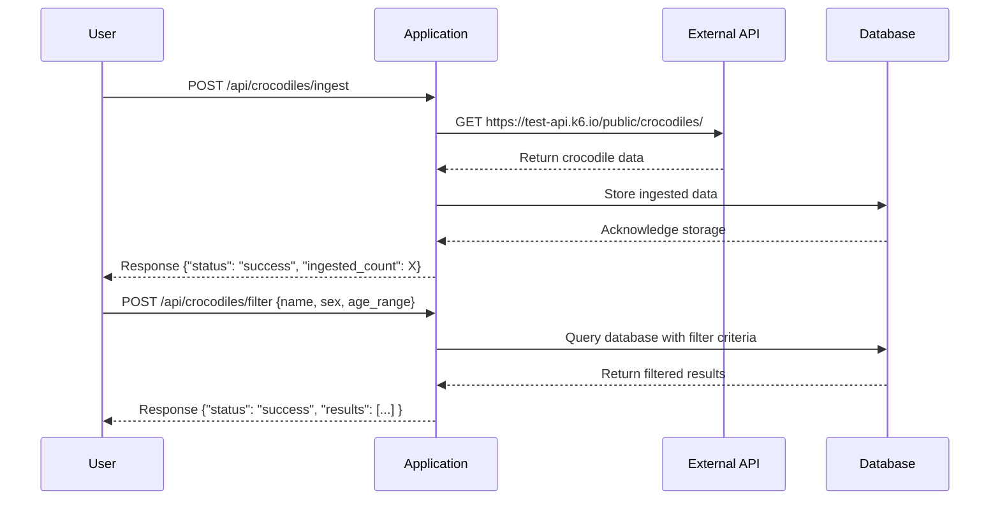
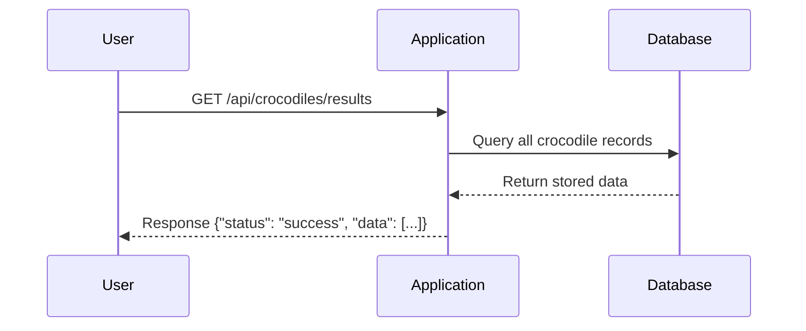

# Functional Requirements for Crocodile Data Application

## API Endpoints

### 1. POST /api/crocodiles/ingest
- **Purpose:** Ingest crocodile data from the external API (https://test-api.k6.io/public/crocodiles/) and store it in the application database.
- **Request:**
  - No payload is required.
- **Response:**
  ```json
  {
    "status": "success",
    "message": "Data ingested successfully.",
    "ingested_count": 100
  }
  ```

### 2. POST /api/crocodiles/filter
- **Purpose:** Process provided filter criteria (name, sex, age range) and return the filtered crocodile results.
- **Request:**
  ```json
  {
    "name": "Croc",        // Optional, supports exact or partial match
    "sex": "M",            // Optional, values: "M" or "F"
    "age_range": {         // Optional, range from 0 to 200
      "min": 10,
      "max": 50
    }
  }
  ```
- **Response:**
  ```json
  {
    "status": "success",
    "results": [
      {
        "id": 1,
        "name": "Croc",
        "sex": "M",
        "age": 25
      },
      ...
    ]
  }
  ```

### 3. GET /api/crocodiles/results
- **Purpose:** Retrieve all stored crocodile records.
- **Request:**
  - No payload is required.
- **Response:**
  ```json
  {
    "status": "success",
    "data": [
      {
        "id": 1,
        "name": "Croc",
        "sex": "M",
        "age": 25
      },
      ...
    ]
  }
  ```

## Business Logic Notes
- All business logic that involves invoking external data sources or performing calculations (e.g., filtering) is implemented in POST endpoints.
- GET endpoints are strictly used for simple retrieval of already processed or stored results.

## User Interaction Diagrams

### User Journey Diagram

```mermaid
journey
  title Crocodile Data Application User Journey
  section Initiate Data Ingestion
    User triggers data ingestion: 5: User, Application, External API
    Application calls external API to retrieve crocodile data: 4: Application, External API
    Data is stored in the database: 3: Application, Database
  section Filter Data
    User provides filter criteria (name/sex/age range): 5: User, Application
    Application processes the filters via POST endpoint: 4: Application, Database
    Filtered results are provided to the user: 5: Application, User
```

### Sequence Diagram for Data Ingestion and Filtering

```mermaid
sequenceDiagram
  participant U as User
  participant A as Application
  participant E as External API
  participant DB as Database
  
  U->>A: POST /api/crocodiles/ingest
  A->>E: GET https://test-api.k6.io/public/crocodiles/
  E-->>A: Return crocodile data
  A->>DB: Store ingested data
  DB-->>A: Acknowledge storage
  A-->>U: Response {"status": "success", "ingested_count": X}
  
  U->>A: POST /api/crocodiles/filter {name, sex, age_range}
  A->>DB: Query database with filter criteria
  DB-->>A: Return filtered results
  A-->>U: Response {"status": "success", "results": [...] }
```

### Sequence Diagram for Retrieving All Data

```mermaid
sequenceDiagram
  participant U as User
  participant A as Application
  participant DB as Database
  
  U->>A: GET /api/crocodiles/results
  A->>DB: Query all crocodile records
  DB-->>A: Return stored data
  A-->>U: Response {"status": "success", "data": [...]} 
```