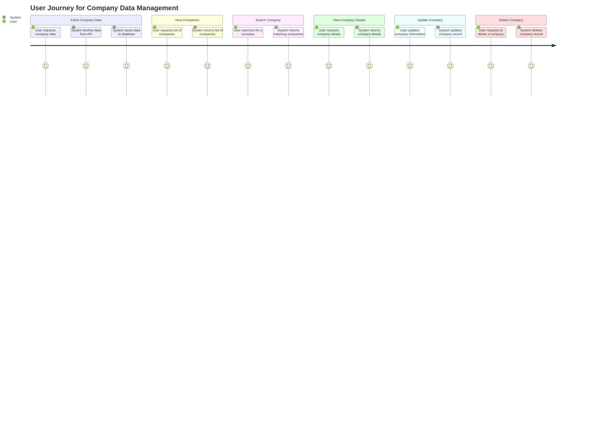

Here are the final functional requirements presented in a well-structured format:

### Functional Requirements for Company Data Management Application

#### User Stories

1. **Fetch Company Data**
   - **As a user**, I want to fetch company data from the API so that I can view the latest information.
     - **Acceptance Criteria**: The system should retrieve data from the API and store it in the PostgreSQL database.

2. **View List of Companies**
   - **As a user**, I want to view a list of companies so that I can see the stored data.
     - **Acceptance Criteria**: The system should provide an endpoint to retrieve a list of companies from the database.

3. **Search for a Specific Company**
   - **As a user**, I want to search for a specific company so that I can find its details quickly.
     - **Acceptance Criteria**: The system should allow searching by company name through an endpoint.

4. **View Company Details**
   - **As a user**, I want to view the details of a specific company so that I can get more information.
     - **Acceptance Criteria**: The system should provide an endpoint to retrieve details of a specific company.

5. **Update Company Information**
   - **As a user**, I want to update company information so that I can keep the data accurate.
     - **Acceptance Criteria**: The system should allow updating company details through an endpoint.

6. **Delete Company Record**
   - **As a user**, I want to delete a company record so that I can remove outdated information.
     - **Acceptance Criteria**: The system should allow deletion of a company record through an endpoint.

#### API Endpoints

| Endpoint                   | Method | Request Body                      | Response Format                     |
|----------------------------|--------|-----------------------------------|-------------------------------------|
| `/companies`               | GET    | N/A                               | JSON array of company objects       |
| `/companies/search`        | GET    | Query parameter: `company_name`  | JSON array of matching company objects |
| `/companies/{id}`          | GET    | N/A                               | JSON object of the specified company |
| `/companies`               | POST   | JSON object of company data       | JSON object of created company      |
| `/companies/{id}`          | PUT    | JSON object of updated company data | JSON object of updated company      |
| `/companies/{id}`          | DELETE | N/A                               | JSON object confirming deletion     |

#### User Journey

```mermaid
journey
    title User Journey for Company Data Management
    section Fetch Company Data
      User requests company data: 5: User
      System fetches data from API: 5: System
      System saves data to database: 5: System
    section View Companies
      User requests list of companies: 5: User
      System returns list of companies: 5: System
    section Search Company
      User searches for a company: 5: User
      System returns matching companies: 5: System
    section View Company Details
      User requests company details: 5: User
      System returns company details: 5: System
    section Update Company
      User updates company information: 5: User
      System updates company record: 5: System
    section Delete Company
      User requests to delete a company: 5: User
      System deletes company record: 5: System
```

These requirements outline the key functionalities of your application, ensuring clarity for development and further iterations. If you have any additional requirements or modifications, feel free to share!