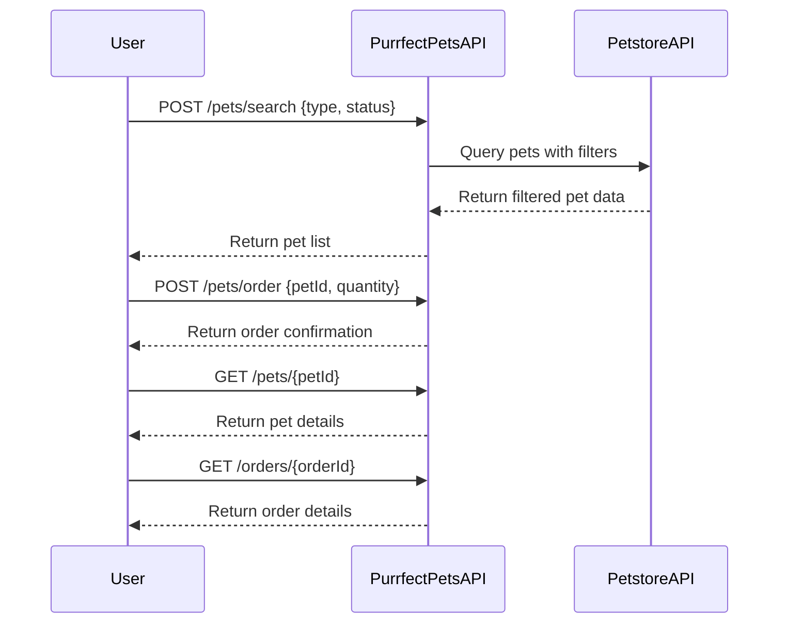

```markdown
# Purrfect Pets API - Functional Requirements

## API Endpoints

### 1. POST /pets/search  
- **Purpose:** Search/filter pets using Petstore API data (external data retrieval and filtering done here)  
- **Request:**  
```json
{
  "type": "string (optional, e.g. cat, dog)",
  "status": "string (optional, e.g. available, sold)",
  "tags": ["string"] (optional)
}
```  
- **Response:**  
```json
{
  "pets": [
    {
      "id": "integer",
      "name": "string",
      "type": "string",
      "status": "string",
      "tags": ["string"]
    }
  ]
}
```

---

### 2. POST /pets/order  
- **Purpose:** Place an order for a pet (simulate order creation, business logic here)  
- **Request:**  
```json
{
  "petId": "integer",
  "quantity": "integer"
}
```  
- **Response:**  
```json
{
  "orderId": "integer",
  "petId": "integer",
  "quantity": "integer",
  "status": "string (e.g. placed)"
}
```

---

### 3. GET /pets/{petId}  
- **Purpose:** Retrieve pet details from previously fetched or cached data (no external calls)  
- **Response:**  
```json
{
  "id": "integer",
  "name": "string",
  "type": "string",
  "status": "string",
  "tags": ["string"]
}
```

---

### 4. GET /orders/{orderId}  
- **Purpose:** Retrieve order details (from internal app data)  
- **Response:**  
```json
{
  "orderId": "integer",
  "petId": "integer",
  "quantity": "integer",
  "status": "string"
}
```

---

## User-App Interaction Sequence


```mermaid
sequenceDiagram
    participant User
    participant PurrfectPetsAPI
    participant PetstoreAPI

    User->>PurrfectPetsAPI: POST /pets/search {type, status}
    PurrfectPetsAPI->>PetstoreAPI: Query pets with filters
    PetstoreAPI-->>PurrfectPetsAPI: Return filtered pet data
    PurrfectPetsAPI-->>User: Return pet list

    User->>PurrfectPetsAPI: POST /pets/order {petId, quantity}
    PurrfectPetsAPI-->>User: Return order confirmation

    User->>PurrfectPetsAPI: GET /pets/{petId}
    PurrfectPetsAPI-->>User: Return pet details

    User->>PurrfectPetsAPI: GET /orders/{orderId}
    PurrfectPetsAPI-->>User: Return order details
```

---

## Summary  
- POST endpoints handle external API calls and business logic.  
- GET endpoints serve cached/internal data to the user.  
- Petstore API is used for data retrieval in search.  
- Orders are managed internally by the app.
```
