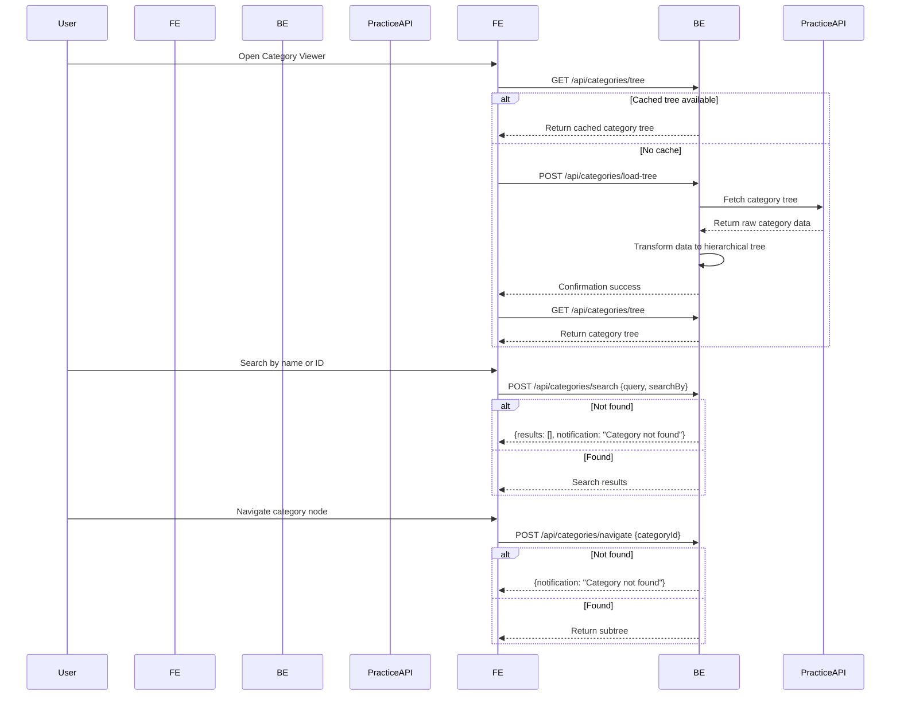
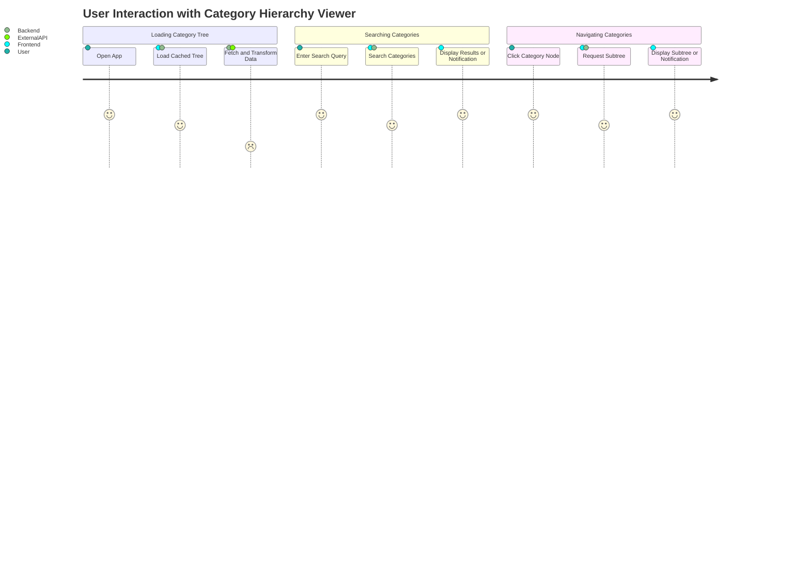

```markdown
# Functional Requirements and API Specification for Category Hierarchy Viewer Backend

## API Endpoints

### 1. POST /api/categories/load-tree
**Description:**  
Triggers data ingestion and transformation by retrieving the complete category tree structure from the external Practice Software Testing API, converts it into a hierarchical tree structure suitable for visualization, and caches/stores the result internally.

**Request:**  
```json
{}
```

**Response:**  
```json
{
  "status": "success",
  "message": "Category tree loaded and transformed successfully."
}
```

---

### 2. POST /api/categories/search
**Description:**  
Performs a search for categories by name (supports partial matching) or category ID (exact match). Triggers data ingestion and transformation if data is not loaded or stale.

**Request:**  
```json
{
  "query": "string",     // category name or category ID
  "searchBy": "name" | "id"
}
```

**Response:**  
```json
{
  "results": [
    {
      "categoryId": "string",
      "categoryName": "string",
      "parentId": "string|null",
      "children": [ /* nested sub-categories if any */ ]
    }
  ],
  "notification": "Category not found" // present only if no results found
}
```

---

### 3. GET /api/categories/tree
**Description:**  
Retrieves the cached hierarchical category tree structure for visualization.

**Request:**  
_No request body_

**Response:**  
```json
{
  "categoryTree": {
    "categoryId": "string",
    "categoryName": "string",
    "children": [
      {
        "categoryId": "string",
        "categoryName": "string",
        "children": [ /* recursive */ ]
      }
    ]
  }
}
```

---

### 4. POST /api/categories/navigate
**Description:**  
Retrieves a subtree starting from a specified category ID. Triggers ingestion/transformation if needed.

**Request:**  
```json
{
  "categoryId": "string"
}
```

**Response:**  
```json
{
  "subtree": {
    "categoryId": "string",
    "categoryName": "string",
    "children": [ /* nested sub-categories */ ]
  },
  "notification": "Category not found" // present only if categoryId is invalid
}
```

---

## Business Logic Summary

- All external API calls to Practice Software Testing API are invoked via POST endpoints (`load-tree`, `search`, `navigate`) to comply with business rules.
- GET endpoint is used only for retrieving cached data without invoking external services.
- Search supports partial matching for names and exact match for IDs.
- Notifications are returned within the response object when categories or subcategories are not found.

---

## User-App Interaction Sequence Diagram


```mermaid
sequenceDiagram
    participant User
    participant Frontend as FE
    participant Backend as BE
    participant ExternalAPI as PracticeAPI

    User->>FE: Open Category Viewer
    FE->>BE: GET /api/categories/tree
    alt Cached tree available
        BE-->>FE: Return cached category tree
    else No cache
        FE->>BE: POST /api/categories/load-tree
        BE->>PracticeAPI: Fetch category tree
        PracticeAPI-->>BE: Return raw category data
        BE->>BE: Transform data to hierarchical tree
        BE-->>FE: Confirmation success
        FE->>BE: GET /api/categories/tree
        BE-->>FE: Return category tree
    end
    User->>FE: Search by name or ID
    FE->>BE: POST /api/categories/search {query, searchBy}
    alt Not found
        BE-->>FE: {results: [], notification: "Category not found"}
    else Found
        BE-->>FE: Search results
    end
    User->>FE: Navigate category node
    FE->>BE: POST /api/categories/navigate {categoryId}
    alt Not found
        BE-->>FE: {notification: "Category not found"}
    else Found
        BE-->>FE: Return subtree
    end
```

---

## User Interaction Journey Diagram


```mermaid
journey
    title User Interaction with Category Hierarchy Viewer
    section Loading Category Tree
      Open App: 5: User
      Load Cached Tree: 4: Frontend, Backend
      Fetch and Transform Data: 2: Backend, ExternalAPI
    section Searching Categories
      Enter Search Query: 5: User
      Search Categories: 4: Frontend, Backend
      Display Results or Notification: 5: Frontend
    section Navigating Categories
      Click Category Node: 5: User
      Request Subtree: 4: Frontend, Backend
      Display Subtree or Notification: 5: Frontend
```