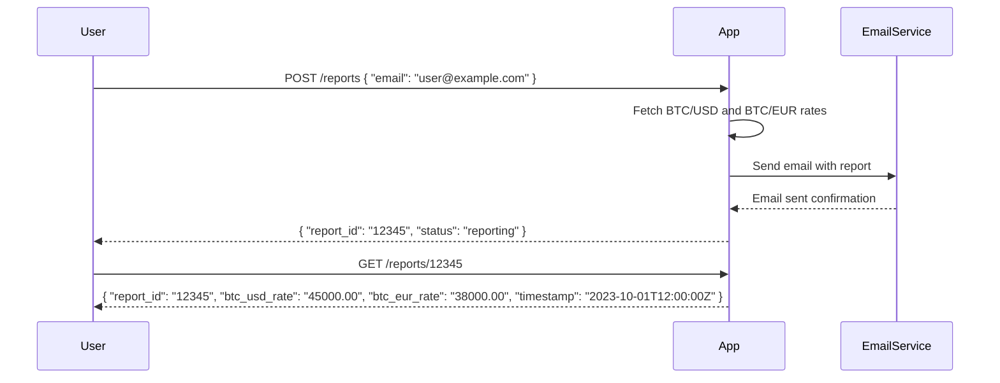

Here are the final functional requirements for your project, formatted clearly and concisely:

### Functional Requirements

#### User Stories

1. **Report Creation**
   - **As a user, I want to initiate a report creation process so that I can receive the latest Bitcoin conversion rates via email.**
     - **Endpoint**: `POST /reports`
     - **Request Format**:
       ```json
       {
         "email": "user@example.com"
       }
       ```
     - **Response Format**:
       ```json
       {
         "report_id": "12345",
         "status": "reporting"
       }
       ```
     - **Validation**: The application must validate the email format before processing the request.

2. **Report Retrieval**
   - **As a user, I want to retrieve my report using its ID so that I can view the conversion rates.**
     - **Endpoint**: `GET /reports/{report_id}`
     - **Response Format**:
       ```json
       {
         "report_id": "12345",
         "btc_usd_rate": "45000.00",
         "btc_eur_rate": "38000.00",
         "timestamp": "2023-10-01T12:00:00Z"
       }
       ```
     - **Error Handling**: If the report ID is not found, the application should return a 404 status with an appropriate error message.

#### API Endpoints

- **POST /reports**
  - **Description**: Initiates the report creation process and stores the results.
  - **Request Body**: 
    - `email`: User's email address (string, required).
  - **Response**: 
    - `report_id`: Unique identifier for the report (string).
    - `status`: Current status of the report (string).

- **GET /reports/{report_id}**
  - **Description**: Retrieves the stored report by its ID.
  - **Path Parameter**: 
    - `report_id`: Unique identifier for the report (string, required).
  - **Response**: 
    - `report_id`: Unique identifier for the report (string).
    - `btc_usd_rate`: Current Bitcoin-to-USD conversion rate (string).
    - `btc_eur_rate`: Current Bitcoin-to-EUR conversion rate (string).
    - `timestamp`: Time when the rates were fetched (ISO 8601 format).

### Sequence Diagram


```mermaid
sequenceDiagram
    participant User
    participant App
    participant EmailService

    User->>App: POST /reports { "email": "user@example.com" }
    App->>App: Fetch BTC/USD and BTC/EUR rates
    App->>EmailService: Send email with report
    EmailService-->>App: Email sent confirmation
    App-->>User: { "report_id": "12345", "status": "reporting" }
    
    User->>App: GET /reports/12345
    App-->>User: { "report_id": "12345", "btc_usd_rate": "45000.00", "btc_eur_rate": "38000.00", "timestamp": "2023-10-01T12:00:00Z" }
```

This document outlines the key functional requirements for your application, including user interactions, API endpoints, and expected behaviors. If there are any additional details or modifications needed, feel free to let me know!