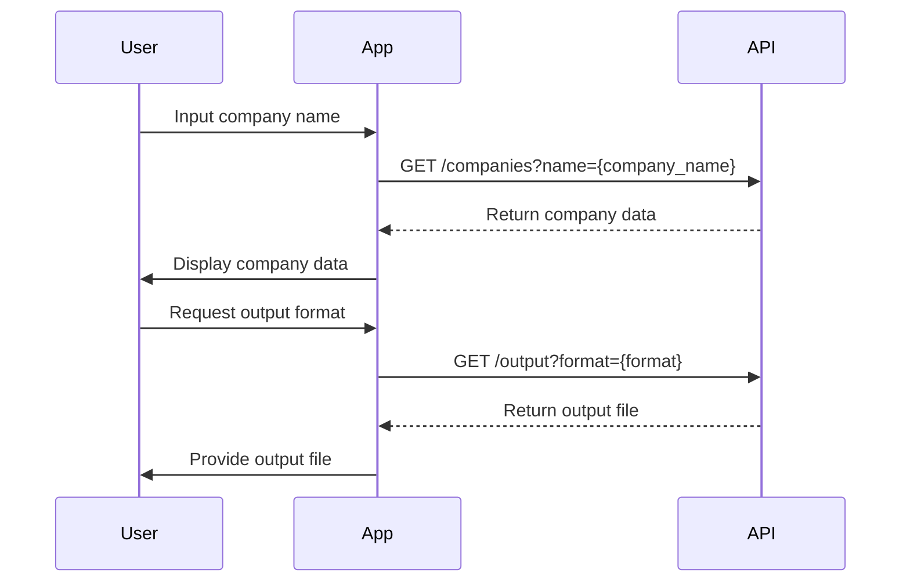

Here is the final well-formatted functional requirements document for your Finnish Companies Data Retrieval and Enrichment Application:

---

## Functional Requirements Document

### Overview
The Finnish Companies Data Retrieval and Enrichment Application retrieves data from the Finnish Companies Registry and enriches it with Legal Entity Identifier (LEI) information. The application filters out inactive companies and outputs the data in both JSON and CSV formats.

### User Stories

1. **Data Retrieval**
   - As a user, I want to retrieve company information by providing a company name or partial name, so that I can find relevant companies in the Finnish Companies Registry.

2. **Filtering**
   - As a user, I want the application to filter out inactive company names, so that I only see active companies in the results.

3. **LEI Data Enrichment**
   - As a user, I want to enrich the company data with the Legal Entity Identifier (LEI), so that I have complete information about the active companies.

4. **Output Format**
   - As a user, I want to receive the final output in both JSON and CSV formats, so that I can choose the format that best suits my needs.

### API Endpoints

1. **GET /companies**
   - **Description**: Retrieve company information based on the provided company name.
   - **Request**: 
     - Query parameters: `name` (string, required)
   - **Response**: 
     - **200 OK**: 
       ```json
       [
         {
           "company_name": "Example Company",
           "business_id": "1234567-8",
           "company_type": "Limited",
           "registration_date": "2020-01-01",
           "status": "Active",
           "lei": "LEI123456789"
         },
         ...
       ]
       ```
     - **404 Not Found**: If no companies are found.

2. **GET /companies/{id}**
   - **Description**: Retrieve detailed information for a specific company by ID.
   - **Request**: 
     - Path parameter: `id` (string, required)
   - **Response**: 
     - **200 OK**: 
       ```json
       {
         "company_name": "Example Company",
         "business_id": "1234567-8",
         "company_type": "Limited",
         "registration_date": "2020-01-01",
         "status": "Active",
         "lei": "LEI123456789"
       }
       ```
     - **404 Not Found**: If the company does not exist.

3. **GET /output**
   - **Description**: Generate and retrieve the output in the specified format (JSON or CSV).
   - **Request**: 
     - Query parameters: `format` (string, required, values: "json", "csv")
   - **Response**: 
     - **200 OK**: Returns the output file in the requested format.
     - **400 Bad Request**: If the format is invalid.

### User-App Interaction


```mermaid
sequenceDiagram
    participant User
    participant App
    participant API

    User->>App: Input company name
    App->>API: GET /companies?name={company_name}
    API-->>App: Return company data
    App->>User: Display company data
    User->>App: Request output format
    App->>API: GET /output?format={format}
    API-->>App: Return output file
    App->>User: Provide output file
```

### Conclusion
This document outlines the functional requirements necessary for the development of the Finnish Companies Data Retrieval and Enrichment Application. The user stories, API endpoints, and interaction diagram provide a clear framework for implementation.

--- 

Feel free to modify any sections as needed! Let me know if you require any further assistance.