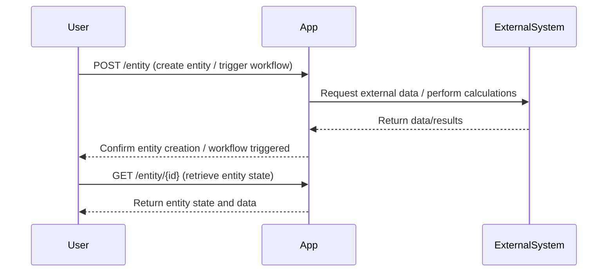
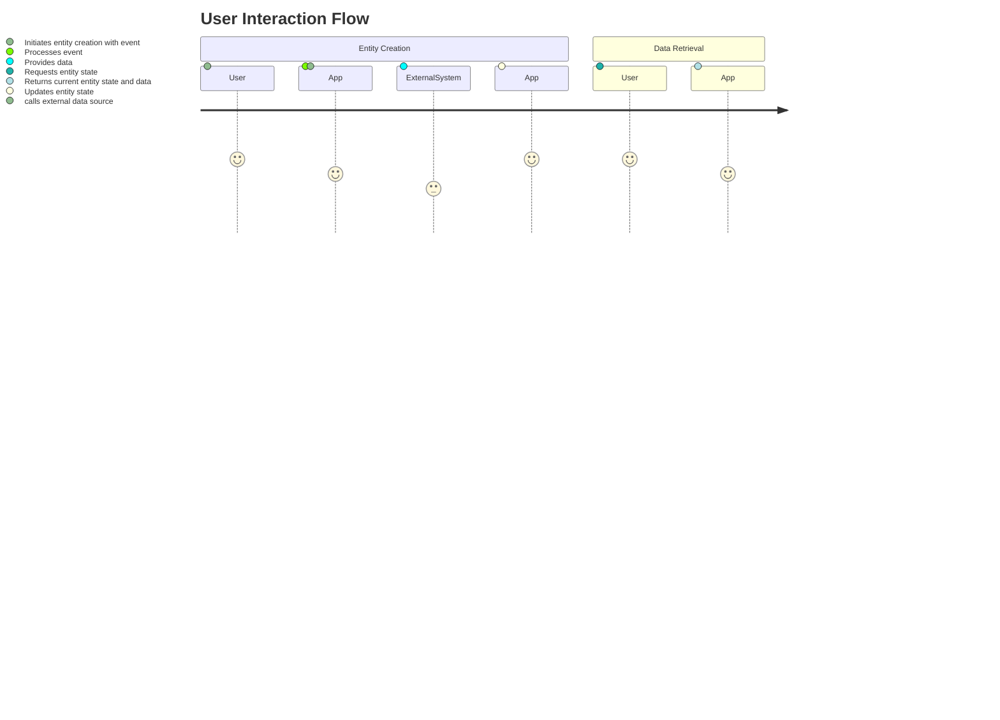

```markdown
# Functional Requirements and API Design for Your Application

## API Endpoints Overview

### 1. Create Entity / Trigger Workflow (POST)
- **Endpoint:** `/entity`
- **Purpose:** Create a new entity or trigger a workflow event that may involve external data retrieval or calculations.
- **Request Format (JSON):**
  ```json
  {
    "entityType": "string",
    "data": { "key": "value", ... },
    "event": "string"  // Optional: workflow event to trigger
  }
  ```
- **Response Format (JSON):**
  ```json
  {
    "entityId": "string",
    "status": "string",
    "message": "string"
  }
  ```

### 2. Retrieve Entity State / Results (GET)
- **Endpoint:** `/entity/{entityId}`
- **Purpose:** Retrieve the current state or results of a specific entity.
- **Response Format (JSON):**
  ```json
  {
    "entityId": "string",
    "entityType": "string",
    "state": "string",
    "data": { "key": "value", ... }
  }
  ```

### 3. List Entities (GET)
- **Endpoint:** `/entities`
- **Purpose:** List all entities or filter by type/state.
- **Query Parameters:** 
  - `entityType` (optional)
  - `state` (optional)
- **Response Format (JSON):**
  ```json
  [
    {
      "entityId": "string",
      "entityType": "string",
      "state": "string"
    },
    ...
  ]
  ```

---

## User-App Interaction (Sequence Diagram)


```mermaid
sequenceDiagram
    participant User
    participant App
    participant ExternalSystem

    User->>App: POST /entity (create entity / trigger workflow)
    App->>ExternalSystem: Request external data / perform calculations
    ExternalSystem-->>App: Return data/results
    App-->>User: Confirm entity creation / workflow triggered

    User->>App: GET /entity/{id} (retrieve entity state)
    App-->>User: Return entity state and data
```

---

## User Journey Diagram


```mermaid
journey
    title User Interaction Flow
    section Entity Creation
      User: 5: Initiates entity creation with event
      App: 4: Processes event, calls external data source
      ExternalSystem: 3: Provides data
      App: 5: Updates entity state
    section Data Retrieval
      User: 5: Requests entity state
      App: 4: Returns current entity state and data
```
```

If you have no further questions, I will proceed to finish_discussion.