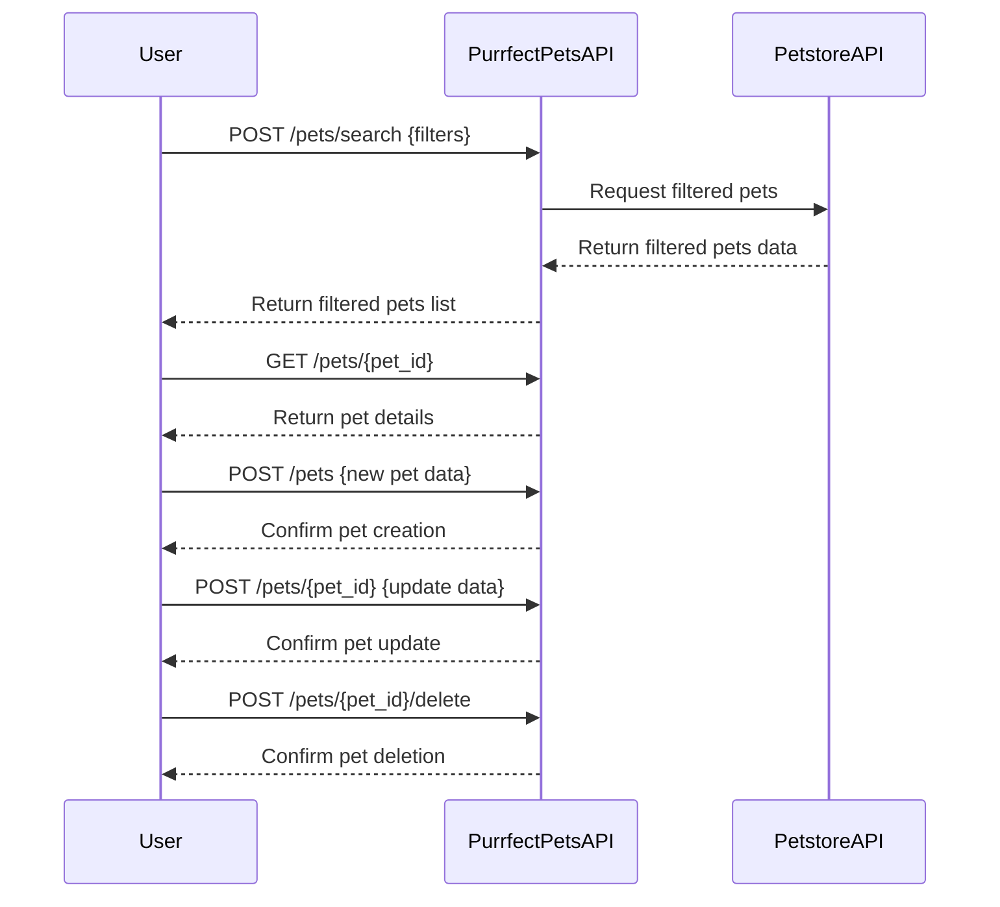

```markdown
# Purrfect Pets API - Functional Requirements

## API Endpoints

### 1. Search Pets (POST `/pets/search`)
- **Purpose:** Search pets using filters, fetch data from Petstore API, and apply any business logic.
- **Request JSON Example:**
  ```json
  {
    "type": "dog",
    "status": "available",
    "name": "Buddy"
  }
  ```
- **Response JSON Example:**
  ```json
  {
    "pets": [
      {
        "id": 1,
        "name": "Buddy",
        "type": "dog",
        "status": "available",
        "category": "pets"
      }
    ]
  }
  ```

### 2. Get Pet Details (GET `/pets/{pet_id}`)
- **Purpose:** Retrieve pet details from internal cache/database (no external calls).
- **Response JSON Example:**
  ```json
  {
    "id": 1,
    "name": "Buddy",
    "type": "dog",
    "status": "available",
    "category": "pets",
    "photoUrls": ["url1", "url2"]
  }
  ```

### 3. Create New Pet (POST `/pets`)
- **Purpose:** Add a new pet to the internal system (simulate creation; no external Petstore API call).
- **Request JSON Example:**
  ```json
  {
    "name": "Mittens",
    "type": "cat",
    "status": "available",
    "category": "pets",
    "photoUrls": ["url1"]
  }
  ```
- **Response JSON Example:**
  ```json
  {
    "id": 101,
    "message": "Pet created successfully"
  }
  ```

### 4. Update Pet Info (POST `/pets/{pet_id}`)
- **Purpose:** Update pet details internally.
- **Request JSON Example:**
  ```json
  {
    "name": "Mittens",
    "status": "sold"
  }
  ```
- **Response JSON Example:**
  ```json
  {
    "id": 101,
    "message": "Pet updated successfully"
  }
  ```

### 5. Delete Pet (POST `/pets/{pet_id}/delete`)
- **Purpose:** Delete pet from the internal system.
- **Response JSON Example:**
  ```json
  {
    "id": 101,
    "message": "Pet deleted successfully"
  }
  ```

---

## User-App Interaction Sequence


```mermaid
sequenceDiagram
  participant User
  participant PurrfectPetsAPI
  participant PetstoreAPI

  User->>PurrfectPetsAPI: POST /pets/search {filters}
  PurrfectPetsAPI->>PetstoreAPI: Request filtered pets
  PetstoreAPI-->>PurrfectPetsAPI: Return filtered pets data
  PurrfectPetsAPI-->>User: Return filtered pets list

  User->>PurrfectPetsAPI: GET /pets/{pet_id}
  PurrfectPetsAPI-->>User: Return pet details

  User->>PurrfectPetsAPI: POST /pets {new pet data}
  PurrfectPetsAPI-->>User: Confirm pet creation

  User->>PurrfectPetsAPI: POST /pets/{pet_id} {update data}
  PurrfectPetsAPI-->>User: Confirm pet update

  User->>PurrfectPetsAPI: POST /pets/{pet_id}/delete
  PurrfectPetsAPI-->>User: Confirm pet deletion
```

---

## Notes
- All external Petstore API calls are done only in POST endpoints.
- GET endpoints return cached or internal data only.
- Request and response formats use JSON.
```
