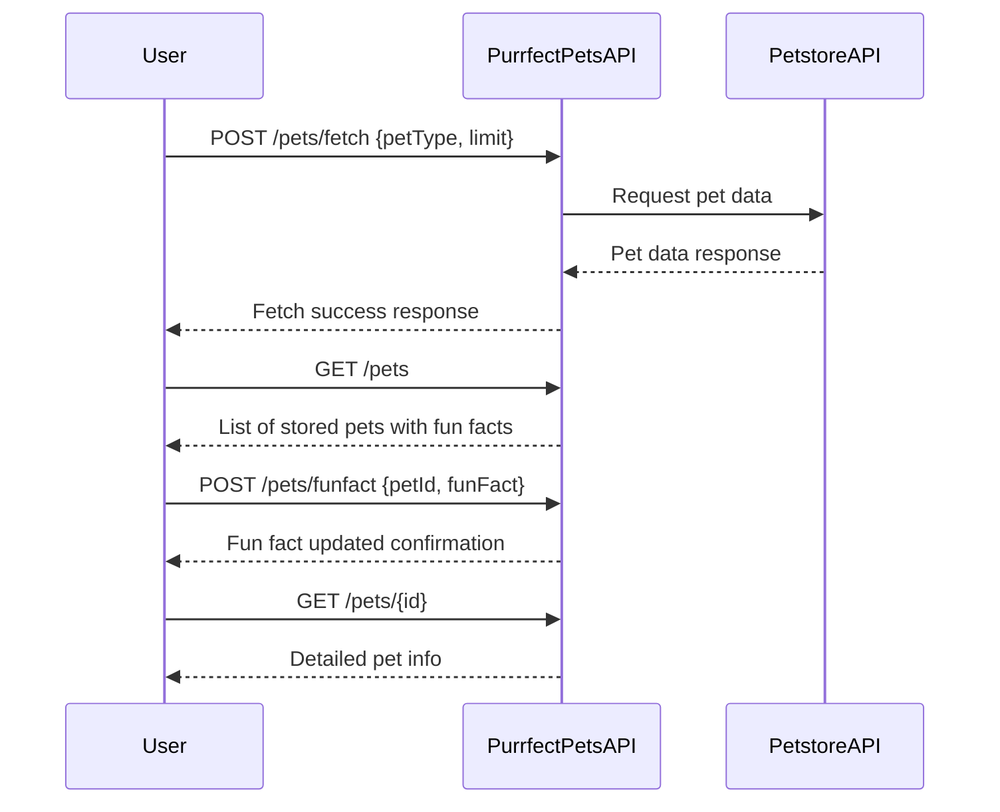

```markdown
# Purrfect Pets API - Functional Requirements

## Overview
The API provides a fun way to interact with pet data sourced from the Petstore API, enriched with fun facts.  
All external data fetching or calculations happen in POST endpoints.  
GET endpoints retrieve stored or processed results only.

---

## API Endpoints

### 1. POST /pets/fetch  
**Description:** Fetch pet data from the external Petstore API filtered by type and limit, enrich it (e.g., add fun facts), and store locally.  
**Request Body:**  
```json
{
  "petType": "string",        // e.g., "cat", "dog", or "all"
  "limit": "integer"          // optional, max number of pets to fetch
}
```  
**Response:**  
```json
{
  "status": "success",
  "fetchedCount": "integer",
  "message": "string"
}
```

---

### 2. GET /pets  
**Description:** Retrieve the list of stored pets with enriched data.  
**Response:**  
```json
[
  {
    "id": "integer",
    "name": "string",
    "type": "string",
    "status": "string",
    "funFact": "string"
  },
  ...
]
```

---

### 3. POST /pets/funfact  
**Description:** Add or update a fun fact for a pet by ID.  
**Request Body:**  
```json
{
  "petId": "integer",
  "funFact": "string"
}
```  
**Response:**  
```json
{
  "status": "success",
  "message": "Fun fact updated"
}
```

---

### 4. GET /pets/{id}  
**Description:** Retrieve detailed information of a single pet by ID.  
**Response:**  
```json
{
  "id": "integer",
  "name": "string",
  "type": "string",
  "status": "string",
  "funFact": "string"
}
```

---

## Business Logic Notes
- External Petstore API calls occur only in POST /pets/fetch.
- POST /pets/funfact allows enriching stored data.
- GET requests serve only cached or processed data.

---

## User-App Interaction Sequence


```mermaid
sequenceDiagram
    participant User
    participant PurrfectPetsAPI
    participant PetstoreAPI

    User->>PurrfectPetsAPI: POST /pets/fetch {petType, limit}
    PurrfectPetsAPI->>PetstoreAPI: Request pet data
    PetstoreAPI-->>PurrfectPetsAPI: Pet data response
    PurrfectPetsAPI-->>User: Fetch success response

    User->>PurrfectPetsAPI: GET /pets
    PurrfectPetsAPI-->>User: List of stored pets with fun facts

    User->>PurrfectPetsAPI: POST /pets/funfact {petId, funFact}
    PurrfectPetsAPI-->>User: Fun fact updated confirmation

    User->>PurrfectPetsAPI: GET /pets/{id}
    PurrfectPetsAPI-->>User: Detailed pet info
```
```