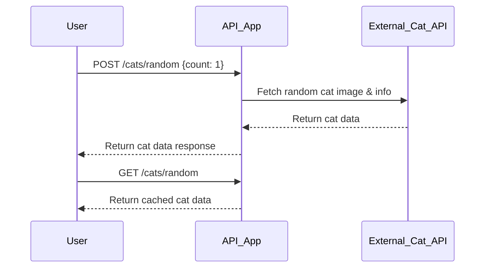
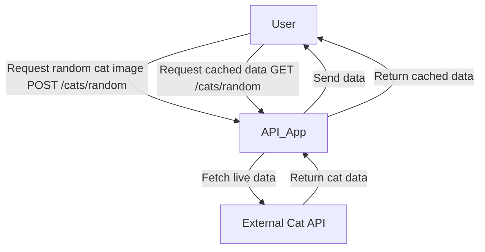

```markdown
# Functional Requirements for 'Purrfect Pets' API App

## API Endpoints

### 1. POST /cats/random
- **Purpose:** Fetch a random cat image and info from an external live cat data API.
- **Request Body:**
  ```json
  {
    "count": 1
  }
  ```
- **Response:**
  ```json
  {
    "cats": [
      {
        "id": "abc123",
        "image_url": "https://cdn.example.com/cat1.jpg",
        "breed": "Siamese",
        "description": "A friendly and vocal breed."
      }
    ]
  }
  ```

### 2. POST /cats/breeds
- **Purpose:** Retrieve information about one or multiple cat breeds from external sources.
- **Request Body:**
  ```json
  {
    "breeds": ["Siamese", "Maine Coon"]
  }
  ```
- **Response:**
  ```json
  {
    "breeds_info": [
      {
        "name": "Siamese",
        "origin": "Thailand",
        "temperament": "Social, playful",
        "description": "A friendly and vocal breed."
      },
      {
        "name": "Maine Coon",
        "origin": "USA",
        "temperament": "Gentle, intelligent",
        "description": "Large and affectionate."
      }
    ]
  }
  ```

### 3. POST /cats/facts
- **Purpose:** Retrieve random cat facts from an external data source.
- **Request Body:**
  ```json
  {
    "count": 3
  }
  ```
- **Response:**
  ```json
  {
    "facts": [
      "Cats sleep 12-16 hours a day.",
      "Cats have five toes on their front paws.",
      "A group of cats is called a clowder."
    ]
  }
  ```

### 4. GET /cats/random
- **Purpose:** Retrieve last fetched random cat image(s) info from the app cache or database.
- **Response:**
  ```json
  {
    "cats": [
      {
        "id": "abc123",
        "image_url": "https://cdn.example.com/cat1.jpg",
        "breed": "Siamese",
        "description": "A friendly and vocal breed."
      }
    ]
  }
  ```

### 5. GET /cats/breeds
- **Purpose:** Retrieve last requested cat breeds info from the app cache or database.
- **Response:**
  ```json
  {
    "breeds_info": [
      {
        "name": "Siamese",
        "origin": "Thailand",
        "temperament": "Social, playful",
        "description": "A friendly and vocal breed."
      }
    ]
  }
  ```

### 6. GET /cats/facts
- **Purpose:** Retrieve last fetched cat facts from the app cache or database.
- **Response:**
  ```json
  {
    "facts": [
      "Cats sleep 12-16 hours a day.",
      "Cats have five toes on their front paws.",
      "A group of cats is called a clowder."
    ]
  }
  ```

---

## User-App Interaction Sequence Diagram


```mermaid
sequenceDiagram
    participant User
    participant API_App
    participant External_Cat_API

    User->>API_App: POST /cats/random {count: 1}
    API_App->>External_Cat_API: Fetch random cat image & info
    External_Cat_API-->>API_App: Return cat data
    API_App-->>User: Return cat data response

    User->>API_App: GET /cats/random
    API_App-->>User: Return cached cat data
```

---

## User Journey Diagram


```mermaid
flowchart TD
    A[User] -->|Request random cat image POST /cats/random| B[API_App]
    B -->|Fetch live data| C[External Cat API]
    C -->|Return cat data| B
    B -->|Send data| A
    A -->|Request cached data GET /cats/random| B
    B -->|Return cached data| A
```
```