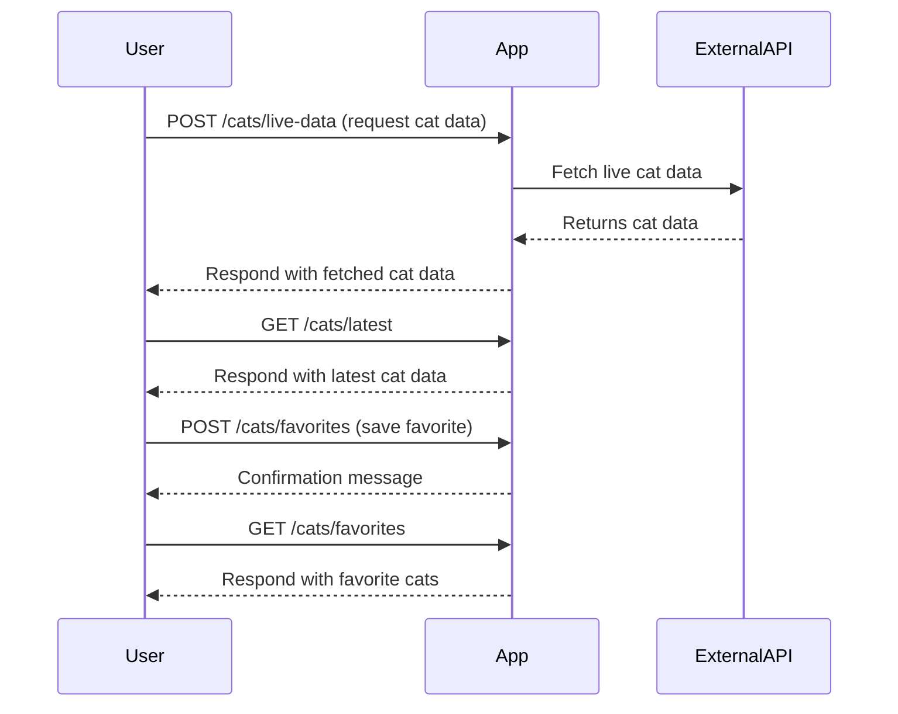

```markdown
# Purrfect Pets API - Functional Requirements

## API Endpoints

### 1. POST /cats/live-data
- **Purpose:** Fetch live cat data from external sources (breeds, images, facts, etc.) and process it.
- **Request Body:**
```json
{
  "data_type": "breeds" | "images" | "facts" | "random",
  "filters": {
    "breed": "Siamese"
  }
}
```
- **Response:**
```json
{
  "status": "success",
  "data": [ /* array of cat data objects depending on data_type */ ]
}
```

---

### 2. GET /cats/latest
- **Purpose:** Retrieve the latest fetched cat data stored in the application.
- **Response:**
```json
{
  "status": "success",
  "data": [ /* array of recently fetched cat data objects */ ]
}
```

---

### 3. POST /cats/favorites
- **Purpose:** Save a cat item as a favorite.
- **Request Body:**
```json
{
  "cat_id": "string",
  "user_id": "string"
}
```
- **Response:**
```json
{
  "status": "success",
  "message": "Cat added to favorites"
}
```

---

### 4. GET /cats/favorites
- **Purpose:** Retrieve saved favorite cat items.
- **Response:**
```json
{
  "status": "success",
  "data": [ /* array of favorite cat data objects */ ]
}
```

---

## User-App Interaction Sequence


```mermaid
sequenceDiagram
    participant User
    participant App
    participant ExternalAPI

    User->>App: POST /cats/live-data (request cat data)
    App->>ExternalAPI: Fetch live cat data
    ExternalAPI-->>App: Returns cat data
    App-->>User: Respond with fetched cat data

    User->>App: GET /cats/latest
    App-->>User: Respond with latest cat data

    User->>App: POST /cats/favorites (save favorite)
    App-->>User: Confirmation message

    User->>App: GET /cats/favorites
    App-->>User: Respond with favorite cats
```
```