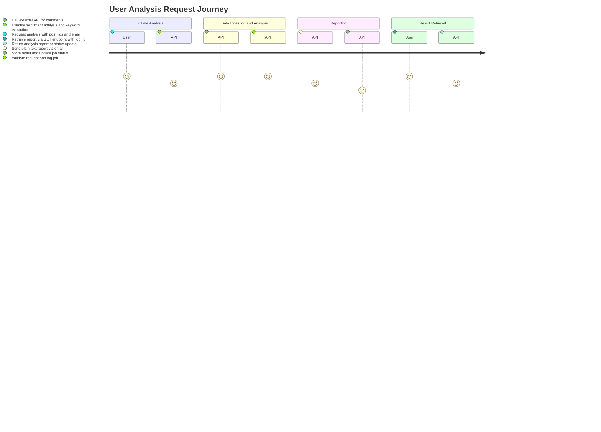

# Functional Requirements Specification

## Overview
The application is designed to ingest comments data from an external API, analyze the data (perform sentiment analysis and keyword extraction), and send a plain text summary report via email. All business logic, external data retrieval, and calculations are performed via POST endpoints. GET endpoints are dedicated solely to retrieving previously processed results.

## API Endpoints

### POST /api/analyze
- **Description:** Initiates the process by ingesting comments data from the external API, analyzing it, and sending the report via email.
  
- **Request Body Format:**
  ```json
  {
    "post_ids": [1, 2, 3],
    "email": "recipient@example.com"
  }
  ```
  - `post_ids` (array of integers): List of post IDs for which the comments will be fetched.
  - `email` (string): Email address that receives the report.

- **Response Format:**
  ```json
  {
    "job_id": "unique-job-identifier",
    "status": "processing"
  }
  ```
  - `job_id` (string): Unique identifier for the analysis task.
  - `status` (string): Initial status indicating that processing has started.

### GET /api/result/{job_id}
- **Description:** Retrieves the results of a previously submitted analysis.
  
- **Path Parameter:**
  - `job_id`: Unique identifier returned from the POST /api/analyze endpoint.

- **Response Format:**
  ```json
  {
    "job_id": "unique-job-identifier",
    "status": "completed",
    "report": "Total Comments Analyzed: 5\nPositive Comments: 2\nNegative Comments: 1\nNeutral Comments: 2\n\nKeywords: [...]"
  }
  ```
  - `job_id` (string): Unique job identifier.
  - `status` (string): Status of the job, e.g., "processing" or "completed".
  - `report` (string): Plain text summary report (present when status is completed).

## Business Logic
- **POST /api/analyze Endpoint:**
  - Validates the input request.
  - Invokes external API calls to `https://jsonplaceholder.typicode.com/posts/{post_id}/comments` for every post ID provided.
  - Performs sentiment analysis and keyword extraction on the fetched comments.
  - Compiles the analysis results into a plain text summary report.
  - Sends the report to the provided email address.
  - Returns a unique job identifier.

- **GET /api/result/{job_id} Endpoint:**
  - Retrieves analysis results for the given job ID from the application data store.
  - Returns the report if processing is completed; otherwise, returns the current status.

## User-App Interaction Diagrams

### Journey Diagram

```mermaid
journey
    title User Analysis Request Journey
    section Initiate Analysis
      User: 5: Request analysis with post_ids and email
      API: 4: Validate request and log job
    section Data Ingestion and Analysis
      API: 5: Call external API for comments
      API: 5: Execute sentiment analysis and keyword extraction
    section Reporting
      API: 4: Send plain text report via email
      API: 3: Store result and update job status
    section Result Retrieval
      User: 5: Retrieve report via GET endpoint with job_id
      API: 4: Return analysis report or status update
```

### Sequence Diagram
```mermaid
sequenceDiagram
    participant User
    participant API
    participant ExtAPI as "External API"
    participant EmailSvc as "Email Service"
    participant DB as "DataStore"

    User->>API: POST /api/analyze {post_ids, email}
    API->>API: Validate request; create job record
    API->>ExtAPI: GET /posts/{post_id}/comments (for each post id)
    ExtAPI-->>API: Return comments data
    API->>API: Perform sentiment analysis\nand keyword extraction
    API->>EmailSvc: Send report to email
    API->>DB: Store analysis report and update job status
    API-->>User: Return {job_id, status: "processing"}
    
    User->>API: GET /api/result/{job_id}
    API->>DB: Retrieve job details and report
    DB-->>API: Return job status and report
    API-->>User: Return result response (report or current status)
```